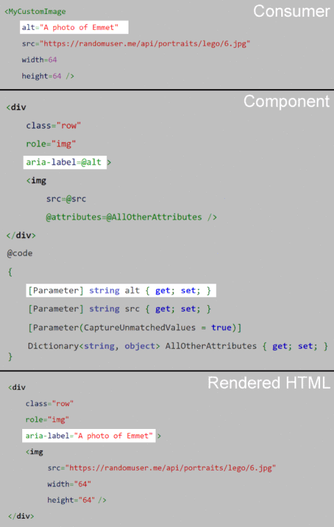

[](https://github.com/mrpmorris/blazor-university/tree/master/src/Components/CapturingUnexpectedParameters)

Previously we've seen how to declare parameters and cascading parameters with specific names. Take, for example,
a custom component that wraps an `` element inside some custom HTML.

```razor
<div class="row">
  
</div>

@code 
{
  [Parameter]
  public string src { get; set; }
}
```

During review it is pointed out that images without an `alt` tag are not very accessible to people with vision impairments,
so another parameter is added and the HTML updated.

```razor
<div class="row" role="img" aria-label=@alt>
  
</div>

@code 
{
  [Parameter]
  public string src { get; set; }
  
  [Parameter]
  public string alt { get; set; }
}
```

Over time more attributes are required:

- align
- width
- height

At this point you are likely to stop having additional requirements for an image component, but having to write a parameter
for every possible attribute every time you write a component can be tiresome,
especially when you don't actually process the values but simply pass them through to the HTML element's mark-up.
The `<input>` control has approximately 30 attributes that would require us to write parameter code for.

## Capturing values without coding parameters

Previously we saw how to utilize [Attribute splatting](/components/code-generated-html-attributes/) to programmatically
generate HTML attributes and their values.
This involved assigning the value of a `Dictionary<string, object>` to a specially named `@attributes` attribute.

Capturing values of attributes without matching parameters works in a similar way.
We simply create a property of type `Dictionary<string, object>`, decorate it as being a `[Parameter]`,
but in the Parameter we need to specify `CaptureUnmatchedValues = true`.

```razor
<div class="row" role="img" aria-label=@alt>
  
</div>

@code 
{
  [Parameter]
  public string src { get; set; }

  [Parameter]
  public string alt { get; set; }

  [Parameter(CaptureUnmatchedValues = true)]
  public Dictionary<string, object> AllOtherAttributes { get; set; }
}
```

Now instead of throwing an exception when the consumer of your component adds attribute values you have not explicitly
permitted with a `[Parameter]` decorated property (the normal behavior), Blazor will collect them into the dictionary
for us as Key/Value pairs.

In the preceding example, any `attributes=value` assignments specified by the consumer of our component will be added to
the `` element within our component.

```razor
<MyCustomImage src="https://randomuser.me/api/portraits/lego/6.jpg" alt="A photo of Emmet" width=64 height=64 />
```


