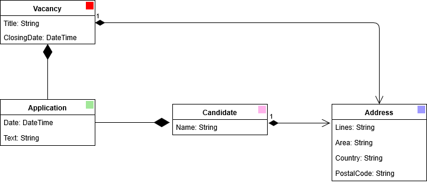
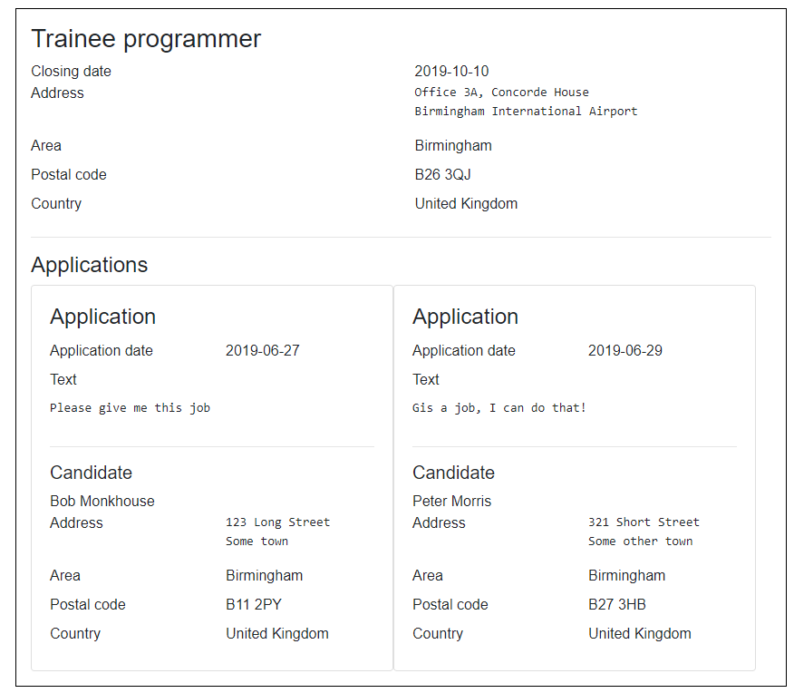
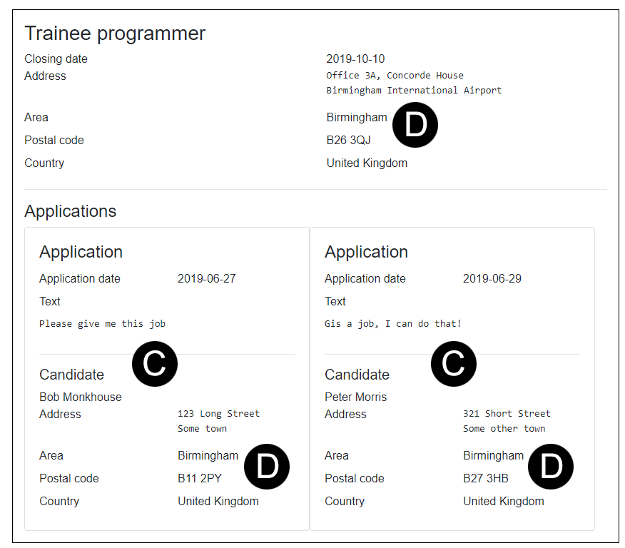
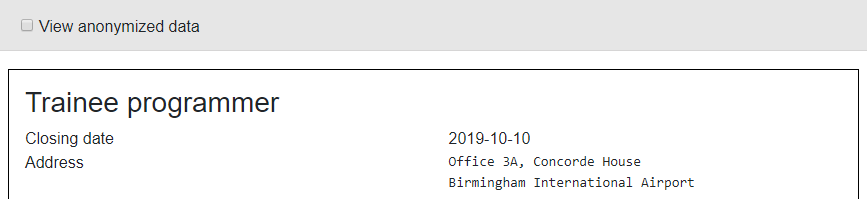
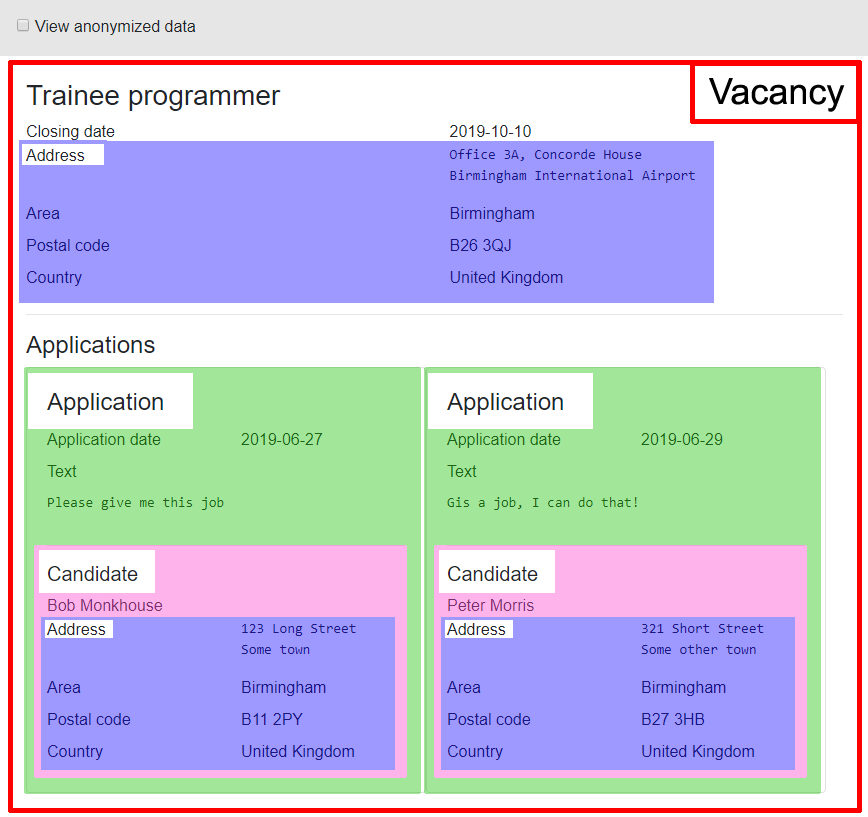
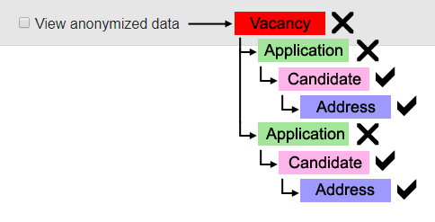

We've already seen how Blazor allows us to pass context from a parent component to a child using [Parameters](/components/one-way-binding/).
As a component becomes more complex it is not uncommon to split it up into sub-components.
At some point it is likely a component will require its consumer to pass state that it doesn't use itself,
but is needed by one of its sub-components. As our components' structures become more complex with time,
we might find ourselves with components that require multiple parameters added to them that they don't consume,
but simply pass on because they are required somewhere deeper down.

Take a job recruitment application as an example. A `Vacancy` can have many `Applications`;
each `Application` is for a single `Vacancy` and belongs to a single `Candidate`;
both `Vacancy` and `Candidate` have an `Address`.

Viewing the vacancy shows all applications.
At some point a requirement is identified to allow the user to click on a single application and view it in detail on its
own page, so a new `ViewApplication.razor` component is created that will be used when viewing a vacancy or when viewing
a single application.

Now we have a `ViewVacancy.razor` component (labelled **A**) which loops through all applications against the vacancy and
for each it renders a `ViewApplication.razor` component (labelled **B**).

As an exercise in standardizing the application, it is decided candidates should be displayed using a `ViewCandidate.razor`
component (labelled **C**), and all addresses should be displayed using a `ViewAddress.razor` component (labelled **D**).

In the interests of equal opportunities, the page that displays applications for a vacancy needs the option of viewing
applications without revealing the name or full address of the candidate,
so a checkbox is added to the page "View anonymized data".
In fact, this feature is seen as so critical to the application,
the checkbox is added to the `MainLayout.razor` page so it is available everywhere throughout the system.

The `ViewVacancy.razor` component has no sensitive data so it doesn't need to know if the user is viewing anonymized data.
The `ViewApplication.razor` component within it also has no sensitive information, so it doesn't need to know either;
but the `ViewCandidate.razor` component needs to anonymize the candidate's name,
and the `ViewAddress.razor` component within the `ViewCandidate.razor` component needs to anonymize data too.

Because `ViewAddress.razor` and `ViewCandidate.razor` require a Boolean parameter identifying whether or not they should
display sensitive information, some components must therefore also require the same parameter just to pass it on to any
components it hosts either directly or indirectly.

Illustration of a parameter being required solely to pass data on to children

This is the challenge that Cascading values solve.
