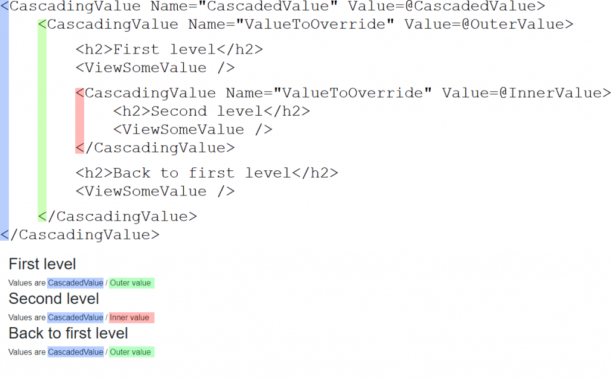

[](https://github.com/mrpmorris/blazor-university/tree/master/src/CascadingValues/OverridingCascadedValues)

Cascading values and cascading parameters allow their values to cascade down the render tree without being passed explicitly
from parent to child.
Another feature of Blazor is that it allows us to override the value of a `CascadingValue` further down the render tree.

Given the following `ViewSomeValue` component that displays the value of a `CascadingValue` named `ValueToOverride`:

```razor
<div>Values are @SomeValue1 / @SomeValue2</div>

@code
{
  [CascadingParameter(Name = "CascadedValue")]
  private string SomeValue1 { get; set; }

  [CascadingParameter(Name = "ValueToOverride")]
  private string SomeValue2 { get; set; }
}
```

And the following page that consumes the component:

```razor
@page "/overridden"

<CascadingValue Name="CascadedValue" Value=@CascadedValue>
  <CascadingValue Name="ValueToOverride" Value=@OuterValue>

    <h2>First level</h2>
    <ViewSomeValue />

    <CascadingValue Name="ValueToOverride" Value=@InnerValue>
      <h2>Second level</h2>
      <ViewSomeValue />
    </CascadingValue>

    <h2>Back to first level</h2>
    <ViewSomeValue />

  </CascadingValue>
</CascadingValue>

@code
{
  string CascadedValue = "CascadedValue";
  string OuterValue = "Outer value";
  string InnerValue = "Inner value";
}
```

We see the following output:  
  
**First level**  
Values are CascadedValue / Outer value  
**Second level**  
Values are CascadedValue / Inner value  
**Back to first level**  
Values are CascadedValue / Outer value

Note how the value of `ValueToOverride` for the third component automatically reverts to "Outer value".
This is because the value is determined by the depth of the element.
The third component is rendered within the outermost `CascadingValue`, so that is the nearest parent it finds that holds
a matching value.  
  
Note also how the value of `CascadedValue` is available to all of the components.


