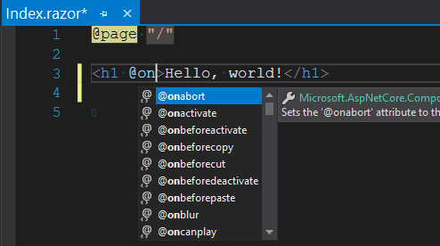

When rendering any mark-up, it is possible to assign standard JavaScript events on the rendered HTML elements so that our
own Blazor C# methods are executed.
For example, we have used the `@onclick` [Directive](/components/literals-expressions-and-directives/directives/)
in many samples elsewhere:

```razor
<button @onclick=ButtonClicked>Click me</button>
```

These event directives have full IntelliSense support within the Visual Studio editor,
so starting to type the `@` symbol should present us with a comprehensive list of available directives,
along with a description identifying which argument class type the event passes us in our event handler.
DOM events start with `@on`.



> Sets the '@onabort' attribute to the provided string or delegate value. A delegate value should be of type 'Microsoft.AspNetCore.Components.Web.ProgressEventArgs'

**Warning:** When writing a Blazor app that runs entirely on the server,
Blazor will hook events in the browser and send them to server so our C# methods can be invoked.
This can lead to a noticeable slow-down for frequently fired events such as `onmousemove`.

**Note:** Because JavaScript invocation of C# methods is asynchronous,
this means that in C# methods we cannot cancel events as we can in JavaScript.
This is because cancelling browser DOM events is a synchronous operation,
by the time our C# has been asynchronously invoked it is already too late to cancel the event.

Available DOM events and their parameter types include:

<table>
  <tbody>
    <tr>
      <td colspan="2"><h2>General events</h2></td>
    </tr>
    <tr>
      <td><strong>DOM event</strong></td>
      <td><strong>Argument type</strong></td>
    </tr>
    <tr>
      <td>on<em>a</em>ctivate</td>
      <td><code>EventArgs</code></td>
    </tr>
    <tr>
      <td><em>o</em>n<em>b</em>efore<em>a</em>ctivate</td>
      <td><code>EventArgs</code></td>
    </tr>
    <tr>
      <td>on<em>b</em>efore<em>d</em>eactivate</td>
      <td><code>EventArgs</code></td>
    </tr>
    <tr>
      <td>on<em>d</em>eactivate</td>
      <td><code>EventArgs</code></td>
    </tr>
    <tr>
      <td>on<em>e</em>nded</td>
      <td><code>EventArgs</code></td>
    </tr>
    <tr>
      <td>on<em>f</em>ullscreen<em>c</em>hange</td>
      <td><code>EventArgs</code></td>
    </tr>
    <tr>
      <td>on<em>f</em>ullscreen<em>e</em>rror</td>
      <td><code>EventArgs</code></td>
    </tr>
    <tr>
      <td>on<em>l</em>oaded<em>d</em>ata</td>
      <td><code>EventArgs</code></td>
    </tr>
    <tr>
      <td>on<em>l</em>oaded<em>m</em>etadata</td>
      <td><code>EventArgs</code></td>
    </tr>
    <tr>
      <td>on<em>p</em>ointer<em>l</em>ock<em>c</em>hange</td>
      <td><code>EventArgs</code></td>
    </tr>
    <tr>
      <td>on<em>p</em>ointer<em>l</em>ock<em>e</em>rror</td>
      <td><code>EventArgs</code></td>
    </tr>
    <tr>
      <td>on<em>r</em>eady<em>s</em>tate<em>c</em>hange</td>
      <td><code>EventArgs</code></td>
    </tr>
    <tr>
      <td>on<em>s</em>croll</td>
      <td><code>EventArgs</code></td>
    </tr>
    <tr>
      <td colspan="2" style="padding-top: 2rem"><h2>Focus events</h2></td>
    </tr>
    <tr>
      <td><strong>DOM event</strong></td>
      <td><strong>Argument type</strong></td>
    </tr>
    <tr>
      <td>on<em>f</em>ocus</td>
      <td><code>FocusEventArgs</code></td>
    </tr>
    <tr>
      <td>on<em>b</em>lur</td>
      <td><code>FocusEventArgs</code></td>
    </tr>
    <tr>
      <td>on<em>f</em>ocus<em>i</em>n</td>
      <td><code>FocusEventArgs</code></td>
    </tr>
    <tr>
      <td>on<em>f</em>ocus<em>o</em>ut</td>
      <td><code>FocusEventArgs</code></td>
    </tr>
    <tr>
      <td colspan="2" style="padding-top: 2rem"><h2>Mouse events</h2></td>
    </tr>
    <tr>
      <td><strong>DOM event</strong></td>
      <td><strong>Argument type</strong></td>
    </tr>
    <tr>
      <td>on<em>m</em>ouse<em>o</em>ver</td>
      <td><code>MouseEventArgs</code></td>
    </tr>
    <tr>
      <td>on<em>m</em>ouse<em>o</em>ut</td>
      <td><code>MouseEventArgs</code></td>
    </tr>
    <tr>
      <td>on<em>m</em>ouse<em>m</em>ove</td>
      <td><code>MouseEventArgs</code></td>
    </tr>
    <tr>
      <td>on<em>m</em>ouse<em>d</em>own</td>
      <td><code>MouseEventArgs</code></td>
    </tr>
    <tr>
      <td>on<em>m</em>ouse<em>u</em>p</td>
      <td><code>MouseEventArgs</code></td>
    </tr>
    <tr>
      <td>on<em>c</em>lick</td>
      <td><code>MouseEventArgs</code></td>
    </tr>
    <tr>
      <td>on<em>d</em>bl<em>c</em>lick</td>
      <td><code>MouseEventArgs</code></td>
    </tr>
    <tr>
      <td>on<em>c</em>ontextmenu</td>
      <td><code>MouseEventArgs</code></td>
    </tr>
    <tr>
      <td>on<em>w</em>heel</td>
      <td><code>WheelEventArgs</code></td>
    </tr>
    <tr>
      <td>on<em>m</em>ouse<em>w</em>heel</td>
      <td><code>WheelEventArgs</code></td>
    </tr>
    <tr>
      <td colspan="2" style="padding-top: 2rem"><h2>Drag events</h2></td>
    </tr>
    <tr>
      <td><strong>DOM event</strong></td>
      <td><strong>Argument type</strong></td>
    </tr>
    <tr>
      <td>on<em>d</em>rag</td>
      <td><code>DragEventArgs</code></td>
    </tr>
    <tr>
      <td>on<em>d</em>rag<em>e</em>nd</td>
      <td><code>DragEventArgs</code></td>
    </tr>
    <tr>
      <td>on<em>d</em>rag<em>e</em>nter</td>
      <td><code>DragEventArgs</code></td>
    </tr>
    <tr>
      <td>on<em>d</em>rag<em>l</em>eave</td>
      <td><code>DragEventArgs</code></td>
    </tr>
    <tr>
      <td>on<em>d</em>rag<em>o</em>ver</td>
      <td><code>DragEventArgs</code></td>
    </tr>
    <tr>
      <td>on<em>d</em>rag<em>s</em>tart</td>
      <td><code>DragEventArgs</code></td>
    </tr>
    <tr>
      <td>on<em>d</em>rop</td>
      <td><code>DragEventArgs</code></td>
    </tr>
    <tr>
      <td colspan="2" style="padding-top: 2rem"><h2>Keyboard events</h2></td>
    </tr>
    <tr>
      <td><strong>DOM event</strong></td>
      <td><strong>Argument type</strong></td>
    </tr>
    <tr>
      <td>on<em>k</em>ey<em>d</em>own</td>
      <td><code>KeyboardEventArgs</code></td>
    </tr>
    <tr>
      <td>on<em>k</em>ey<em>u</em>p</td>
      <td><code>KeyboardEventArgs</code></td>
    </tr>
    <tr>
      <td>on<em>k</em>ey<em>p</em>ress</td>
      <td><code>KeyboardEventArgs</code></td>
    </tr>
    <tr>
      <td colspan="2" style="padding-top: 2rem"><h2>Input events</h2></td>
    </tr>
    <tr>
      <td><strong>DOM event</strong></td>
      <td><strong>Argument type</strong></td>
    </tr>
    <tr>
      <td>on<em>c</em>hange</td>
      <td><code>ChangeEventArgs</code></td>
    </tr>
    <tr>
      <td>on<em>i</em>nput</td>
      <td><code>ChangeEventArgs</code></td>
    </tr>
    <tr>
      <td>on<em>i</em>nvalid</td>
      <td><code>EventArgs</code></td>
    </tr>
    <tr>
      <td>on<em>r</em>eset</td>
      <td><code>EventArgs</code></td>
    </tr>
    <tr>
      <td>on<em>s</em>elect</td>
      <td><code>EventArgs</code></td>
    </tr>
    <tr>
      <td>on<em>s</em>elect<em>s</em>tart</td>
      <td><code>EventArgs</code></td>
    </tr>
    <tr>
      <td>on<em>s</em>election<em>c</em>hange</td>
      <td><code>EventArgs</code></td>
    </tr>
    <tr>
      <td>on<em>s</em>ubmit</td>
      <td><code>EventArgs</code></td>
    </tr>
    <tr>
      <td colspan="2" style="padding-top: 2rem"><h2>Clipboard events</h2></td>
    </tr>
    <tr>
      <td><strong>DOM event</strong></td>
      <td><strong>Argument type</strong></td>
    </tr>
    <tr>
      <td>on<em>b</em>efore<em>c</em>opy</td>
      <td><code>EventArgs</code></td>
    </tr>
    <tr>
      <td>on<em>b</em>efore<em>c</em>ut</td>
      <td><code>EventArgs</code></td>
    </tr>
    <tr>
      <td>on<em>b</em>efore<em>p</em>aste</td>
      <td><code>EventArgs</code></td>
    </tr>
    <tr>
      <td>on<em>c</em>opy</td>
      <td><code>ClipboardEventArgs</code></td>
    </tr>
    <tr>
      <td>on<em>c</em>ut</td>
      <td><code>ClipboardEventArgs</code></td>
    </tr>
    <tr>
      <td>on<em>p</em>aste</td>
      <td><code>ClipboardEventArgs</code></td>
    </tr>
    <tr>
      <td colspan="2" style="padding-top: 2rem"><h2>Touch events</h2></td>
    </tr>
    <tr>
      <td><strong>DOM event</strong></td>
      <td><strong>Argument type</strong></td>
    </tr>
    <tr>
      <td>on<em>t</em>ouch<em>c</em>ancel</td>
      <td><code>TouchEventArgs</code></td>
    </tr>
    <tr>
      <td>on<em>t</em>ouch<em>e</em>nd</td>
      <td><code>TouchEventArgs</code></td>
    </tr>
    <tr>
      <td>on<em>t</em>ouch<em>m</em>ove</td>
      <td><code>TouchEventArgs</code></td>
    </tr>
    <tr>
      <td>on<em>t</em>ouch<em>s</em>tart</td>
      <td><code>TouchEventArgs</code></td>
    </tr>
    <tr>
      <td>on<em>t</em>ouch<em>e</em>nter</td>
      <td><code>TouchEventArgs</code></td>
    </tr>
    <tr>
      <td>on<em>t</em>ouch<em>l</em>eave</td>
      <td><code>TouchEventArgs</code></td>
    </tr>
    <tr>
      <td colspan="2" style="padding-top: 2rem"><h2>Pointer events</h2></td>
    </tr>
    <tr>
      <td><strong>DOM event</strong></td>
      <td><strong>Argument type</strong></td>
    </tr>
    <tr>
      <td>on<em>g</em>ot<em>p</em>ointer<em>c</em>apture</td>
      <td><code>PointerEventArgs</code></td>
    </tr>
    <tr>
      <td>on<em>l</em>ost<em>p</em>ointer<em>c</em>apture</td>
      <td><code>PointerEventArgs</code></td>
    </tr>
    <tr>
      <td>on<em>p</em>ointer<em>c</em>ancel</td>
      <td><code>PointerEventArgs</code></td>
    </tr>
    <tr>
      <td>on<em>p</em>ointer<em>d</em>own</td>
      <td><code>PointerEventArgs</code></td>
    </tr>
    <tr>
      <td>on<em>p</em>ointer<em>e</em>nter</td>
      <td><code>PointerEventArgs</code></td>
    </tr>
    <tr>
      <td>on<em>p</em>ointer<em>l</em>eave</td>
      <td><code>PointerEventArgs</code></td>
    </tr>
    <tr>
      <td>on<em>p</em>ointer<em>m</em>ove</td>
      <td><code>PointerEventArgs</code></td>
    </tr>
    <tr>
      <td>on<em>p</em>ointer<em>o</em>ut</td>
      <td><code>PointerEventArgs</code></td>
    </tr>
    <tr>
      <td>on<em>p</em>ointer<em>o</em>ver</td>
      <td><code>PointerEventArgs</code></td>
    </tr>
    <tr>
      <td>on<em>p</em>ointer<em>u</em>p</td>
      <td><code>PointerEventArgs</code></td>
    </tr>
    <tr>
      <td colspan="2" style="padding-top: 2rem"><h2>Media events</h2></td>
    </tr>
    <tr>
      <td><strong>DOM event</strong></td>
      <td><strong>Argument type</strong></td>
    </tr>
    <tr>
      <td>on<em>c</em>an<em>p</em>lay</td>
      <td><code>EventArgs</code></td>
    </tr>
    <tr>
      <td>on<em>c</em>an<em>p</em>lay<em>t</em>hrough</td>
      <td><code>EventArgs</code></td>
    </tr>
    <tr>
      <td>on<em>c</em>ue<em>c</em>hange</td>
      <td><code>EventArgs</code></td>
    </tr>
    <tr>
      <td>on<em>d</em>uration<em>c</em>hange</td>
      <td><code>EventArgs</code></td>
    </tr>
    <tr>
      <td>on<em>e</em>mptied</td>
      <td><code>EventArgs</code></td>
    </tr>
    <tr>
      <td>on<em>p</em>ause</td>
      <td><code>EventArgs</code></td>
    </tr>
    <tr>
      <td>on<em>p</em>lay</td>
      <td><code>EventArgs</code></td>
    </tr>
    <tr>
      <td>on<em>p</em>laying</td>
      <td><code>EventArgs</code></td>
    </tr>
    <tr>
      <td>on<em>r</em>ate<em>c</em>hange</td>
      <td><code>EventArgs</code></td>
    </tr>
    <tr>
      <td>on<em>s</em>eeked</td>
      <td><code>EventArgs</code></td>
    </tr>
    <tr>
      <td>on<em>s</em>eeking</td>
      <td><code>EventArgs</code></td>
    </tr>
    <tr>
      <td>on<em>s</em>talled</td>
      <td><code>EventArgs</code></td>
    </tr>
    <tr>
      <td>on<em>s</em>top</td>
      <td><code>EventArgs</code></td>
    </tr>
    <tr>
      <td>on<em>s</em>uspend</td>
      <td><code>EventArgs</code></td>
    </tr>
    <tr>
      <td>on<em>t</em>ime<em>u</em>pdate</td>
      <td><code>EventArgs</code></td>
    </tr>
    <tr>
      <td>on<em>v</em>olume<em>c</em>hange</td>
      <td><code>EventArgs</code></td>
    </tr>
    <tr>
      <td>on<em>w</em>aiting</td>
      <td><code>EventArgs</code></td>
    </tr>
    <tr>
      <td colspan="2" style="padding-top: 2rem"><h2>Progress events</h2></td>
    </tr>
    <tr>
      <td><strong>DOM event</strong></td>
      <td><strong>Argument type</strong></td>
    </tr>
    <tr>
      <td>on<em>l</em>oad<em>s</em>tart</td>
      <td><code>ProgressEventArgs</code></td>
    </tr>
    <tr>
      <td>on<em>t</em>imeout</td>
      <td><code>ProgressEventArgs</code></td>
    </tr>
    <tr>
      <td>on<em>a</em>bort</td>
      <td><code>ProgressEventArgs</code></td>
    </tr>
    <tr>
      <td>on<em>l</em>oad</td>
      <td><code>ProgressEventArgs</code></td>
    </tr>
    <tr>
      <td>on<em>l</em>oad<em>e</em>nd</td>
      <td><code>ProgressEventArgs</code></td>
    </tr>
    <tr>
      <td>on<em>p</em>rogress</td>
      <td><code>ProgressEventArgs</code></td>
    </tr>
    <tr>
      <td>on<em>e</em>rror</td>
      <td><code>ErrorEventArgs</code></td>
    </tr>
  </tbody>
</table>
