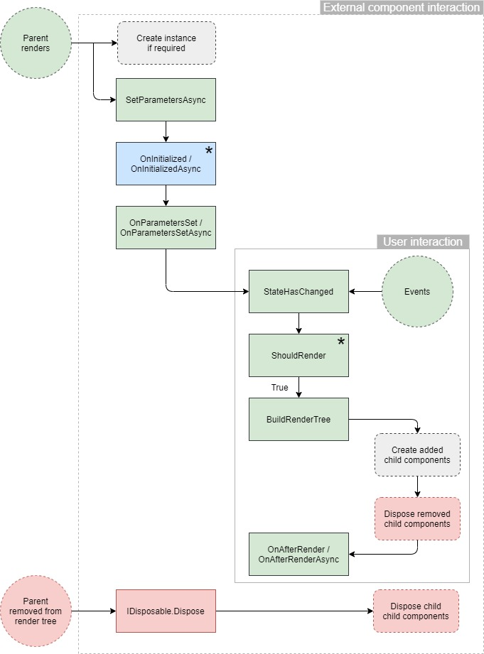
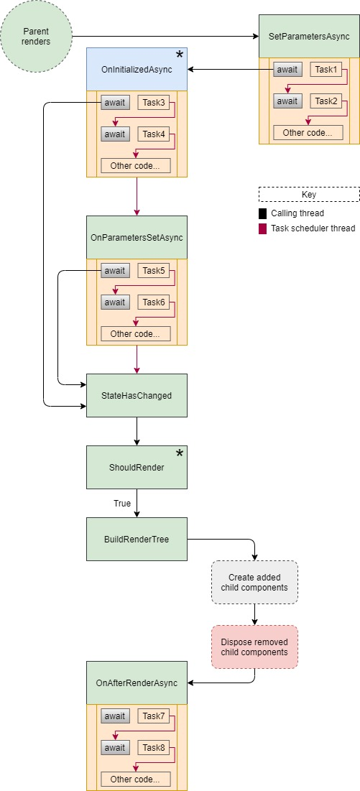

[](https://github.com/mrpmorris/blazor-university/tree/master/src/Components/ComponentLifecycles)

Blazor components have a number of virtual methods we can override to affect the behavior of our application.
These methods are executed at different times during a component's lifetime.
The following diagram outlines the flow of these lifecycle methods.

## Component lifecycle diagram



## Lifecycle under different render modes

The lifecycle methods described below behave differently depending on the render mode.

**Static Server-Side Rendering (Static SSR)** does not execute the `OnAfterRender` / `OnAfterRenderAsync` methods at all because there is no interactive Blazor circuit in the browser. The component renders once on the server and the HTML is sent to the client. Any JavaScript interop calls made during `OnInitialized` or `OnParametersSet` will also fail because there is no JS bridge available.

**Prerendering** (such as when using Interactive Server with prerendering enabled) runs the component twice. First, the component is rendered statically on the server to produce HTML. During this prerender phase, `OnInitialized` / `OnInitializedAsync` and `OnParametersSet` / `OnParametersSetAsync` execute, but `OnAfterRender` / `OnAfterRenderAsync` is skipped (same as Static SSR). Once the Blazor circuit is established in the browser, the component is rendered interactively and all lifecycle methods run normally, including `OnAfterRender` / `OnAfterRenderAsync`. This means code in `OnInitializedAsync` that fetches data may execute twice, so it is common to guard against duplicate work using a flag or by persisting state with `PersistentComponentState`.

Blazor provides the `PersistentComponentState` service and, in .NET 10, the `[PersistentState]` attribute to help manage this. When prerendering, you can store serializable state in `PersistentComponentState` during `OnInitializedAsync`; the state is then rehydrated on the client so the interactive render can skip the server call.

```cs
@using Microsoft.AspNetCore.Components
@inject PersistentComponentState PersistentComponentState

@code
{
    [PersistentState("weather")]
    private WeatherForecast[]? Forecasts { get; set; }

    protected override async Task OnInitializedAsync()
    {
        if (Forecasts is null)
        {
            Forecasts = await Http.GetFromJsonAsync<WeatherForecast[]>("weather");
            PersistentComponentState.RegisterOnPersisting(() =>
            {
                // State will be serialized for rehydration
                return Task.CompletedTask;
            });
        }
    }
}
```

## SetParametersAsync

This method is executed whenever the parent renders.

Parameters that were passed into the component are contained in a `ParameterView`.
This is a good point at which to make asynchronous calls to a server (for example) based on the state passed into the component.

The component’s [Parameter] properties are assigned their values when you call base.SetParametersAsync(parameters)
inside your override.

It is also the correct place to assign default parameter values.
See [Optional route parameters](/routing/optional-route-parameters/) for a full explanation.

## OnInitialized / OnInitializedAsync

Once the state from the `ParameterView` has been assigned to the component's `[Parameter]` properties,
these methods are executed. This is useful in the same way as **SetParametersAsync**,
except it is possible to use the component's state.

_\* This method is only executed once when the component is first created._
_If the parent changes the component's parameters at a later time, this method is skipped._

**Note**: When the component is a `@page`, and our Blazor app navigates to a new URL that renders the same page,
Blazor will reuse the current object instance for that page.
Because the object is the same instance, Blazor does not call `IDisposable.Dispose` on the object,
nor does it execute its `OnInitialized` method again.

## OnParametersSet / OnParametersSetAsync

This method will be executed immediately after `OnInitializedAsync` if this is a new instance of a component.
If it is an existing component that is being re-rendered because its parent is re-rendering then the `OnInitialized*`
methods will not be executed, and this method will be executed immediately after `SetParametersAsync` instead.

## StateHasChanged

This method flags the component to be rendered.

A component will call this method whenever it wants to inform Blazor that changes have occurred that would result in the
rendered output being different.
For example, in a `Clock` component we might set off a recurring 1 second timer that executes `StateHasChanged`
in order to re-render with the correct time.

Another use is to instruct Blazor to perform re-renders part way through an asynchronous method.

```razor
private async Task GetDataFromMultipleSourcesAsync()
{
  var remainingTasks = new HashSet<Task>(CreateTheTasks());
  while (remainingTasks.Any())
  {
    Task completedTask = await Task.WhenAny(remainingTasks);
    remainingTasks.Remove(completedTask);
    StateHasChanged();
  }
}
```

The call to StateHasChanged will be honored when an `await` occurs (line 6) or when the method completes (line 10).

When a component handles its own events (such as `@onclick`), Blazor's `IHandleEvent` infrastructure automatically calls `StateHasChanged` after the event handler completes. This means you generally do not need to call `StateHasChanged` manually in event handlers.

## ShouldRender

This method can be used to prevent the component's RenderTree from being recalculated by returning `false`.
Note that this method is not executed the first time a component is created and rendered.

Instructing Blazor not to go through the `BuildRenderTree` process can save processing time and improve the user's
experience when we know that our state is either unaltered since the last render,
or only altered in a way that would cause identical output to be rendered.

_\* This method is not executed the first time the component is rendered._

## BuildRenderTree

This method renders the component's content to an in-memory representation ([RenderTree](/components/render-trees/))
of what should be rendered to the user.

```razor
<h1>People</h1>
@foreach(Person currentPerson in people)
{
  <ShowPersonDetails Person=@currentPerson/>
}
```

The preceding mark-up will add an `h1` to the render tree with "People" as its content. It will then create a new instance of the `ShowPersonDetails` for every `Person` in `people`.

If our component re-renders at a later time with an additional item in `people` then a new instance of the
`ShowPersonDetails` component will be created and added to our component's RenderTree.
If there are fewer items in `people` then some of the previously created `ShowPersonDetails` component instances will be
discarded from our component's RenderTree, and `Dispose()` will be executed on them if they implement `IDisposable`.

**Note:** For rendering efficiency, whenever possible always use the [@key directive](/components/render-trees/)
when rendering mark-up within any kind of loop.

## OnAfterRender / OnAfterRenderAsync

These last two methods are executed every time Blazor has re-generated the component's [RenderTree](/components/render-trees/).
This can be as a result of the component's parent re-rendering, the user interacting with the component (e.g. a mouse-click),
or if the component executes its `StateHasChanged` method to invoke a re-render.

These methods have a single parameter named `firstRender`.
This parameter is true only the first time the method is called on the current component,
from there onwards it will always be false.
In cases where additional component hook-up is required (for example, via JavaScript)
it is useful to know this is the first render.

It is not until after the `OnAfterRender` methods have executed that it is safe to use any references to
components set via the `@ref` directive.

```razor
<ChildComponent @ref=MyReferenceToChildComponent/>

@code
{
  // This will be null until the OnAfterRender\* methods execute
  ChildComponent MyReferenceToChildComponent;
}
```

And it is not until after the `OnAfterRender` methods have been executed with `firstRender` set to `true` that it is safe
to use any references to HTML elements set via the `@ref` directive.

```razor
<h1 @ref=MyReferenceToAnHtmlElement>Hello</h1>

@code
{
  // This will be null until the OnAfterRender\* methods execute
  // with firstRender set to true
  ElementReference MyReferenceToAnHtmlElement;
}
```

## Dispose

Although this isn't strictly one of the ComponentBase's lifecycle methods, if a component implements `IDisposable` then
Blazor will execute `Dispose` once the component is removed from its parent's render tree.
To implement IDisposable we need to add `@implements IDisposable` to our razor file.

```razor
@implements IDisposable
<h1>This is MyComponent</h1>

@code {
  void IDisposable.Dispose()
  {
    // Code here
  }
}
```

## IAsyncDisposable

In addition to `IDisposable`, Blazor also supports the asynchronous disposal pattern. If a component implements `IAsyncDisposable`, Blazor will call `DisposeAsync` when the component is removed from the render tree. This is useful for tearing down asynchronous resources such as network connections or file streams.

```razor
@implements IAsyncDisposable
<h1>This is MyComponent</h1>

@code {
  async ValueTask IAsyncDisposable.DisposeAsync()
  {
    // Asynchronous cleanup code here
    await SomeAsyncCleanupAsync();
  }
}
```

## Awaiting within Async lifecycle methods

It is important to note that instead of waiting for long-running asynchronous methods to complete before being able to
render a component, Blazor will trigger a render as soon as it possibly can.

This enables the component to render mark-up for the user to see whilst it performs background tasks
such as retrieving data from a server.

### Individual method await behaviours

#### SetParametersAsync

- **Action on first await**
    Continue the lifecycle process
    (OnInitialized\* if new instance, otherwise OnParametersSet\*)
- **Action on exit method**
    No further action

**Note:** The `base.SetParametersAsync` method must be executed before any `await` instructions in the method,
otherwise an `InvalidOperationException` will be thrown.

#### OnInitializedAsync

- **Action on first await**
    Render the component
- **Action on exit method**
    Continue the lifecycle process

#### OnParametersSetAsync

- **Action on first await**
    Render the component
- **Action on exit method**
    Continue the lifecycle process

#### OnAfterRenderAsync

- **Action on first await**
    No further action
- **Action on exit method**
    No further action

The simple rule is that `SetParametersAsync` is the only method that cannot suspend the lifecycle process by awaiting a `Task`.

All other async methods can suspend the lifecycle process until execution exits the method,
and the first `await` will cause a render via `BuildRenderTree` to prevent the user from having to wait to see updates.

`OnAfterRenderAsync` might look like an exception as it performs no further action in either case.
If we consider the fact that rendering is the end of execution chain then we can think of it as
completing the chain rather than doing nothing.
As for rendering on `await`, if desired then this must be done explicitly by the programmer by calling `StateHasChanged`,
otherwise an `await` in an `OnAfterRenderAsync` would cause an endless loop.

## Component lifecycle with asynchronous awaits



## Asynchronous methods and multiple awaits

The code Blazor executes on `await` inside an async method will only be executed on the first `await`.
Subsequent awaits will not cause multiple renders. For example

```razor
protected override async Task OnParametersSetAsync()
{
  // Automatically renders when next line starts to await
  await Task.Delay(1000);

  // No automatic render when next line starts to await
  await Task.Delay(1000);

  // No automatic render when next line starts to await
  await Task.Delay(1000);
}
```

If we want to render at additional points then we must call `StateHasChanged` just before all additional `await` statements.

```razor
protected override async Task OnParametersSetAsync()
{
  // Automatically renders when next line starts to await
  await Task.Delay(1000);

  // Explicitly render when next line starts to await
  StateHasChanged();
  await Task.Delay(1000);

  // Explicitly render when next line starts to await
  StateHasChanged();
  await Task.Delay(1000);
}
```

For more information about how to work safely with different threads running on the same component,
see the section on [Multi-threaded rendering](/components/multi-threaded-rendering/).
