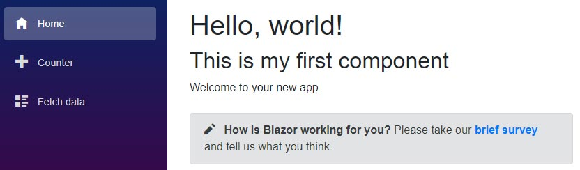

[](https://github.com/mrpmorris/blazor-university/tree/master/src/Components/CreatingAComponent)

In the Client app create a new folder named **Components**.
This is not a special name, we can choose any name we wish.

Once you've created the new **Components** folder,
create a file within it named **MyFirstComponent.razor** and enter the following mark-up.

```razor
<div>
    <h2>This is my first component</h2>
</div>
```

Now edit the **Index.razor** file.
At this point we can either reference the component with a fully qualified name:

```razor
<CreatingAComponent.Client.Components.MyFirstComponent/>
```

Or edit **/_Imports.razor** and add `@using CreatingAComponent.Client.Components`.
The using statements here are cascaded into all Razor views -
which means the mark-up to use the new component in **/Pages/Index.razor** no longer needs a namespace.

```razor
@page "/"

<h1>Hello, world!</h1>
<MyFirstComponent/>

Welcome to your new app.

<SurveyPrompt Title="How is Blazor working for you?" />
```

Now run the app and we'll see the following.


