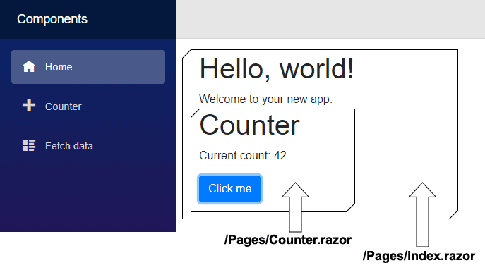

By default, rendered Blazor views descend from the `ComponentBase` class, this includes Layouts, Pages, and also Components.

A Blazor page is essentially a component with a `@page` directive that specifies the URL the browser must navigate to in
order for it to be rendered.
In fact, if we compare the generated code for a component and a page there is very little difference.

The following generated source code can be found in `obj\Debug\{DotNetVersion}\generated\Microsoft.CodeAnalysis.Razor.Compiler\Microsoft.NET.Sdk.Razor.SourceGenerators.RazorSourceGenerator\Components\Pages\Counter_razor.g.cs` - where the path after `Microsoft.NET.Sdk.Razor.SourceGenerators.RazorSourceGenerator` matches the folder layout in your project.

Note that after Blazor version 3 these files are no longer automatically written to disk.
To re-enable this feature, edit your `csproj` file and add the following:

```xml
<PropertyGroup>
 <EmitCompilerGeneratedFiles>true</EmitCompilerGeneratedFiles>
</PropertyGroup>
```

```csharp
namespace MyFirstBlazorApp.Client.Pages
{
    [Microsoft.AspNetCore.Components.RouteAttribute("/counter")]
    public class Counter : Microsoft.AspNetCore.Components.ComponentBase
    {
        protected override void BuildRenderTree(Microsoft.AspNetCore.Components.RenderTree.RenderTreeBuilder builder)
        {
            // Code omitted for brevity
        }

    private int counter = 42;

    private void IncrementCounter()
    {
        counter++;
    }
  }
}
```

`[Microsoft.AspNetCore.Components.RouteAttribute("/counter")]` identifies the URL for the page.

In fact, because pages are merely components decorated with additional attributes, if you alter the **Pages/Index.razor**
file of a default Blazor app, it is possible to embed the **Counter** page as a component.

```razor
@page "/"

<h1>Hello, world!</h1>
Welcome to your new app.
<Counter/>
```



When embedding a page within another page, Blazor treats it as a component.

If you have added an explicit [Layout](../layouts/) you will also see the attribute `[Microsoft.AspNetCore.Components.LayoutAttribute(typeof(MainLayout))]`, which identifies which layout to use.

When a page is embedded within another page like this, the `LayoutAttribute` on the embedded page is ignored because Blazor already has an explicit container - the parent component that contains it.
