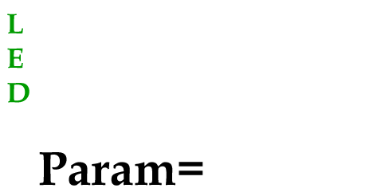
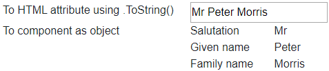

[](https://github.com/mrpmorris/blazor-university/tree/master/src/Components/LiteralsExpressionsAndDirectives)

> Note that this section does not cover Razor mark-up in general.
> It will not cover things such as conditional output, loops, and so on.
> That subject and is covered quite extensively in other places, both on the web and in books.

When consuming a component we can pass it information as parameters.
These parameters can be simple types such as integers, strings, booleans -
or they can be complex types such as a `Func<T>`, actions, or instances of complex objects.
Unlike HTML attributes, we are not limited to values that can be represented as a value in a plain HTML file.

How Blazor interprets the values we pass to the component depends on the type of the `[Parameter]` we are setting,
and whether or not we have made our intentions explicit by use of the `@` symbol.

Parameters are assigned using the `name=value` format, just as they are in HTML mark-up.
Whether we are using an expression to determine the value, a directive (a special case),
or a literal depends on the positioning (or absence of) the `@` symbol.

<table>
  <tbody>
    <tr>
      <td><strong>Position</strong></td>
      <td><strong>Type</strong></td>
      <td><strong>Example</strong></td>
    </tr>
    <tr>
      <td>Absent</td>
      <td>Literal</td>
      <td><code>&lt;MyComponent MyParameter=42/&gt;</code></td>
    </tr>
    <tr>
      <td>Right</td>
      <td>Expression</td>
      <td><code>&lt;MyComponent Value=@SomeValue/&gt;</code></td>
    </tr>
    <tr>
      <td>Left</td>
      <td>Directive</td>
      <td><code>&lt;MyComponent @Bind-Value=SomeValue/&gt;</code></td>
    </tr>
  </tbody>
</table>

An easy way to remember this is the "lightbulb method".
From right to left we spell out the abbreviation [L.E.D](https://en.wikipedia.org/wiki/Light-emitting_diode).



As with HTML mark-up, the Blazor mark-up allows us to choose whether or not we wish to enclose our values in quotes.
The following are equivalent.

```razor
<MyComponent Value=@SomeValue/>
<MyComponent Value="@SomeValue"/>
```

_My personal preference is to only enclose parameter values in quotes only when passing a literal string._

## Literals

Any value passed to an HTML attribute (not prepended with `@`) is considered a literal value.
When passing a value to a `[Parameter]` decorated property on a Blazor component this isn't always the case
(I'll go into detail [here](#inferred-expressions)), but for the most part this rule holds true.

<table>
  <tbody>
    <tr>
      <td><strong>Type</strong></td>
      <td><strong>Razor view</strong></td>
      <td><strong>HTML</strong></td>
    </tr>
    <tr>
      <td>HTML attribute</td>
      <td>&lt;input size=8/&gt;</td>
      <td>&lt;input size="8"/&gt;</td>
    </tr>
    <tr>
      <td>Component parameter</td>
      <td>&lt;MyHeader Text="Hello" Visible=<code>true</code>/&gt;</td>
      <td>&lt;h1&gt;Hello&lt;/h1&gt;</td>
    </tr>
  </tbody>
</table>

Where **MyHeader** is defined as so:

```razor
@if (Visible)
{
  <h1>@Text</h1>
}

@code
{
  [Parameter]
  public bool Visible { get; set; } = true;

  [Parameter]
  public string Text { get; set; }
}
```

With the exception of [Inferred expressions](#inferred-expressions)
(which only apply to parameters on Components, not HTML attributes),
when rendering a component what you see in the HTML is literally what you wrote in the mark-up.

## Expressions

When we need to render HTML that contains dynamic values, rather than fixed literal values, we need to use expressions.
We indicate to Blazor that we are using an expression by prepending an `@` symbol before the value we assign.
Blazor will then try to interpret the text after the `@` as a valid piece of C# code,
such as a member name, or a method invocation.

Given a code section in our component that defines the following members and values:

```razor
int InputSize = 8;
bool HeaderVisible = true;
string HeaderText = "Value of variable";

private int DoubleInputSize()
{
  return InputSize * 2;
}
```

We would expect to see the following:

<table>
  <tbody>
    <tr>
      <td><strong>Razor view</strong></td>
      <td><strong>HTML</strong></td>
    </tr>
    <tr>
      <td>&lt;input value=<code>@InputSize</code>/&gt;</td>
      <td>&lt;input value="8"/&gt;</td>
    </tr>
    <tr>
      <td>&lt;input value=<code>@DoubleInputSize()</code>/&gt;</td>
      <td>&lt;input value="16"/&gt;</td>
    </tr>
    <tr>
      <td>
        &lt;MyHeader Text=<code>@HeaderText</code>
        Visible=<code>@HeaderVisible</code>/&gt;
      </td>
      <td>&lt;h1&gt;Value of variable&lt;/h1&gt;</td>
    </tr>
  </tbody>
</table>

We can even pass more complex expressions, such as string interpolation and/or calculated values,
by enclosing the expression text in brackets.

<table>
  <tbody>
    <tr>
      <td><strong>Razor view</strong></td>
      <td><strong>HTML</strong></td>
    </tr>
    <tr>
      <td>&lt;input size=<code>@(InputSize * 3)</code> /&gt;</td>
      <td>&lt;input size="24"/&gt;</td>
    </tr>
    <tr>
      <td>&lt;input value=<code>@($"Size is {InputSize}")</code> /&gt;</td>
      <td>&lt;input value="Size is 8"/&gt;</td>
    </tr>
    <tr>
      <td>
        &lt;input value=<code>@($"Size is {DoubleInputSize()}")</code> /&gt;
      </td>
      <td>&lt;input value="Size is 16"/&gt;</td>
    </tr>
  </tbody>
</table>

### Expressions that evaluate to complex types

Complex types can also be passed as a parameter value to both HTML attributes and also Blazor components' `[Parameter]` properties.
When passing a non-simple value as an expression to an HTML attribute, Blazor will render the value using `ValuePassed.ToString()`;
when the value is being passed to a `[Parameter]` property on a Blazor component, the object itself is passed.

Take the following `Person` class as an example:

```cs
public class Person
{
  public string Salutation { get; set; }
  public string GivenName { get; set; }
  public string FamilyName { get; set; }

  public override string ToString() => $"{Salutation} {GivenName} {FamilyName}";
}
```

If we create an instance of `Person` in one of our views,
we can pass that instance as a value to a standard HTML attribute and
Blazor will use the overridden `ToString()` method to represent the value.

```razor {: .line-numbers}
<div class="row">
  <div class="col-4">To HTML attribute using .ToString()</div>
  <div class="col-8"><input readonly value=@MyPerson /></div>
</div>

@code
{
  Person MyPerson;

  protected override void OnInitialized()
  {
    base.OnInitialized();
    MyPerson = new Person
    {
      Salutation = "Mr",
      GivenName = "Peter",
      FamilyName = "Morris"
    };
  }
}
```

- **Line 8**  
    Declares a member of type `Person`
- **Line 13**  
    Creates an instance of `Person`
- **Line 3**  
    Passes the `Person` instance as an HTML attribute

The HTML rendered is as follows:

```html
<div class="row">
  <div class="col-4">To HTML attribute using .ToString()</div>
  <div class="col-8"><input readonly value="Mr Peter Morris" /></div>
</div>
```

To prove that Blazor passes objects by reference to other components,
create a new component that takes an instance of `Person` as a `[Parameter]`.
Create a new component named PersonView and enter the following mark-up:

```razor {: .line-numbers}
<div class="row">
  <div class="col-2">Salutation</div>
  <div class="col-10">@Person?.Salutation</div>
</div>
<div class="row">
  <div class="col-2">Given name</div>
  <div class="col-10">@Person?.GivenName</div>
</div><div class="row">
  <div class="col-2">Family name</div>
  <div class="col-10">@Person?.FamilyName</div>
</div>
@code
{
  [Parameter]
  public Person Person { get; set; }
}
```

- **Lines 14-15**  
    Declares a property named `Person` which is of type `Person`,
    and decorates it with the `[Parameter]` attribute so that its value may be set in Razor mark-up by any consuming components.
- **Lines 3, 7, and 10**  
    If `Person` is not null, the Salutation, GivenName, and FamilyName are displayed.

Finally, change our view so that it passes **MyPerson** to our new `PersonView` component:

```razor
<div class="row">
  <div class="col-4">To component as object</div>
  <div class="col-8">
    <PersonView Person=@MyPerson />
  </div>
</div>
```

When running the application, we can now see the result of **MyPerson** being passed to an HTML attribute,
and also to another Blazor component as an instance of `Person`.



### Inferred expressions

When passing a literal value to the parameter of a consumed component,
Blazor will need to ensure the value being passes is compatible with the target.
For example, given the component **MyHeader** that has a boolean parameter **Visible**, the following combinations are valid.

<table>
  <tbody>
    <tr>
      <td>&lt;MyComponent Visible=<code>@true</code>/&gt;</td>
      <td>An expression evaluating to <code>true</code>.</td>
    </tr>
    <tr>
      <td>&lt;MyComponent Visible="<code>@true</code>"/&gt;</td>
      <td>An expression in quotes.</td>
    </tr>
    <tr>
      <td>&lt;MyComponent Visible="<code>true</code>"/&gt;</td>
      <td>
        A literal of type <code>string</code>, inferred as the expression
        <code>@true</code>.
      </td>
    </tr>
    <tr>
      <td>&lt;MyComponent Visible=<code>true</code>/&gt;</td>
      <td>
        An unquoted literal string, again inferred to be the expression
        <code>@true</code>.
      </td>
    </tr>
  </tbody>
</table>

The first row of this table is an explicit expression, `true`.
The other rows are in fact attempting to set a `boolean` parameter to a `string` value.
In these cases, Blazor will infer our intention and pass a `boolean` value instead.

Except in the case where the property being assigned is a string,
Blazor will unquote values that are passed to other components as parameters and assume they are expressions.
The following table shows mark-up and how that mark-up is transpiled into C#.

<table>
  <tbody>
    <tr>
      <td><strong>Mark-up</strong></td>
      <td><strong>C#</strong></td>
    </tr>
    <tr>
      <td>&lt;MyComponent Visible="<code>true</code>"/&gt;</td>
      <td>Visible = true</td>
    </tr>
    <tr>
      <td>&lt;MyComponent Visible=<code>@HeaderVisible</code>/&gt;</td>
      <td>Visible = HeaderVisible</td>
    </tr>
    <tr>
      <td>&lt;MyComponent Visible="<code>HeaderVisible</code>"/&gt;</td>
      <td>Visible = HeaderVisible</td>
    </tr>
  </tbody>
</table>

In cases where the property being assigned is a string, Blazor will assume values assigned without `@` are literal values.

Given that our consuming component has a member `string HeaderText = "Value of variable"`,
and the embedded component has a `[Parameter]` decorated property `public string Text { get; set; }`
the following table shows mark-up and how it is transpiled into C#.

<table>
  <tbody>
    <tr>
      <td><strong>Mark-up</strong></td>
      <td><strong>C#</strong></td>
      <td><strong>Value</strong></td>
    </tr>
    <tr>
      <td>&lt;MyComponent Text="Hello"/&gt;</td>
      <td>Text = "Hello"</td>
      <td>"Hello"</td>
    </tr>
    <tr>
      <td>&lt;MyComponent Text=@HeaderText/&gt;</td>
      <td>Text = HeaderText</td>
      <td>"Value of variable"</td>
    </tr>
    <tr>
      <td>&lt;MyComponent Text="HeaderText"/&gt;</td>
      <td>Text = "HeaderText"</td>
      <td>"HeaderText"</td>
    </tr>
    <tr>
      <td>&lt;MyComponent Text=HeaderText/&gt;</td>
      <td>Text = "HeaderText"</td>
      <td>"HeaderText"</td>
    </tr>
  </tbody>
</table>

- The first example is unambiguous, there is no member in our consuming component named **Hello**,
  so the compiler knows we intend to set **Text** to a literal string.
- The second example is also unambiguous as we have explicitly identified this is an expression by
  prepending an `@` symbol before our value.
- The third example is ambiguous because we have a member named **HeaderText**.
  Blazor must decide if this is a literal string, or an expression.
- The fourth example might look like an unambiguous member reference but,
  because passing unquoted values is supported by both HTML and Blazor, this could easily be an unquoted literal string.

It is quite easy in Visual Studio to see how Blazor is interpreting assignments. Expressions are syntax highlighted,
whereas literals are not.

- <MyHeader Text=HeaderText Visible=`HeaderVisible`/>  
    HeaderText is a literal string, HeaderVisible is an expression.
- <MyHeader Text=`@HeaderText` Visible="`HeaderVisible`"/>  
    Both are expressions.

To avoid accidentally tripping up over inferred literals, my advice is to stick to the lightbulb method.
Always make expressions explicit by prepending them with an `@` symbol.


## Directives

Directives are a complex subject.
Because this section is about how to differentiate between literals, expressions, and directives,
they will not be covered in depth here.

Instead, directives will be covered in the [Directives](directives) section.
