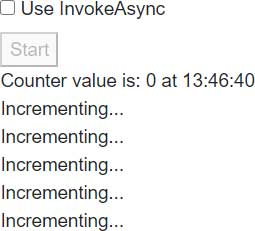
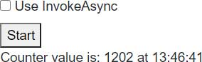
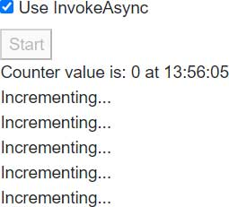
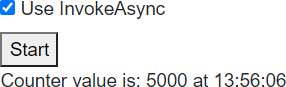

In circumstances where our code is called by a non-UI event (such as the ones outlined in [Multi-threaded rendering)](https://blazor-university.com/components/multi-threaded-rendering/),
we would ordinarily need to implement some kind of thread locking/synchronization if we intend to manipulate state.

**Recap**: Non-UI events include:

- A callback from a System.Threading.Timer
- An event triggered by another thread on a Singleton instance shared by multiple users
- A data push from another server we've connected to via a Web Socket.

To avoid having to write thread-safe code, people writing a WPF app might use `Dispatcher.Invoke` to ensure the UI thread
executes the code, and WinForms developers might use the `Invoke` method of the form.
Any code invoked in this manner is always executed by a specific thread (the UI thread), which avoids the use for thread
synchronizing code.

The [StateHasChanged](https://blazor-university.com/components/component-events/) framework method, which is used to tell
Blazor to re-render our component, does not allow multiple threads to access the rendering process at the same time.
If `StateHasChanged` is called by a secondary thread an exception will be thrown.

> System.InvalidOperationException: The current thread is not associated with the Dispatcher.

In a server-side Blazor application, there is a single dispatcher associated with each connection (each browser tab).
When we use `InvokeAsync` we are executing actions via this dispatcher (just like WPF `Dispatcher.Invoke` or WinForms `Control.Invoke`).

When calling `StateHasChanged` in one the previously outlined scenarios (executing code from a `Thread` etc.),
it is necessary to invoke it via the `InvokeAsync()` method.
The `InvokeAsync` will serialize the work, and so will avoid `StateHasChanged` throwing an exception.

Although methods will be executed by any number of different threads, only one thread will be accessing components at
any given moment, eliminating the need to write thread-locking/synchronization code around shared state.

## InvokeAsync example

[](https://github.com/mrpmorris/blazor-university/tree/master/src/Components/UsingInvokeAsync)

To demonstrate the different in behavior between executing component methods directly from a thread vs executing via `InvokeAsync`,
we'll create a server-side application that will show how multiple concurrent threads can corrupt shared state.

After creating a new Blazor server-side application, add a static class that will store an integer value that can be
accessed by multiple components/threads.

```cs
public static class CounterState
{
  public static int Value { get; set; }
}
```

### Displaying the state

We'll show the value of this state in a component, and have the value checked twice per second.
To do this, we'll create a component in the **/Shared** folder named **ShowCounterValue.razor**.

```razor
@implements IDisposable
<div>
  Counter value is: @CounterState.Value at @DateTime.UtcNow.ToString("HH:mm:ss")
</div>

@code
{
  private System.Threading.Timer Timer;

  protected override void OnInitialized()
  {
    base.OnInitialized();
    Timer = new System.Threading.Timer(_ =>
    {
      InvokeAsync(StateHasChanged);
    }, null, 500, 500);
  }

  void IDisposable.Dispose()
  {
    Timer?.Dispose();
    Timer = null;
  }
}
```

- **Line1**  
    Declares our component implements `IDisposable`
- **Line 3**  
    Displays the current value of `CounterState.Value` along with the current time.
- **Line 13**  
    When the component initializer, a `System.Threading.Timer` is created that will execute `StateHasChanged` every 500 milliseconds.
    It is invoked via `InvokeAsync` to prevent Blazor throwing an exception telling us we are calling `StateHasChanged`
    from a thread.
- **Line 21**  
    Disposes the timer when the component is disposed.

**Note:** If the timer is not disposed then it will remain active for the lifetime of the user session.
If the timer remains active, then the component will not be garbage collected because the timer callback holds an implicit
reference to the component via its `InvokeAsync` and `StateHasChanged` methods.

### Modifying the state

We'll now create a component that will increment the `CounterState.Value` field.
Each component will perform a loop in a thread and update the `Value` 1000 times.
We can then have multiple instances of this component on our main page, to ensure multiple threads are updating the state.

Note: This component will be passed a `System.Threading.WaitHandle`.
The component's thread will be suspended until the main page triggers this `WaitHandle`,
triggering all threads to start looping at the same time.

In the **/Shared** folder, create a new file named **IncrementCounter.razor**.
We'll start off with some text to show the component exists on the page, a parameter to accept the required `WaitHandle`,
and a parameter to indicate if we want to use `InvokeAsync` to increment the value or not.

```razor
<div>
  Incrementing...
</div>
@code
{
  [Parameter]
  public bool ShouldUseInvokeAsync { get; set; }

  [Parameter]
  public System.Threading.WaitHandle Trigger { get; set; }

   // More to come
}
```

To increment the `CounterState.Value`, we'll create a thread in the `OnInitialized` [lifecycle method](https://blazor-university.com/components/component-lifecycles/).
We'll start the thread immediately, but the first instruction in the thread will be to suspend itself until our
`WaitHandle` is triggered.

```razor
protected override void OnInitialized()
{
  var thread = new System.Threading.Thread(_ =>
  {
    Trigger.WaitOne();
    for (int i = 0; i < 1000; i++)
    {
      if (!ShouldUseInvokeAsync)
      {
        CounterState.Value++;
      }
      else
      {
        InvokeAsync(() => CounterState.Value++);
      }
    }
  });

  thread.Start();
}
```

- **Line 1**  
    Override `OnInitialized`.
- **Line 3**  
    Create a `Thread` to modify the shared state.
- **Line 5**  
    The first thing the thread should do is to wait for the parent page's `WaitHandle` to be triggered.
- **Line 6**  
    Perform 1000 changes to the shared state.
- **Line 8**  
    Check if we should use `InvokeAsync` or not.
- **Line 10**  
    Change the shared state directly from the `Thread`.
- **Line 14**  
    Use `InvokeAsync` to ensure sequential access when changing the shared state.
- **Line 19**  
    Start the `Thread` so it can wait to be triggered.

### Using the components to demonstrate state conflict

The final step is to create some mark-up in our `Index` page that will create 5 of these components.

To make the application more interesting, we will also

1. Have a checkbox that will allow the user to specify if they want state changes to be performed via `InvokeAsync`.
2. Allow the user to reset the state of the app and try again by clicking a button.

We'll need some component state in our `Index` page to indicate that we are currently running a test, if the user wants
to use `InvokeAsync`, and a `System.Threading.ManualReset` object that we can pass to our `IncrementCounter` to trigger
the processing of their threads.

```cs
private bool IsWorking;
private bool UseInvokeAsync;
private System.Threading.ManualResetEvent Trigger = new System.Threading.ManualResetEvent(false);
```

For the mark-up, we'll need to use [Two-way binding](https://blazor-university.com/components/two-way-binding/) to bind
our `IsWorking` field to an HTML `<input>` element.

```razor
<div>
  <input type="checkbox" @bind=UseInvokeAsync id="UseInvokeAsyncCheckbox" />
  <label for="UseInvokeAsyncCheckbox">Use InvokeAsync</label>
</div>
```

Followed by a button the user can click to start a test run. The button should be disabled during the duration of a test
run.

```razor
<div>
  <button @onclick=Start disabled=@IsWorking>Start</button>
</div>
```

We'll also want to use our `ShowCounterValue` to keep our user informed of the current value of `CounterState.Value`.

```razor
<ShowCounterValue />
```

And, finally for the mark-up, we will want to create 5 instances of the `IncrementCounter` component.
These components will only be created once the test run starts, and will be disposed of once the run has completed.
To achieve this, we only render them if `IsWorking` is `true`.

```razor {: .line-numbers}
@if (IsWorking)
{
  for (int i = 0; i < 5; i++)
  {
    <IncrementCounter Trigger=@Trigger ShouldUseInvokeAsync=@UseInvokeAsync />
  }
}
```

- Line 1  
    Only renders the components if `IsWorking` is `true`, indicating that a test run is in progress.
- Line 3  
    A loop to create 5 instances of our `IncrementCounter` component.
- Line 5  
    Creates an instance of `IncrementCounter`, passing in our `ManualResetEvent` (Trigger) and a `boolean` indicating if
    the user clicked **Use InvokeAsync** in the UI or not.

The only code we have to write now is the `Start` method.
This will simply reset the state, set `IsWorking` to true, trigger our components to start incrementing,
and then set `IsWorking` to false.

The `Index` page should now look like so:

```razor {: .line-numbers}
@page "/"
<div>
  <input type="checkbox" @bind=UseInvokeAsync id="UseInvokeAsyncCheckbox" />
  <label for="UseInvokeAsyncCheckbox">Use InvokeAsync</label>
</div>
<div>
  <button @onclick=Start disabled=@IsWorking>Start</button>
</div>
<ShowCounterValue />
@if (IsWorking)
{
  for (int i = 0; i < 5; i++)
  {
    <IncrementCounter Trigger=@Trigger ShouldUseInvokeAsync=@UseInvokeAsync />
  }
}

@code
{
  private bool IsWorking;
  private bool UseInvokeAsync;
  private System.Threading.ManualResetEvent Trigger = new System.Threading.ManualResetEvent(false);

  private async Task Start()
  {
    CounterState.Value = 0;
    IsWorking = true;
    StateHasChanged();

    await Task.Delay(500);
    Trigger.Set();

    await Task.Delay(1000);
    IsWorking = false;
    Trigger.Reset();
  }
}
```

- **Line 3**  
    Bind an HTML `<input>` to `UseInvokeAsync`.
- **Line 7**  
    A button that executes the `Start` method when clicked. The button is disabled if `IsWorking` is `true`.
- **Line 9**  
    Updates the UI with the current value of `CounterState.Value`.
- **Line 14**  
    Render some `IncrementCounter` components, but only if `IsWorking` is `true`.
- **Lines 26-28**  
    Reset the shared state to zero.
- **Line 30**  
    Wait for 500 milliseconds to give the threads in all of the components a chance to get started.
- **Line 31**  
    Trigger our `ManualResetEvent` (Trigger) so that all `IncrementCounter` components' threads can resume and start to
    modify shared state at the same time.
- **Lines 33-35**  
    Wait 1 second for the test to complete, and then reset `IsWorking` and our `ManualResetEvent` so they are ready for
    another rest run.

## Running the example application

### Running without InvokeAsync

Run the application, and for the first test leave the **Use InvokeAsync** checkbox unticked.
Then click the **Start** button and you'll see something like the following image.



Followed 1 second later with a screen that looks like the following image.
Note how the final `CounterState.Value` in my case is only 1202.
Considering there are 5 components, each incrementing the value by 1 in a 1000 iteration loop,
ideally we should be seeing 5000 as the final value.



### Running with InvokeAsync

Next, tick the checkbox and click the **Start** button again.



One second later, the rest run will complete and we see a much more desirable result.



## Summary

When working with UI triggered events (button clicks, navigation events, etc.), we don't need to make any special considerations
for thread safety.
Blazor will manage this for us, and ensure only a single thread is executing component code at any one time.

When non-UI events trigger our code, then in a server-side Blazor app then this code will be triggered in an
unsynchronized thread.
It is not possible to call `StateHasChanged`, and access to any shared state is prone to corruption due to [thread race conditions](https://en.wikipedia.org/wiki/Race_condition).

**Note**: Blazor WebAssembly apps are single-threaded so do not have to account for thread safety.

The Blazor `InvokeAsync`, introduced on the class `ComponentBase`, will ensure that race conditions do not occur by synchronizing
thread execution per-user connection.

Blazor is able to ensure that only a single thread is executing code at any given time by executing code via a Dispatcher
that is created when a user connects to the Blazor server-side application.

One possible complication to consider is that the Blazor Dispatcher will not ensure an entire piece of code runs to execution
before the next dispatched code is executed.
If all of the actions dispatched are synchronous code then this is the case, however,
if any of the dispatched actions are asynchronous then that thread will relinquish its execution time as soon as it executes
an `await` on some asynchronous code such as `Task.Delay` or an HTTP request.

This means that although Blazor's `InvokeAsync` can guarantee threads are synchronized in their execution, it does not
mean we can do without thread-safe code when using asynchronous resources such as queries to Entity Framework Core.

The following code executed by two separate threads will result in more than one thread trying to use the same
Entity Framework Core `DbContext` at the same time, even when invoked via `InvokeAsync`.

```razor
IsLoading = true;
StateHasChanged();

Person[] people = await ApplicationDbContext.Person.ToArrayAsync();
IsLoading = false;
```

This is because the `await` statement relinquishes execution and allows Blazor to let a different logical chunk of code
to execute.

<table>
  <thead>
    <tr>
      <th>First InvokeAsync</th>
      <th>Second InvokeAsync</th>
    </tr>
  </thead>
  <tbody>
    <tr>
      <td>
        <pre>
          <code class="language-razor">
IsLoading = true;
StateHasChanged();
... await
          </code>
        </pre>
      </td>
      <td>
      <td></td>
    </tr>
    <tr>
      <td></td>
      <td>
        <pre>
          <code class="language-razor">
IsLoading = true;
StateHasChanged();
... await
          </code>
        </pre>
      </td>
    </tr>
    <tr>
      <td>
      <pre>
        <code class="language-razor">
Person[] people = (result from await)
        </code>
      </pre>
      </td>
      <td></td>
    </tr>
    <tr>
      <td></td>
      <td>
      <pre>
        <code class="language-razor">
Person[] people = (result from await)
        </code>
      </pre>
      </td>
    </tr>
    <tr>
      <td></td>
      <td></td>
    </tr>
  </tbody>
</table>

In the preceding illustration, at step 2 the `ApplicationDbContext` has been instructed by two separate threads to perform
an asynchronous operation. Because Entity Framework Core does not support thread reentrancy,
it will throw an exception telling us that only a single thread may access the `DbContext` at any given time.

So, although shared state is safe in synchronous code when executed via `InvokeAsync`, keep in mind that as soon as your
code introduces an `await` it allows other threads the opportunity to step in until the `await` is complete.
