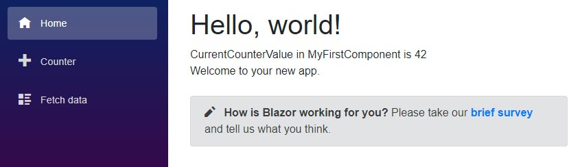
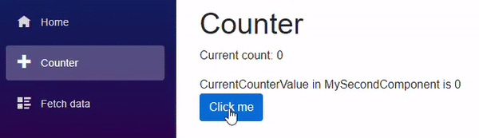

[](https://github.com/mrpmorris/blazor-university/tree/master/src/Components/OneWayBinding)

At this point we have a component displaying inside a page, but the content is static.
What we really want is to be able to output content dynamically.

If we alter the contents of **/Components/MyFirstComponent.razor** we can introduce a private member and
output the value of that member using the `@` symbol.

```razor
<div>
  CurrentCounterValue in MyFirstComponent is @CurrentCounterValue
</div>

@code {
  private int CurrentCounterValue = 42;
}
```



## Receiving values via Parameters

`CurrentCounterValue` within the component always shows the value "42",
but what if we wanted the parent component to tell us which value to show?
To achieve this, create a new component named **MySecondComponent** and copy the mark-up from **MyFirstComponent**,
then change the private member to a public property.

```razor
<div>
  CurrentCounterValue in MySecondComponent is @CurrentCounterValue
</div>

@code {
  public int CurrentCounterValue { get; set; }
}
```

Edit the Counter page, add a MySecondComponent component, and set its CurrentCounterValue, like so:

```razor
<MySecondComponent CurrentCounterValue=@currentCount/>
```

Running the app and navigating to the Counter page will now show an error in the browser's console window.

>WASM: System.InvalidOperationException: Object of type 'OneWayBinding.Client.Components.MySecondComponent'
has a property matching the name 'CurrentCounterValue',
but it does not have `[ParameterAttribute]` or `[CascadingParameterAttribute]` applied.

This tells us clearly what is missing.
To add a parameter to our component we must decorate our component's property with a `[Parameter]` attribute.

```razor
<div>
  CurrentCounterValue in MySecondComponent is @CurrentCounterValue
</div>

@code {
  [Parameter]
  public int CurrentCounterValue { get; set; }
}
```

This informs Blazor we want a parameter on our component that is settable via what looks like an HTML attribute.
Whenever the parent component is rerendered, Blazor will also rerender any child component it provides parameter values to.
This ensures the child component is rerendered to represent any possible change
in the state passed down to the component via a `[Parameter]` decorated property.

If we run our application again and navigate to the Counter page, we'll see that whenever the `currentCount` in the
Counter page changes it will push that change down to our embedded component via its `CurrentCounterValue` property.



**Note**: Parameters must be `public` properties.

Before continuing to learn how two-way binding works, we first need to learn about Component Events, and Directives.
