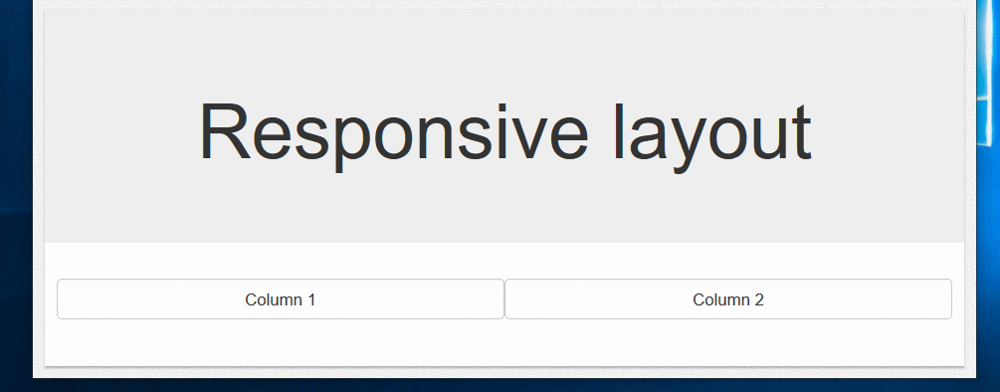
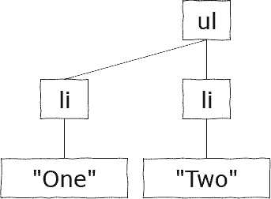
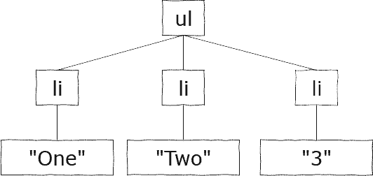
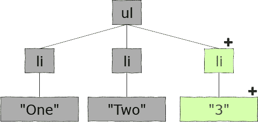
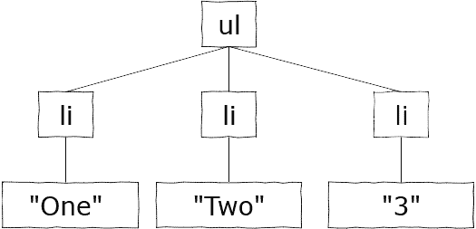
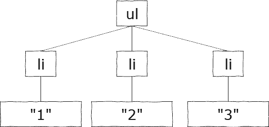
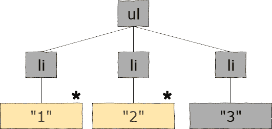

When a browser renders content it not only draws the elements defined in the HTML,
it also has to calculate where to draw them based on the page size (element-flow).
For example, the following Bootstrap HTML will place elements in different places as the browser window is resized.

```razor
<div class="text-center jumbotron">
  <h1>Responsive layout</h1>
</div>
  
<div class="container">
  <div class="row">
    <div class="col-sm-6 col-xs-12 btn btn-default">
      Column 1
    </div>
    <div class="col-sm-6 col-xs-12 btn btn-default">
      Column 2
    </div>
  </div>
</div>
```



Layout changing as the browser resizes.

Any time an attribute of an HTML element changes (`width`, `height`, `padding`, `margin`, etc.)
the browser must reflow the elements on the page before rendering them.
Updating the browser's document-object-model (DOM) can be very CPU intensive, and therefore slow,
especially when performing lots of updates.

## The Virtual DOM

Other client-side tools such as React and Angular circumvent this problem by implementing both a Virtual DOM,
and an Incremental DOM approach.

A Virtual DOM is an in-memory representation of the elements that will make up the HTML page.
This data creates a tree of HTML elements as if they had been specified by an HTML mark-up page.
Blazor components create this Virtual DOM in its Razor views via a virtual method named `BuildRenderTree`.
For example, the `BuildRenderTree` for the standard **Pages/Index.razor** page looks like this.

```razor
protected override void BuildRenderTree(Microsoft.AspNetCore.Components.Rendering.RenderTreeBuilder builder)
{
  builder.AddMarkupContent(0, "<h1>Hello, world!</h1>\\r\\n\\r\\nWelcome to your new app.\\r\\n\\r\\n");
  builder.OpenComponent<MyFirstBlazorApp.Client.Shared.SurveyPrompt>(1);
  builder.AddAttribute(2, "Title", "How is Blazor working for you?");
  builder.CloseComponent();
}
```

Building a data tree that represents the view to be rendered has two significant benefits:

1. Attribute values of those virtual HTML elements can be updated many times in code during a complex update process
   without the browser having to re-render and reflow its view until after the process has finished.
2. Render trees can be created by comparing two trees and building a new tree that is the difference between the two.
   This allows us to utilize an Incremental DOM approach.

## The Incremental DOM

Incremental DOM is a technique that minimizes the amount of work needed to update the elements in a browser's view.

Being able to create a diff tree gives us the ability to represent changes to the view using the smallest number of
changes possible required to update the DOM.
This saves time when changing the display (so the user-experience is better),
and in Server-Side Blazor apps it means fewer bytes over the network -
making a Blazor app more useable on slow networks or very remote locations.

## Example 1 - Adding a new list item

Imagine our user is using a Blazor app that shows a list of items. They click a button to add a new item to the list -
which is automatically given the text "3".

**Render 1**: The current Virtual DOM for the view in the browser consists of a list with two items.



Current view

**Render 1**: The app adds a new item to the list. Blazor represents this in a new Virtual DOM.



Next view

**Render 1**: The following differential tree is determined to be the fewest number of changes required.
In this case, one new `<li>` and one new text element `"3"`.



Differential tree

The differential render tree is then used to update the actual HTML DOM in the browser.

## Example 2 - Changing display text

The user sees the list "One", "Two", "3" and decides they would prefer to see numerical digits.
They click another button which changes the text of each list item to its index in the list.

**Render 2**: The current Virtual DOM for the view in the browser consists of a list with three items.



Current view

**Render 2**: The app changes the text of all the items in the list. Again, Blazor represents this in a new Virtual DOM.



Next view

**Render 2**: The following differential tree is determined to be the fewest number of changes required. In this case,
only two changes to existing text elements.



Differential tree

The differential render tree is then used to update the actual HTML DOM in the browser.
