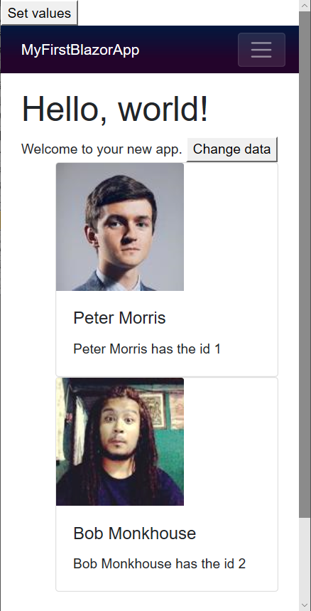

[](https://github.com/mrpmorris/blazor-university/tree/master/src/RenderTrees/OptimisingUsingKeys)

**Tip**: Always use `@key` for components that are generated in a loop at runtime.

The previous example worked well because Blazor was able to easily match Virtual DOM elements to the correct elements in
the browser's DOM, when the elements are matched successfully it is easier to update them using fewer changes.

When elements are re-arranged, however, this becomes more difficult. Take for example a list of user ID cards.



Using Incremental [RenderTree Proof](http://components/render-trees/incremental-rendertree-proof) as a starting point,
edit **/Pages/Index.razor** and enter the following mark-up.

```razor {: .line-numbers}
@page "/"

<h1>Hello, world!</h1>

Welcome to your new app.
<button @onclick=@ChangeData>Change data</button>

<style>
    .card-img-top {
        width: 150px;
        height: 150px;
    }
</style>
<ol>
    @foreach (Person person in People)
    {
        <li class="card">
            
            <div class="card-body">
                <h5 class="card-title">
                    @person.GivenName @person.FamilyName
                </h5>
                <p class="card-text">
                    @person.GivenName @person.FamilyName has the id @person.ID
                </p>
            </div>
        </li>
    }
</ol>

@code {
    List<Person> People = new List<Person>
    {
        new Person(1, "Peter", "Morris"),
        new Person(2, "Bob", "Monkhouse"),
        new Person(3, "Frank", "Sinatra"),
        new Person(4, "David", "Banner")
    };

    void ChangeData()
    {
        var person = People[0];
        People.RemoveAt(0);
        People.Add(person);    }

    class Person
    {
        public int ID { get; set; }
        public string GivenName { get; set; }
        public string FamilyName { get; set; }

        public Person(int id, string givenName, string familyName)
        {
            ID = id;
            GivenName = givenName;
            FamilyName = familyName;
        }
    }
}
```

The page is essentially the same as it was previously when we were showing a simple list of integers,
but now has the following changes.

- **Line 46**  
    A new class named **Person** is defined.  
    **_Note_**: This new class would normally be in its own source file, but is placed in-line in this example for simplicity.
- **Line 32**  
    Defines a private member named **People** and adds two items to display in the view.
- **Line 40**  
    Removes the person at the start of the list, and adds them to the end of the list.
- **Line 15**  
    Renders the list of people as Bootstrap cue-cards.

Now run the application. Click the **Set values** button and inspect the elements in the list,
we will see something like this:

```html
<ol>
  <li class="card" originalValue=" Peter Morris Peter Morris has the id 1">
    ...Html for Peter Morris
  </li>
  <li class="card" originalValue=" Bob Monkhouse Bob Monkhouse has the id 2">
    ...Html for Bob Monkhouse
  </li>
  <li class="card" originalValue=" Frank Sinatra Frank Sinatra has the id 3">
    ...Html for Frank Sinatra
  </li>
  <li class="card" originalValue=" David Banner David Banner has the id 4">
    ...Html for David Banner
  </li>
</ol>
```

But when we click the **Change data** button and then inspect the elements again we see that despite the elements in the
data are the same (just reordered), all of the elements in the HTML have been updated.
This is evident from the fact that the **originalValue** represents the person previously held by that element,
this means many child elements had to be updated in order to show the correct HTML mark-up.

```html
<ol>
  <li class="card" originalValue=" Peter Morris Peter Morris has the id 1">
    ...Html for Bob Monkhouse
  </li>
  <li class="card" originalValue=" Bob Monkhouse Bob Monkhouse has the id 2">
    ...Html for Frank Sinatra
  </li>
  <li class="card" originalValue=" Frank Sinatra Frank Sinatra has the id 3">
    ...Html for David Banner
  </li>
  <li class="card" originalValue=" David Banner David Banner has the id 4">
    ...Html for Peter Morris
  </li>
</ol>
```

The delta for these changes would look something like the following:

- **Element 1**  
    1.jpg => 2.jpg  
    Peter Morris => Bob Monkhouse
- **Element 2**  
    2.jpg => 3.jpg  
    Bob Monkhouse => Frank Sinatra
- **Element 3**  
    3.jpg => 4.jpg  
    Frank Sinatra => David Banner
- **Element 4**  
    4.jpg => 1.jpg  
    David Banner => Peter Morris  

Altogether there are three HTML elements that have changed for each person.
It would be better if Blazor could detect when elements have been rearranged.
That way, when the data is rearranged, the delta changes from Virtual DOM to browser DOM will also be a simple re-arrangement.

## Identifying elements with @key

This is exactly what the **@key** directive is for.
Edit line 17, change **<li class="card">** and add a key, like so:

```razor
<li class="card" @key=person>
```

1. Run the app.
2. Click the **Set values** button.
3. Click the **Change data** button.
4. Right-click the first item in the list and inspect the element.

Now instead of seeing element 1 containing the inner HTML of person 2, we will see the inner HTML has remained completely
untouched, and the `<li>` elements have simply been rearranged.

```html
<ol>
  <li class="card" originalValue=" Bob Monkhouse Bob Monkhouse has the id 2">
    ...Html for Frank Sinatra
  </li>
  <li class="card" originalValue=" Frank Sinatra Frank Sinatra has the id 3">
    ...Html for David Banner
  </li>
  <li class="card" originalValue=" David Banner David Banner has the id 4">
    ...Html for Peter Morris
  </li>
  <li class="card" originalValue=" Peter Morris Peter Morris has the id 1">
    ...Html for Bob Monkhouse
  </li>
</ol>
```

Clearly it is advantageous to use the **@key** directive any time you render items from a list when you expect the data
to either be re-arranged, or any items added / removed from anywhere other than the end of the list.

The value used for `@key` can be any type of object. We can use the `Person` instance itself or,
if the instances in the list change, then we can use something like `Person.ID` instead.
