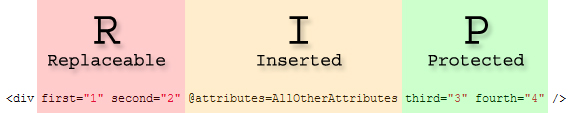

[](https://github.com/mrpmorris/blazor-university/tree/master/src/Components/ReplacingChildAttributes)

So far we've seen how to create [code-generated attributes](https://blazor-university.com/components/code-generated-html-attributes/),
and also how to [capture unexpected parameters](https://blazor-university.com/components/capturing-unexpected-parameters/).
In addition to these two techniques, Blazor also allows us to override/replace existing attributes in a child component.

Take the following page mark-up:

```razor
<ChildComponent first="consumer-value-1" second="consumer-value-2" />
```

Which consumes the following child component:

```razor
<div @attributes=AllOtherAttributes>
  Right-click and inspect the HTML for this element to see the results!
</div>

@code
{
  [Parameter(CaptureUnmatchedValues=true)]
  public Dictionary<string, object> AllOtherAttributes { get; set; }
}
```

As we've seen before in [Code-generated attributes](https://blazor-university.com/components/code-generated-html-attributes/),
the `ChildComponent` will capture the attributes provided by the consumer (`first` and `second`) into our parameter `AllOtherAttributes`
and the call to `@attributes=AllOtherAttributes` will instruct Blazor to output the name/value pairs in our
`Dictionary<string, object>`.
The preceding code will output the following HTML.

```html
<div first="consumer-value-1" second="consumer-value-2">
  Right-click and inspect the HTML for this element to see the results!
</div>
```

## Replacing child attributes

What if we want to specify default values for `first` and `second` to output whenever the consumer does not provide them?
It might be tempting to override [SetParametersAsync](https://blazor-university.com/components/component-lifecycles/) 
and insert values if they are not set, but there is a much easier way!

All we have to do is to write out our default values as part of our child component's mark-up, and the `@attributes=` 
directive will override them with any values that have been passed by the consumer.
So, if we change our child component to specify some default attribute values, like so:

```razor
<div first="1" second="2" third="3" fourth="4"  @attributes=AllOtherAttributes>
  Right-click and inspect the HTML for this element to see the results!
</div>
```

then we can replace those default values from our consumer like so:

```razor
<ChildComponent first="consumer-value-1" second="consumer-value-2" />
```

which would render the following HTML:

```html
<div first="consumer-value-1" second="consumer-value-2" third="3" fourth="4">
  Right-click and inspect the HTML for this element to see the results!
</div>
```

Our child component will always render all four of its HTML attributes, but will also allow the consumer to replace
their values.

## Protecting attributes against being replaced

In some scenarios we may wish to allow our component's consumer to replace some of the attributes,
but we would like to protect other attributes against being altered. For example:

```razor
<input class="form-control" type="number" @attributes=AllOtherAttributes />
```

In this hypothetical `InputNumber` control we would want to allow our consumer to replace the default CSS `class` attribute,
but wouldn't want them to accidentally change the `type` from `number` to `checkbox`.

In Blazor the placement of our `@attributes=` directive is important.
Any attribute preceding the directive (above it, or to its left) can have its value replaced by the consumer,
but all of the attributes following it (below it, or to its right) are protected against having their values replaced.

Given the following consumer markup:

```razor
<ChildComponent
  first="consumer-value-1"
  second="consumer-value-2"
  inserted="consumer-inserted-value" />
```

then adjusting the position of `@attributes=` in our `ChildComponent` will give us the following outputs:

```razor
// Example 1
<div
  @attributes=AllOtherAttributes
  first="1"
  second="2" />

// Generated HTML
<div
  inserted="consumer-inserted-value
  first="1"
  second="2" />

// Example 2
<div
  first="1"
  @attributes=AllOtherAttributes
  second="2" />

// Generated HTML
<div
  first="consumer-value-1"
  inserted="consumer-inserted-value
  second="2" />

// Example 3
<div
  first="1"
  second="2"
  @attributes=AllOtherAttributes />

// Generated HTML
<div
  first="consumer-value-1"
  second="consumer-value-2"
  inserted="consumer-inserted-value />
```

## R.I.P. default values

A simple way to remember which values take priority is using the "R.I.P. method".

The `@attributes=` directive will always insert additional values from the consumer, so think of the `I` as meaning `inserted`.
Every attribute value preceding the `I` can be **R**eplaced, every attribute value following the `I` is **P**rotected.

```razor
<div first="1" second="2" @attributes=AllOtherAttributes third="3" fourth="4" />
```


