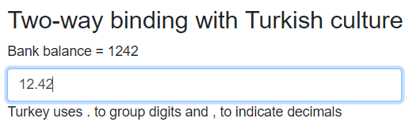

[](https://github.com/mrpmorris/blazor-university/tree/master/src/Components/BindingDirectives)

We covered [Directives](/components/literals-expressions-and-directives/directives/) earlier -
if you are unfamiliar with directives, please read the section about them before you continue.

We previously covered Directives, and Directive Attributes.
In this section we will cover assigning values to Directive Attributes 
by demonstrating how they are utilized when using two-way binding.

As a quick recap, a Directive is an identifier within an element that starts with an `@` symbol. For example

```razor
<h1 @ref=OurReferenceToThisElement>Hello</h1>
```

A Directive Attribute is additional information provided to the directive in the form `@directive:attribute`.
For example, the `preventDefault` attribute applied to the `@onclick` directive would prevent
a submit button from actually submitting a form.

```razor
<input type="submit" @onclick:preventDefault>
```

In addition to these, it is also possible to assign values to some directive attributes in the following form:

```razor
<h1 @directive:attribute="someValue">Hello</h1>
```

Although there is no reason why these attribute values should be constrained to two-way binding in particular,
it just so happens that the only place currently in the Blazor framework that utilizes this ability happens to be two-way
binding, which is why this subject is covered beneath the two-way binding section.

## Getting started

**Note:** Although we will use the HTML `<input>` element here for simplicity, for a richer user experience
(adding validation etc.) I recommend using the Blazor `<Input*>` components (InputDate, etc.) within an `<EditForm>` component.
These are covered in the section on [Forms](/forms).

First we need a page with the following members defined in the `@code` section, so we have something to bind to:

```razor
@code
{
  private string Name;
  private DateTime? DateOfBirth;
  private decimal? BankBalance;
}
```

### Standard two-way binding

First we'll start off with a standard two-way binding to the `Name` member of our Blazor page.

```razor
<label>Name = @Name</label>
<input @bind-value=Name/>
```

The important part of the preceding mark-up is `@bind-value=Name`.
This sets up two-way binding for the HTML attribute named `value` on the `<input>` element, and binds it to the `Name` member.

If we run our app now, we will see that the `Name = @Name` text above the input does not change to reflect what we type
in the `<input>` until either after the input element loses focus, or we press the Enter key.

### Immediate change detection using directive attributes

The `@bind` directive has a directive attribute named `event`. Setting the value for this directive form takes the following format:

```razor
<input @bind-value:event="x"/>
```

Valid values for "x" are either **onchange** or **oninput**.

**onchange** is the assumed default when no value for `:event` is specified.
It is the behaviour we saw when we ran our sample -
the binding only occurs when the control loses focus or when the user presses the enter key.

**oninput** is the only other possible value for `:event`,
and instructs Blazor to hook into the JavaScript oninput event of
the HTML element and update the bound member every time the event is fired.
This results in the bound member being updated immediately every time the user changes the value in the input.

**Note**: The `-value` is the name of the HTML attribute or Blazor component property to bind to.
For HTML elements the leading letter will be lowercase, for component properties the leading letter will be uppercase,
the name of the directive and the name of the binding target are separated by the `-` symbol.

Add the following mark-up to our page and run the application.

```razor
<label>Name = @Name</label>
<input @bind-value=Name @bind-value:event="oninput"/>
```

`@bind-value:event="oninput"` is the key to instructing Blazor to use immediate change detection.
First we tell Blazor we want to bind the `value` HTML attribute of `input` to our **Name** member (`@bind-value=Name`),
and then we tell Blazor to hook into the `oninput` event of the HTML element so our binding occurs immediately
every time the value of the element changes (`@bind-value:event="oninput"`).

### Specifying a custom binding format

Specifying a custom format to use in the user interface is achieved by specifying
 a value for the `@bind` directive's `format` attribute.

Add the following mark-up to our page and run the application.

```razor
<label>Date of birth = @DateOfBirth?.ToString("MMMM d, yyyy")</label>
<input @bind-value=DateOfBirth @bind-value:format="yyyy-MM-dd"/>
```

When the app runs, enter an ISO formatted date (such as **1969-07-21**).
Although the date is displayed in the `<label>` as **July 21, 1969**,
the `<input>` control displays it in the ISO specified we specified in `@bind-value:format="yyyy-MM-dd"`.

**Note:** Any value entered that does not match the specified format will be discarded. Because of this,
we cannot set `@bind-value:event="oninput"`, because Blazor will try to parse the input on every keypress,
but the value entered cannot possibly be valid after only a single keypress,
and so the input value will simply disappear.
This is one of the reasons I recommend use of the Blazor `<Input*>` components inside an [EditForm](/forms) when editing
data, because this gives us the ability to use components such as `<InputDate>`.

As mentioned in the section [Descending from InputBase<T>](/forms/descending-from-inputbase/),
the Blazor input components have a pair of complementing protected methods for working with translating the bound value
to and from strings.

#### How it works

The `@bind` directive doesn't add code to bind directly to our member and simply convert it to/from string values.
Instead, it redirects presentation of the current value and parsing of input values through a `BindConverter`.

If we look in the **.cs** file Blazor generates for a one-way binding such as `class=@OurCssClass` we'll see C# that looks
something like this (edited for brevity).

```cs
protected override void BuildRenderTree(RenderTreeBuilder __builder)
{
  _builder.AddAttribute(1, "class", OurCssClass);
}
```

Now if we look at the generated file for two-way binding we'll see something similar to the following (abridged) code for displaying the value:

```cs
protected override void BuildRenderTree(RenderTreeBuilder __builder)
{
  _builder.AddAttribute(1, "value",
    ...BindConverter.FormatValue(Name));
```

And something similar to the following (again abridged) code for converting user input back into the bound member.

```cs
  __builder.AddAttribute(11, "onchange",
    ...EventCallback.Factory.CreateBinder(this, __value => Name = __value, Name));
}
```

The code hooks into the HTML `onchange` event and then, via the binder, sets our member value when the event is triggered.

The difference when setting the `@bind-value:format` directive attribute value is that the format we
provide is passed in the generated code to both `BindConverter.Format` and `EventCallback.Factory.CreateBinder`.

```cs
...BindConverter.FormatValue(Name, format: "yyyy-MM-dd");
// and
CreateBinder(...., format: "yyyy-MM-dd");
```

### Specifying a custom culture

People of the world have different customs and cultures,
this is one of the things that makes the world such an interesting place.
Unfortunately, this is also one of the things that makes writing software more difficult.

Add the following mark-up to our page:

```razor
<label>Bank balance = @BankBalance</label>
<input @bind-value=BankBalance @bind-value:culture=Turkish/>
```

And ensure the following member is added to the page in the `@code` section:

```razor
private CultureInfo Turkish = CultureInfo.GetCultureInfo("tr-TR");
```

Entering the value **12.42** one might expect to have a balance of just over 12 Turkish Lira but,
as we can see, we have just accidentally given someone **1,242** Turkish Lira.
Of course, someone living in Turkey would have known to type in **12,42** instead -
but this highlights the need to specify cultures correctly when our application is intended for use in other countries.



As with the **format** directive attribute, the `@bind-value:culture` specified will be passed as a named (optional) value
to both the `Binder` and `BindConverter`.

If you have not heard of **The Turkey test**, then I recommend reading [this excellent article](http://www.moserware.com/2008/02/does-your-code-pass-turkey-test.html).
