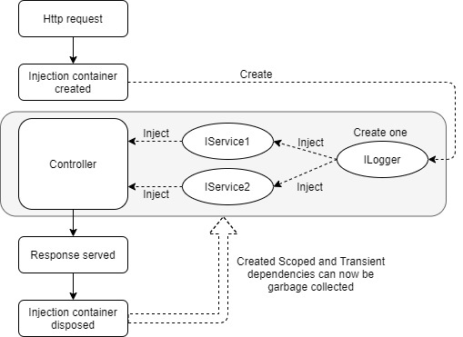
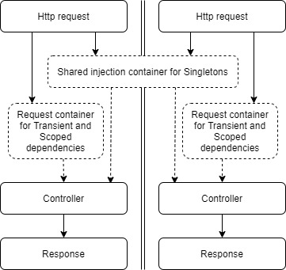
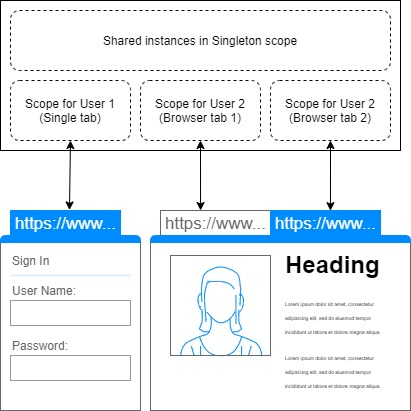
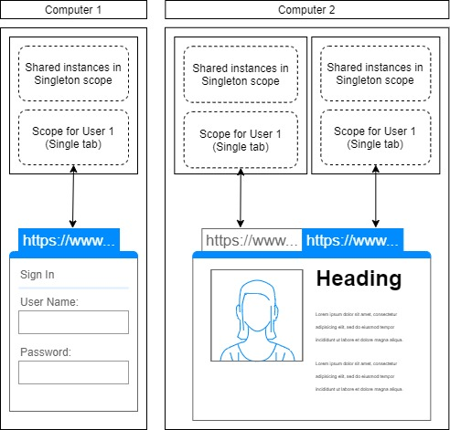

A Scoped dependency is similar to a [Singleton dependency](/dependency-injection/dependency-lifetimes-and-scopes/singleton-dependencies/)
in so far as Blazor will inject the same instance into every object that depends upon it, however,
the difference is that a Scoped instance is not shared by all users.

In a classic ASP.NET MVC application a new dependency injection container is created per request.
The first object that depends on a Scoped registered dependency will receive a new instance of that dependency,
and that new instance will be cached away in the injection container.



From there on, any object requesting the same dependency type (such as ILogger in the preceding example)
will receive the same cached instance.
Then, at the end of the request,
the container is no longer needed and may be garbage collected along with all Scoped and
Transient registered instances it created.

Scoped instances enable us to register dependencies as single-instance-per-user rather than single-instance-per-application.



## Blazor server-side Scoped dependencies

What "Scoped" means in Blazor depends on the render mode.

Under **Static Server Rendering** (SSR), Blazor behaves like a traditional ASP.NET Core application:
each HTTP request creates its own DI scope. A Scoped service lives for the duration of that single request and
is disposed when the response completes. This is the same model as MVC and Razor Pages.

Under **Interactive Server** (rendered with `InteractiveServerRenderMode`), there is no per-request scope.
The application is a single-page application (SPA) that remains on the user's screen for the whole session.
The scope of a Blazor Interactive Server app is the [SignalR circuit](/components/circuits/) between client and server.
During the user's session the URL might change, but the browser does not actually navigate anywhere.
Instead it simply rebuilds the display based on the current URL.
Read the section on [Routing](/routing) if you need to familiarize yourself with how this is done.

Registering a dependency as Scoped in an Interactive Server app will result in dependencies that live for the
duration of the user's SignalR circuit.
Instances of Scoped dependencies will be shared across pages and components for a single user,
but not between different users and not across different tabs in the same browser.



## WebAssembly Scoped services

In **Interactive WebAssembly** (or Interactive Auto when running on WebAssembly), each browser tab is a
unique process. There is no server process that can share Singleton instances across users or tabs.
Consequently, the distinction between Scoped and Singleton collapses:
a service registered as Scoped behaves identically to a service registered as Singleton because the
DI container lives only as long as the application instance in that tab.
Every component in the tab receives the same Scoped instance.



## Captive dependencies and IServiceScopeFactory

A common pitfall is the captive dependency problem. If a Singleton consumes a Scoped service directly,
the Scoped service is captured by the Singleton container and lives for the entire application lifetime,
defeating its intended scope. To resolve Scoped services from a Singleton or from code outside the
normal DI pipeline, use `IServiceScopeFactory` to create a temporary scope:

```cs
public class MySingletonService
{
  private readonly IServiceScopeFactory _scopeFactory;
  public MySingletonService(IServiceScopeFactory scopeFactory)
  {
    _scopeFactory = scopeFactory;
  }

  public async Task DoWork()
  {
    using var scope = _scopeFactory.CreateScope();
    var scoped = scope.ServiceProvider.GetRequiredService<IMyScopedService>();
    // Use scoped service within this scope
  }
}
```

For a hands-on comparison of all three scope lifetimes, see the
[Comparing dependency scopes](/dependency-injection/dependency-lifetimes-and-scopes/comparing-dependency-scopes/) page.
