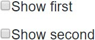
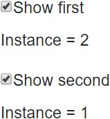
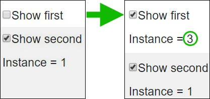

Transient dependencies are the most simple to understand.
The Dependency Container simply acts as a factory when constructing an injectable dependency that was registered as Transient.
Once the instance is created and injected into the dependent component, the container has no further interest in it.

**WARNING**: This is only true of instances that do not implement `IDisposable`.
To avoid potential memory leaks, please read the section at the bottom of this section [Avoiding memory leaks](#avoiding-memory-leaks).

To illustrate the lifetime of transient dependencies,
we'll create a simple application so we can see when an object instance is created.

## Transient dependency example

[](https://github.com/mrpmorris/blazor-university/tree/master/src/DependencyInjection/TransientLifetimes)

First, create a new Blazor Server App. Then create a new folder named **Services** and add the following interface.
This is the service our UI will use to show the instance number of the object that was created by the dependency container
and then injected into our component. Each instance will set its `InstanceNumber` to the next available sequence number.

```razor
public interface IMyTransientService
{
  public int InstanceNumber { get; }
}
```

To implement this interface we'll write a class with a `static` integer field that we can use to determine the next
available sequence number.
This field will be marked as [`volatile`](https://docs.microsoft.com/en-us/dotnet/csharp/language-reference/keywords/volatile)
and altered using `System.Threading.Interlocked.Increment` so we can modify the field across multiple threads without
having to do any thread locking.

```razor
public sealed class MyTransientService : IMyTransientService
{
  public int InstanceNumber { get; }

  private static volatile int PreviousInstanceNumber;

  public MyTransientService()
  {
    InstanceNumber = System.Threading.Interlocked.Increment(ref PreviousInstanceNumber);
  }
}
```

## Registering our dependency

In a server-side application edit `Startup.ConfigureServices` and add the following code:

```cs
services.AddTransient<IMyTransientService, MyTransientService>();
```

In a WebAssembly application edit `Program.Main` and add the following code before `builder.Build()` is called.

```cs
builder.Services.AddTransient<IMyTransientService, MyTransientService>();
```

## Consuming the transient dependency

To consume this transient dependency we'll create a component so we can display multiple instances of
the consuming component on our main page.
The component will simply declare an injected dependency, and then show its `InstanceNumber`.

In the **Shared** folder, create a new component named **MyStandardComponent.razor** and give it the following mark-up.

```razor
@inject IMyTransientService TransientService

<p>Instance = @TransientService.InstanceNumber</p>
```

## Demonstrating transient lifetimes

Next, we'll edit Index.razor so we can show/hide instances of this component by checking or unchecking a checkbox.
Our mark-up will not render an instance of the component unless the relevant checkbox is checked.
Because Blazor creates component instances only when needed,
toggling the checkbox will recreate our component whenever it is displayed
and allow it to be garbage collected when it is not.

```razor {: .line-numbers}
<div>
  <input id="show-first" type="checkbox" @bind=ShowFirst /><label for="show-first">Show first</label>
  @if (ShowFirst)
  {
    <MyStandardComponent />
  }
</div>

<div>
  <input id="show-second" type="checkbox" @bind=ShowSecond /><label for="show-second">Show second</label>
  @if (ShowSecond)
  {
    <MyStandardComponent />
  }
</div>

@code
{
  bool ShowFirst;
  bool ShowSecond;
}
```

- **Lines 19-20**  
    Declares boolean fields to determine whether or not each of the two components should be created and rendered.
- **Line 2**  
    Uses [two-way binding](https://blazor-university.com/components/two-way-binding/) on a checkbox so we can toggle
    the boolean field between `false` and `true`.
- **Line 5**  
    If the relevant field is true then an instance of `MyStandardComponent` is displayed.

## Running the app

When the application first runs, both of the boolean fields will be false, and therefore neither of the two
`MyStandardComponent` mark-ups will be rendered.



When we check one of the checkboxes it will two-way bind to its relevant boolean field, setting it to `true`.
The user interaction will then cause a re-render of the component,
resulting in one of our `MyStandardComponent` instances being rendered -
therefore Blazor will create an instance of it and inject a newly created `MyTransientService`
with an `InstanceNumber` of 1.

The following image shows the expected output when "Show second" is the first checkbox to be checked.


Checking the other checkbox will again cause a re-render,
and the other `MyStandardComponent` will be created and rendered with a dependency having an `InstanceNumber` of 2,
because the Transient dependency injected into it was created on demand.



Whenever we uncheck a checkbox,
our page's mark-up will no longer render the relevant `MyStandardComponent` because it is only conditionally rendered based
on an `@if` statement. When it is unchecked and the page re-renders,
the existing component is no longer referenced and is allowed to be garbage collected.

When we check that same checkbox, our condition will be met and our page will render the relevant `MyStandardComponent`,
a new instance will be created, a new instance of `MyTransientService` will be created to inject into it,
and we'll see a component displaying 3 for its `InstanceNumber`.



1. The page is rendered with neither component created.
2. The 2nd checkbox is checked, setting `ShowSecond` to true.
    - The page is re-render with the 2nd component visible.
    - A new instance of our component is created.
    - A new instance of our transient service (_Instance 1_) is created and injected into the component.
3. The 1st checkbox is checked, setting `ShowFirst` to true.
    - The page is re-rendered with the 1st component visible.
    - A new instance of our component is created.
    - A new instance of our transient service is created (_Instance 2_) and injected into it.
4. The 1st checkbox is unchecked, setting `ShowFirst` to false.
    - The first component is no longer rendered, so it is eligible for garbage collection.
    - The 1st checkbox is checked again, setting `ShowFirst` to true.
    - The page is re-rendered.
    - A new instance of our component is created.
    - A new instance of our transient service (_Instance 3_) is created and injected into it.

## Avoiding memory leaks

### The short version

Only register classes as Transient dependencies if they **DO NOT** implement `IDisposable`, otherwise, your application will leak memory.

### The longer version

The Microsoft dependency injection container will, by default,
simply create instances of dependencies that are registered as Transient and then forget about them.
These instances are then garbage collected when the component they were injected into have been collected.

Historically, the Microsoft dependency injection framework has been used quite extensively in ASP.NET applications,
where a container is created for the incoming web request, and then disposed of at the end of the request.

To save the developer the inconvenience of having to dispose of any injected dependencies,
the Microsoft dependency injection container will, when it is disposed,
automatically call `Dispose` on any object implementing `IDisposable`.

To do this, whenever it creates an instance that implements `IDisposable`,
the container must store a reference to the created instance in order to call it's `Dispose` method.
This means that when Transient dependencies are created,
the behavior is different depending on whether or not the instance is disposable.

Transient objects are usually eligible for garbage collection once the object they were injected into is eligible for
garbage collection - **unless** they implement IDisposable,
in which case the injection container will also hold a reference to created Transient IDisposable,
and it is then only eligible for garbage collection once the container that created it is eligible for garbage collection.

A dependency injection container in Blazor lives until the user closes the tab in their browser that has the Blazor
application in it.
This means that as well as creating a new instance of Transient dependencies whenever they are required,
the container will also hold on to them forever - effectively leading to a memory leak.

There is a way to create a dependency scope per component (so it will be disposed of when the component is disposed)
which will be covered in a later section.

If you want to register dependencies as Transient, it's a good rule to avoid doing so for classes implementing `IDisposable` completely.

## Summary

Registering an injectable dependency as Transient makes our dependency container act as a factory for instances of that type.
The same instance cannot be automatically injected into more than one consuming class,
every injected instance will always be unique.

Classes implementing `IDisposable` should not be registered as Transient unless using components that own their own Scope,
and you know exactly what you are doing (you've read the Scoped dependencies section).
