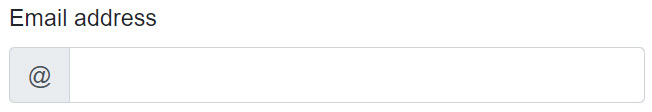
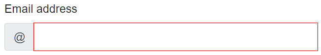
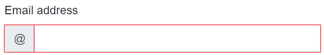
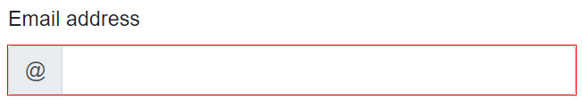

[](https://github.com/mrpmorris/blazor-university/tree/master/src/Forms/AccessingFormState)

Sometimes, we need access to form state inside the `<EditForm>` child content.
The most common use for this is when we need to access the CSS classes for an input,
indicating whether the input is modified or valid/invalid.

For example, if we use Bootstrap to create an email input control prepended with the `@` symbol,
we might end up with mark-up that looks something like the following.

```razor
<div class="form-group">
  <label for="EmailAddress">Email address</label>
  <div class="input-group">
    <div class="input-group-prepend">
      <span class="input-group-text">@@</span>
    </div>
    <InputText @bind-Value=MyContact.EmailAddress id="EmailAddress" class="form-control" type="email" />
  </div>
</div>
```



Email input prepended with an @ symbol

The problem is, however, that when the user enters an invalid value the CSS `invalid` class is applied only to the `<InputText>` control.



Prepended email input with an error

If we want to apply the CSS `invalid` class to the `input-group` itself we can use the `EditContext` passed to us from the `<EditForm>` component.

The `ChildContent` parameter of `<EditForm>` is a `RenderFragment<EditContext>`,
which means the `EditContext` instance is passed into its inner content via a variable named `context`
(or whatever alias we tell Blazor to use).
See [Templating components with RenderFragments for more information](/templating-components-with-renderfragements/).

```razor {: .line-numbers}
<EditForm Model=@MyContact Context="CurrentEditContext">
  <DataAnnotationsValidator />

  <div class="form-group">
    <label for="EmailAddress">Email address</label>
    <div class="input-group @CurrentEditContext.FieldCssClass( () => MyContact.EmailAddress)">
      <div class="input-group-prepend">
        <span class="input-group-text">@@</span>
      </div>
      <InputText @bind-Value=MyContact.EmailAddress id="EmailAddress" class="form-control" type="email" />
    </div>
  </div>

</EditForm>
```

- **Line 1**  
    Using the `Context=` syntax, we tell Blazor to use the variable name **CurrentEditContext** when passing in its `EditContext`.
- **Line 6**  
    Uses the `EditContext.FieldCssClass` method to obtain the correct CSS class name for the input based
    on its state (modified / valid / invalid).



Prepended email input with error CSS applied to the parent element

If we wish, we can hide the red outline on the generated `<input>` HTML element with some simple CSS.

.input-group > input.invalid
{
  outline: none;
}

This CSS tells the browser that our `<input>` HTML element with an **invalid** class applied should not have a red outline
if it is parented directly by an HTML element that has the **input-group** CSS class applied.



Input with only the outer element outlined
