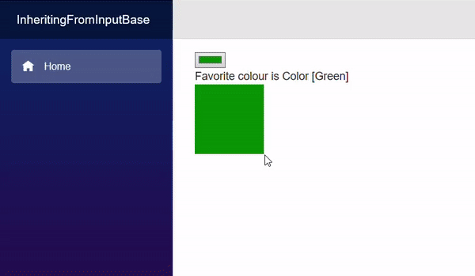

[](https://github.com/mrpmorris/blazor-university/tree/master/src/Forms/InheritingFromInputBase)

The `InputBase<T>` component is the abstract class the various Blazor input controls descend from.
This class adds additional functionality above that of standard HTML `<input>` elements,
such as validation - which we'll cover later.
Because of this, it is recommended we descend components from this base class if we intend them to act as user input.

Implementing `InputBase<T>` is simply a case of implementing one abstract method, and optionally one virtual method.

`InputBase<T>` is a generic class that has a property of type `T` named `Value`.
Because web browsers work with string values, this component needs a way to convert a value of type `T` to and from a string.

protected abstract bool TryParseValueFromString(string value, out T result, out string validationErrorMessage);

`TryParseValueFromString` is an abstract method that should be overridden in order to convert a string value from an
HTML `<input>` element (or other source that works with strings) into the target type `T`.
If the conversion is not possible, the `validationErrorMessage` should be set to a suitable message to indicate the
conversion failed.
This is used to provide a validation error message along with a visual invalid state so the user is aware the attempt
to set the value failed.

protected virtual string FormatValueAsString(T value)

`FormatValueAsString` is the inverse of `TryParseValueFromString`.
In cases where a simple `Value.ToString()` is not sufficient to translate a value of `T` back into the browser UI layer,
this method should be overridden to perform the task correctly.

## Creating an InputColor component

First we need to create an **InputColor.razor** file.
Within that file we need to specify `InputBase<Color>` as a base class, and also add the mark-up we want rendered in our HTML.

```razor
@using System.Drawing
@using System.Text.RegularExpressions
@inherits InputBase<Color>

<input type="color" @attributes=AdditionalAttributes class=@CssClass @bind=CurrentValueAsString/>
```

`System.Drawing` was added for the `Color` class, and `System.Text.RegularExpressions` was added for parsing input
from a hex code into a `Color` value.

The first thing we'll do is implement `FormatValueAsString`. To achieve this we'll simply format the R, G, and B values
as 2 digit hex values.

```cs
protected override string FormatValueAsString(Color value)
  => $"#{value.R:x2}{value.G:x2}{value.B:x2}";
```

To convert a hex string back to a `Color` we'll first need to convert a 2 character hex value into a `byte`.

```cs
byte HexStringToByte(string hex)
{
  const string HexChars = "0123456789abcdef";

  hex = hex.ToLowerInvariant();
  int result = (HexChars.IndexOf(hex[0]) \* 16) + HexChars.IndexOf(hex[1]);
  return (byte)result;
}
```

Next we'll need to implement `TryParseValueAsString`.

```cs
static Regex Regex = new Regex("^#([0-9a-f]{2}){3}$", RegexOptions.Compiled | RegexOptions.IgnoreCase);

protected override bool TryParseValueFromString(string value, out Color result, out string validationErrorMessage)
{
  Match match = Regex.Match(value);
  if (!match.Success)
  {
    validationErrorMessage = "Not a valid color code";
    result = Color.Red;
    return false;
  }

  byte r = HexStringToByte(match.Groups[1].Captures[0].Value);
  byte g = HexStringToByte(match.Groups[1].Captures[1].Value);
  byte b = HexStringToByte(match.Groups[1].Captures[2].Value);

  validationErrorMessage = null;
  result = Color.FromArgb(r, g, b);
  return true;
}
```

The code uses a regular expression to ensure the value is a string in a format of 6 hex characters, preceded with a `#` character.
It captures the three groups of 2 digit hex characters and uses our `HexStringToByte` method to convert them into bytes.
Finally, a `Color` is created using those RGB values.

Because us British like the word "colour" to be spelled correctly, we should really add a parameter to the component to
allow its consumer to specify a custom error message to use when the value passed is invalid.
Add a `[Parameter]` property. It may be called whatever we wish, but **ParsingErrorMessage** is the standard name used
in Blazor.

```cs
[Parameter]
public string ParsingErrorMessage { get; set; }
```

And then change the code that sets the `validationErrorMessage` in our `TryParseValueFromString` method to use that
parameter instead of our hard-coded error message.

```cs
if (!match.Success)
{
  validationErrorMessage = ParsingErrorMessage;
  result = Color.Red;
  return false;
}
```

For the sake of making it easy to display our colour as text, let's refactor our `FormatValueAsString` method to use a
static method, so we can use that static method independently of any instance of `InputColor`.

```cs
public static string ColorToString(Color value)
  => $"#{value.R:x2}{value.G:x2}{value.B:x2}";

protected override string FormatValueAsString(Color value)
  => ColorToString(value);
```

Our entire component should now look like this:

```razor
@using System.Drawing
@using System.Text.RegularExpressions
@inherits InputBase<Color>

<input type="color" @attributes=AdditionalAttributes class=@CssClass @bind=CurrentValueAsString/>

@code {
  [Parameter] public string ParsingErrorMessage { get; set; }

  public static string ColorToString(Color value)
    => $"#{value.R:x2}{value.G:x2}{value.B:x2}";

  protected override string FormatValueAsString(Color value)
    => ColorToString(value);

  static Regex Regex = new Regex("^#([0-9a-f]{2}){3}$", RegexOptions.Compiled | RegexOptions.IgnoreCase);
  protected override bool TryParseValueFromString(string value, out Color result, out string validationErrorMessage)
  {
    Match match = Regex.Match(value);
    if (!match.Success)
    {
      validationErrorMessage = ParsingErrorMessage;
      result = Color.Red;
      return false;
    }

    byte r = HexStringToByte(match.Groups[1].Captures[0].Value);
    byte g = HexStringToByte(match.Groups[1].Captures[1].Value);
    byte b = HexStringToByte(match.Groups[1].Captures[2].Value);

    validationErrorMessage = null;
    result = Color.FromArgb(r, g, b);
    return true;
  }

  byte HexStringToByte(string hex)
  {
    const string HexChars = "0123456789abcdef";

    hex = hex.ToLowerInvariant();
    int result = (HexChars.IndexOf(hex[0]) * 16) + HexChars.IndexOf(hex[1]);
    return (byte)result;
  }
}
```

## InputColor example

We'll make a simple page that let's the user choose a person's favorite color.

```razor {: data-line="1,3-4,12" .line-numbers }
@page "/"
@using System.Drawing

<EditForm Model=CurrentPerson>
  <InputColor @bind-Value=CurrentPerson.FavoriteColor/>
</EditForm>

Favorite colour is @CurrentPerson.FavoriteColor
<div style="width:100px;height:100px;background-color:@ColorAsHex"/>

@code {
  Person CurrentPerson = new Person
  {
    FavoriteColor = Color.Green
  };

  string ColorAsHex => InputColor.ColorToString(CurrentPerson.FavoriteColor);

  class Person
  {
    public Color FavoriteColor { get; set; }
  }
}
```

- **Lines 19-22**  
    Create a class to which our `EditForm` will bind.
- **Lines 12-15**  
    Create an instance of this class.
- **Line 17**  
    Uses our static `InputColor.ColorToString` to convert the chosen colour to a web hex colour string.
- **Line 9**  
    Creates a `<div>` element with inline style that will show the selected colour as a solid box.
- **Line 4**  
    Creates the `EditForm` with its `Model` bound to our page's `Person`.
- **Line 5**  
    Uses our `InputColor` component which will render an HTML `<input>` element with `type=color`
    for the user to interact with.


