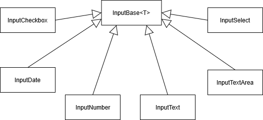

[](https://github.com/mrpmorris/blazor-university/tree/master/src/Forms/FormInputs)

Because the `EditForm` component renders a standard `<form>` HTML element,
it is actually possible to use standard HTML form elements such as `<input>` and `<select>` within our mark-up,
but as with the `EditForm` component I would recommend using the various Blazor input controls,
because they come with additional functionality such as validation.

There is a standard collection of input components available in Blazor, all descended from the base class `InputBase<T>`.



Blazor's standard input components

The following sections will all use the following class for binding:

```razor
@code
{
  SomeModel FormData = new SomeModel();

  class SomeModel
  {
    public bool SomeBooleanProperty { get; set; }
    public DateTime? SomeDateTimeProperty { get; set; }
    public int SomeIntegerProperty { get; set; }
    public decimal SomeDecimalProperty { get; set; }
    public string SomeStringProperty { get; set; }
    public string SomeMultiLineStringProperty { get; set; }
    public SomeStateEnum SomeSelectProperty { get; set; } = SomeStateEnum.Active;
  }

  public enum SomeStateEnum
  {
    Pending,
    Active,
    Suspended
  }
}
```

**Note**: It is possible to specify additional attributes for any of the following components.
Any that are not explicitly recognised by Blazor will be rendered directly onto the target HTML element.

## InputCheckbox

The `InputCheckbox` component binds a Boolean property to an HTML `<input>` element with `type="checkbox"`.
This component does not allow binding to a nullable property.

```razor
<InputCheckbox @bind-Value=FormData.SomeBooleanProperty />
```

## InputDate

The `InputDate` components binds a DateTime property to an HTML `<input>` element with `type="date"`.
This component will bind to a nullable property, however,
not all browsers provide the ability to specify a null value on an input element of this type.

```razor
<InputDate @bind-Value=FormData.SomeDateTimeProperty ParsingErrorMessage="Must be a date" />
```

## InputNumber

The `InputNumber` component binds any kind of C# numerical property to an HTML `<input>` element with `type="number"`.

If the value entered cannot be parsed into the target property type the input will be considered invalid (see Form validation)
and will not update the `Model` with the value.

When the target property is nullable, an invalid input will be considered `null` and the text in the input will be cleared.

```razor
<InputNumber @bind-Value=FormData.SomeIntegerProperty ParsingErrorMessage="Must be an integer value" />

<InputNumber @bind-Value=FormData.SomeDecimalProperty ParsingErrorMessage="Must be a decimal value" />
```

## InputText

The `InputText` components binds a string property to an HTML `<input>` element with no `type` specified.
This enables us to specify any of the available input types such as `password`, `color`,
or one of the other options as specified in the [W3 standards](https://www.w3schools.com/tags/att_input_type.asp).

```razor
<InputText @bind-Value=FormData.SomeStringProperty />
```

## InputTextArea

The `InputTextArea` components binds a string property to an HTML `<textarea>` element.

```razor
<InputTextArea @bind-Value=FormData.SomeMultiLineStringProperty />
```

## InputSelect

The `InputSelect` component binds a property of any kind to an HTML `<select>` element.
Blazor will automatically select the correct `<option>` based on the value of the property.

```razor
<InputSelect @bind-Value=FormData.SomeSelectProperty>
  <option value="Pending">Pending</option>
  <option value="Active">Active</option>
  <option value="Suspended">Suspended</option>
</InputSelect>
```

As the razor view defaults `FormData.SomeSelectProperty`to `SomeStateEnum.Active`,
the `<select>` HTML element will default its selection to that value, even though it is not the first `<option>` specified.
