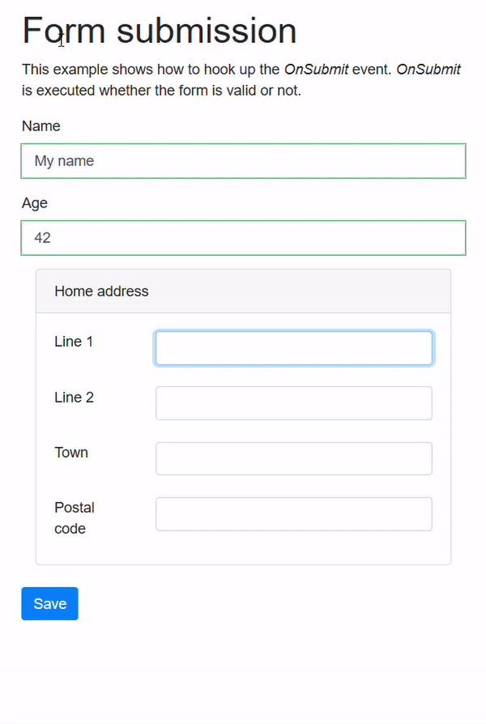
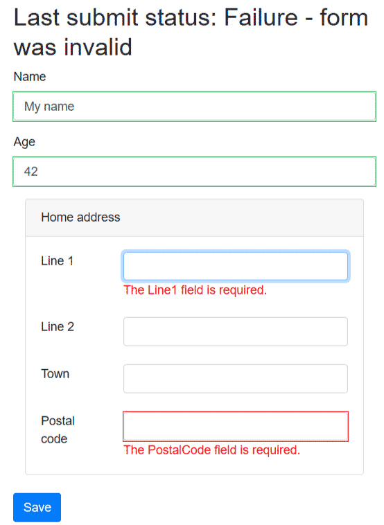

[](https://github.com/mrpmorris/blazor-university/tree/master/src/Forms/HandlingFormSubmission)

When rendering an `EditForm` component, Blazor will output an HTML `<form>` element.
As this is a standard web control,
we can provide the user with the ability to submit the form by adding an `<input>` with `type="submit"`.

```razor
<EditForm Model=@Person>
  <div class="form-group">
    <label for="Name">Name</label>
    <InputText @bind-Value=Person.Name class="form-control" id="Name" />
  </div>
  <div class="form-group">
    <label for="Age">Age</label>
    <InputNumber @bind-Value=Person.Age class="form-control" id="Age" />
  </div>
  <input type="submit" class="btn btn-primary" value="Save"/>
</EditForm>

@code {
  Person Person = new Person();
}
```

Blazor will intercept `form` submission events and route them back through to our razor view.
There are three events on an `EditForm` related to form submission.

- OnValidSubmit
- OnInvalidSubmit
- OnSubmit

Each of these events pass an `EditContext` as a parameter, which we can use to determine the status of the user's input.

**Note**: We can use none of these events or one of these events.
The only situation where we can use two events is when we set `OnValidSubmit` and `OnInvalidSubmit` together.
Neither of those two events can be consumed if `OnSubmit` is set.

## OnValidSubmit / OnInvalidSubmit

Altering the above source code we can subscribe to the `OnValidSubmit` and `OnInvalidSubmit`
events by declaring them against the `EditForm`.

```razor
@if (LastSubmitResult != null)
{
  <h2>
    Last submit status: @LastSubmitResult
  </h2>
}

<EditForm Model=@Person OnValidSubmit=@ValidFormSubmitted OnInvalidSubmit=@InvalidFormSubmitted>
  <DataAnnotationsValidator/>
  … other html mark-up here …
  <input type="submit" class="btn btn-primary" value="Save" />
</EditForm>

@code {
  Person Person = new Person();
  string LastSubmitResult;

  void ValidFormSubmitted(EditContext editContext)
  {
    LastSubmitResult = "OnValidSubmit was executed";
  }

  void InvalidFormSubmitted(EditContext editContext)
  {
    LastSubmitResult = "OnInvalidSubmit was executed";
  }
}
```

## OnSubmit

The `OnSubmit` event is executed when the form is submitted, regardless of whether the form passes validation or not.
It is possible to check the validity status of the form by executing `editContext.Validate()`,
which returns `true` if the form is valid or `false` if it is invalid (has validation errors).

```razor
@if (LastSubmitResult != null)
{
  <h2>
    Last submit status: @LastSubmitResult
  </h2>
}

<EditForm Model=@Person OnSubmit=@FormSubmitted>
  <DataAnnotationsValidator/>
  … other html mark-up here …
  <input type="submit" class="btn btn-primary" value="Save" />
</EditForm>

@code {
  Person Person = new Person();

  string LastSubmitResult;

  void FormSubmitted(EditContext editContext)
  {
    bool formIsValid = editContext.Validate();
    LastSubmitResult =
      formIsValid
      ? "Success - form was valid"
      : "Failure - form was invalid";
  }
}
```

## Blazor validation limitations

For a simple form where all of the properties are simple types, validation works fine.
But when our `EditForm.Model` has properties of complex types, such as the `Person` class in our example having a `HomeAddress`
property that is a type of `Address`, the sub-properties will not be validated unless the user edits them.

The following screenshot shows how `editContext.Validate()` in the previous example returns `true` to indicate the form
is valid, even though `Address.Line` and `Address.PostalCode` are both decorated with `[Required]` DataAnnotation attributes.



The behavior we actually want would result in a user-experience that looks like the following screenshot.


