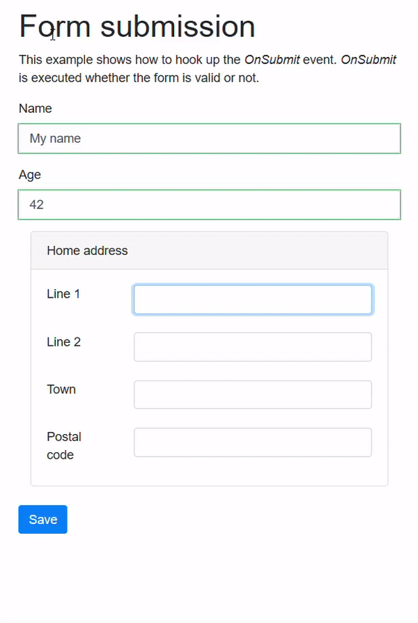
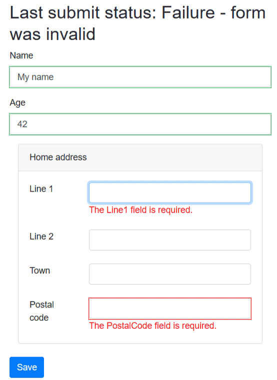

[](https://github.com/mrpmorris/blazor-university/tree/master/src/Forms/HandlingFormSubmission)

When rendering an `EditForm` component, Blazor will output an HTML `<form>` element.
As this is a standard web control,
we can provide the user with the ability to submit the form by adding an `<input>` with `type="submit"`.

```razor
<EditForm Model=@Person>
  <div class="form-group">
    <label for="Name">Name</label>
    <InputText @bind-Value=Person.Name class="form-control" id="Name" />
  </div>
  <div class="form-group">
    <label for="Age">Age</label>
    <InputNumber @bind-Value=Person.Age class="form-control" id="Age" />
  </div>
  <input type="submit" class="btn btn-primary" value="Save"/>
</EditForm>

@code {
  Person Person = new Person();
}
```

Blazor will intercept `form` submission events and route them back through to our razor view.
There are three events on an `EditForm` related to form submission.

- OnValidSubmit
- OnInvalidSubmit
- OnSubmit

Each of these events pass an `EditContext` as a parameter, which we can use to determine the status of the user's input.

**Note**: We can use none of these events or one of these events.
The only situation where we can use two events is when we set `OnValidSubmit` and `OnInvalidSubmit` together.
Neither of those two events can be consumed if `OnSubmit` is set.

## OnValidSubmit / OnInvalidSubmit

Altering the above source code we can subscribe to the `OnValidSubmit` and `OnInvalidSubmit`
events by declaring them against the `EditForm`.

```razor
@if (LastSubmitResult != null)
{
  <h2>
    Last submit status: @LastSubmitResult
  </h2>
}

<EditForm Model=@Person OnValidSubmit=@ValidFormSubmitted OnInvalidSubmit=@InvalidFormSubmitted>
  <DataAnnotationsValidator/>
  … other html mark-up here …
  <input type="submit" class="btn btn-primary" value="Save" />
</EditForm>

@code {
  Person Person = new Person();
  string LastSubmitResult;

  void ValidFormSubmitted(EditContext editContext)
  {
    LastSubmitResult = "OnValidSubmit was executed";
  }

  void InvalidFormSubmitted(EditContext editContext)
  {
    LastSubmitResult = "OnInvalidSubmit was executed";
  }
}
```

## Async submission handlers

Submit handlers can be async. To handle form submission asynchronously, mark the handler with `async Task` and use `await` inside it.

```razor
<EditForm Model=@Person OnValidSubmit=@ValidFormSubmitted>
  ...
</EditForm>

@code {
  async Task ValidFormSubmitted(EditContext editContext)
  {
    await Task.Delay(500);
    // Submit data to an API, save to a database, etc
  }
}
```

## OnSubmit

The `OnSubmit` event is executed when the form is submitted, regardless of whether the form passes validation or not.
It is possible to check the validity status of the form by executing `editContext.Validate()`,
which returns `true` if the form is valid or `false` if it is invalid (has validation errors).

```razor
@if (LastSubmitResult != null)
{
  <h2>
    Last submit status: @LastSubmitResult
  </h2>
}

<EditForm Model=@Person OnSubmit=@FormSubmitted>
  <DataAnnotationsValidator/>
  … other html mark-up here …
  <input type="submit" class="btn btn-primary" value="Save" />
</EditForm>

@code {
  Person Person = new Person();

  string LastSubmitResult;

  void FormSubmitted(EditContext editContext)
  {
    bool formIsValid = editContext.Validate();
    LastSubmitResult =
      formIsValid
      ? "Success - form was valid"
      : "Failure - form was invalid";
  }
}
```

## Static SSR form submission

In Static Server-Side Rendering (Static SSR), there is no ongoing Blazor circuit and the interactive form submission events (OnSubmit, OnValidSubmit, OnInvalidSubmit) do not fire. Instead, the form is submitted via HTTP POST and Blazor maps the posted data to our page model.

To use this pattern, we give the `EditForm` a `FormName` and apply `[SupplyParameterFromForm]` to the model property.

```razor
@page "/"
@using Microsoft.AspNetCore.Components.Forms

<EditForm Model=@Person FormName="PersonForm" OnValidSubmit=@ValidFormSubmitted>
  <DataAnnotationsValidator/>
  <InputText @bind-Value=Person.Name />
  <input type="submit" value="Save" />
</EditForm>

@code {
  [SupplyParameterFromForm]
  public Person? Person { get; set; }

  void ValidFormSubmitted(EditContext editContext)
  {
    // This runs after model binding and validation on the server
  }
}
```

When the page is rendered statically, the `EditForm` renders a `<form>` element with `method="post"`. On submission, Blazor binds the form data to the `[SupplyParameterFromForm]` property and then executes the submit handler in an interactive context.

## Blazor validation limitations

For a simple form where all of the properties are simple types, validation works fine.
But when our `EditForm.Model` has properties of complex types, such as the `Person` class in our example having a `HomeAddress`
property that is a type of `Address`, the sub-properties will not be validated unless the user edits them.

The following screenshot shows how `editContext.Validate()` in the previous example returns `true` to indicate the form
is valid, even though `Address.Line` and `Address.PostalCode` are both decorated with `[Required]` DataAnnotation attributes.



The behavior we actually want would result in a user-experience that looks like the following screenshot.



### Resolving the limitation with AddValidation

In .NET 10, this limitation is resolved by registering the built-in validation service in **Program.cs** with `builder.Services.AddValidation()` and annotating the model with `[ValidatableType]`. When registered, Blazor automatically validates the entire object graph, including nested complex-type properties, without requiring the user to edit every sub-property first.

```cs
// Program.cs
builder.Services.AddValidation();
```

```cs
[ValidatableType]
public class Person
{
  [Required]
  public string Name { get; set; }
  public Address? HomeAddress { get; set; }
}

public class Address
{
  [Required]
  public string Line { get; set; }
  [Required]
  public string PostalCode { get; set; }
}
```

With `AddValidation` registered, the `<DataAnnotationsValidator/>` component inside the `EditForm` is no longer needed, and `editContext.Validate()` will correctly report validation errors on nested complex types.
