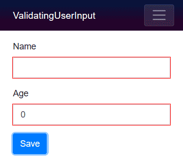
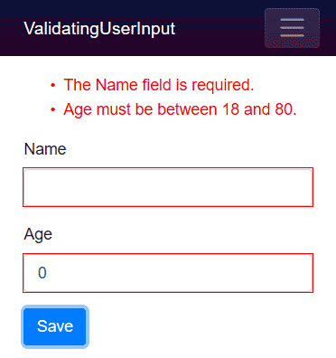
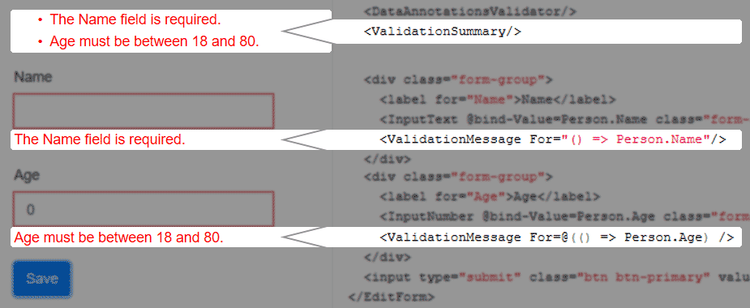

[](https://github.com/mrpmorris/blazor-university/tree/master/src/Forms/ValidatingUserInput)

The `DataAnnotationsValidator` is the standard validator type in Blazor.
Adding this component within an `EditForm` component will enable form validation based on .NET attributes descended 
from `System.ComponentModel.DataAnnotations.ValidationAttribute`.

First we'll create a short example, then we'll go through what happens behind the scenes.
First, create a model we can edit, and decorate its properties with some data annotations for validation.

```razor {: .line-numbers}
public class Person
{
  [Required]
  public string Name { get; set; }
  [Range(18, 80, ErrorMessage = "Age must be between 18 and 80.")]
  public int Age { get; set; }
}
```

- Line 3 specifies the `Name` property cannot be null or empty.
- Line 5 specifies a valid range of values for the `Age` property (from 18 to 80) and
  also provides a suitable error message to display to the user.

## Adding validation

Edit the **Index.razor** page in a default Blazor app and provide some mark-up to edit an instance of `Person`.

```razor
<EditForm Model=@Person>
  <div class="form-group">
    <label for="Name">Name</label>
    <InputText @bind-Value=Person.Name class="form-control" id="Name" />
  </div>
  <div class="form-group">
    <label for="Age">Age</label>
    <InputNumber @bind-Value=Person.Age class="form-control" id="Age" />
  </div>
  <input type="submit" class="btn btn-primary" value="Save"/>
</EditForm>

@code {
  Person Person = new Person();
}
```

Running the app now will result in the user being presented with a form that does not validate their input.
To ensure the form is validated we must specify a validation mechanism.
Add a `DataAnnotationsValidator` component inside the `EditForm` component.

```razor
<EditForm Model=@Person>
  <DataAnnotationsValidator/>
  <div class="form-group">
    <label for="Name">Name</label>
    <InputText @bind-Value=Person.Name class="form-control" id="Name" />
  </div>
  <div class="form-group">
    <label for="Age">Age</label>
    <InputNumber @bind-Value=Person.Age class="form-control" id="Age" />
  </div>
  <input type="submit" class="btn btn-primary" value="Save"/>
</EditForm>
```

Running the app and clicking the **Save** button will update the user interface to provide a visual indication that there
are errors in the user's input.



## Displaying validation error messages

Validation error messages can be displayed to the user in two ways.
We can add a `ValidationSummary` to show a comprehensive list of all errors in the form.
We can also use the `ValidationMessage` component to display error messages for a specific input on the form.
These components are not mutually exclusive, so it is possible to use both at the same time.

The `ValidationSummary` component can simply be dropped into an `EditForm` in our mark-up;
no additional parameters are required at all.



As the `ValidationMessage` component displays error messages for a single field,
it requires us to specify the identity of the field.
To ensure our parameter's value stays correct after refactoring
(for example, when we refactor property names on our `Person` class)
Blazor requires us to specify an `Expression` when identifying the field.
The parameter, named `For`, is defined on the `ValidationMessage` as follows:

```razor
[Parameter]
public Expression<Func<T>> For { get; set; }
```

This means to specify the identity of the field we should use a lambda expression, which can be presented either "quoted",
or wrapped in `@(...)`

- Quoted form  
    `<ValidationMessage For="() => Person.Name"/>`
- Razor expression form  
    `<ValidationMessage For=@( () => Person.Name )/>`

Both forms are equivalent. The quoted form is easier to read,
whereas the razor expression makes it more obvious to other developers that we are defining an expression rather than a string.

```razor
@page "/"
@using Models

<EditForm Model=@Person>
  <DataAnnotationsValidator/>
  <ValidationSummary/>
  <div class="form-group">
    <label for="Name">Name</label>
    <InputText @bind-Value=Person.Name class="form-control" id="Name" />
    <ValidationMessage For="() => Person.Name"/>
  </div>
  <div class="form-group">
    <label for="Age">Age</label>
    <InputNumber @bind-Value=Person.Age class="form-control" id="Age" />
    <ValidationMessage For=@(() => Person.Age) />
  </div>
  <input type="submit" class="btn btn-primary" value="Save"/>
</EditForm>

@code {
  Person Person = new Person();
}
```

[](http://blazor-university.com/wp-content/uploads/2019/08/ValidationSummaryAndValidationMessages.png)
