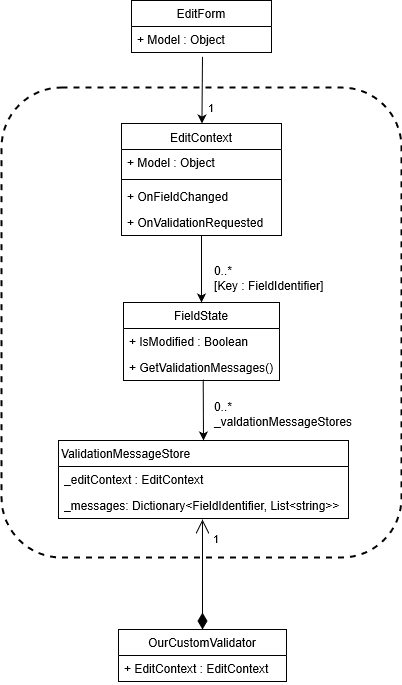

[](https://github.com/mrpmorris/blazor-university/tree/master/src/Forms/CustomValidation)

Note that, as with the section on [EditContext, FieldIdentifiers, and FieldState](/forms/editcontext-fieldidentifiers-and-fieldstate/),
this is an advanced topic.

As mentioned previously, the `FieldState` class holds meta-state for form data.
In addition to indicating whether a value has been manually edited or not,
Blazor stores a collection of validation error messages.
To understand how it works,
this section will explain how to create our own custom validation mechanism that can be used with Blazor to validate
user input.

The following UML diagram shows the relationship between an `EditForm`,
and the various classes (grouped in the diagram) that store this meta-state.
Remember, whenever `EditForm.Model` is altered, the `EditForm` will create a new instance of `EditContext`.
The previous `EditContext` (which is no longer needed because it contains information about the previous model)
can then be garbage collected, and with it all instances of classes that are grouped in the diagram.



Our custom validation will be based on [FluentValidation](https://github.com/JeremySkinner/FluentValidation).
Once you've finished this section (or if you just want something you can use straight away), please have a look a [blazor-validation](https://github.com/mrpmorris/blazor-validation).

## Creating a validator component

Our validator component does not have to descend from any specific class in order to provide validation.
It's only requirement is that it descends from the Blazor `ComponentBase` class so that we can add it inside the `<EditForm>`
mark-up in our view.
The purpose of embedding inside the `<EditForm>` mark-up is so that we can define a [Cascading parameter](/components/cascading-values/)
to pick up the current `EditContext` that is created by the `EditForm` whenever its `Model` parameter changes.

First, create a new Blazor app and add a reference to the [FluentValidation NuGet](https://www.nuget.org/packages/FluentValidation/)
package.
Then create a class called `FluentValidationValidator`.

```razor
public class FluentValidationValidator : ComponentBase
{
    [CascadingParameter]
    private EditContext EditContext { get; set; }

    [Parameter]
    public Type ValidatorType { get; set; }

    private IValidator Validator;
    private ValidationMessageStore ValidationMessageStore;
    [Inject]
    private IServiceProvider ServiceProvider { get; set; }
}
```

- **EditContext**  
    A cascading parameter that is passed to our component from its parent `<EditForm>` component. This will change every time `EditForm.Model` changes.
- **ValidatorType**  
    This will specify the class type to use to perform the actual validation. We will check that this is an `IValidator` (a FluentValidation interface).
- **Validator**  
    This will hold a reference to an instance of the specified `ValidatorType` to perform the actual object validation.
- **ValidationMessageStore**  
    We will create a new one of these every time our `EditContext` changes (because `EditForm.Model` has changed).
- **ServiceProvider**  
    An injected dependency to `IServiceProvider` that we can use to create an instance of `ValidatorType`.  

```razor {: .line-numbers}
public override async Task SetParametersAsync(ParameterView parameters)
{
    // Keep a reference to the original values so we can check if they have changed
    EditContext previousEditContext = EditContext;
    Type previousValidatorType = ValidatorType;

    await base.SetParametersAsync(parameters);

    if (EditContext == null)
        throw new NullReferenceException($"{nameof(FluentValidationValidator)} must be placed within an {nameof(EditForm)}");

    if (ValidatorType == null)
        throw new NullReferenceException($"{nameof(ValidatorType)} must be specified.");

    if (!typeof(IValidator).IsAssignableFrom(ValidatorType))
        throw new ArgumentException($"{ValidatorType.Name} must implement {typeof(IValidator).FullName}");

    if (ValidatorType != previousValidatorType)
        ValidatorTypeChanged();

    // If the EditForm.Model changes then we get a new EditContext
    // and need to hook it up
    if (EditContext != previousEditContext)
        EditContextChanged();
}
```

- **Lines 4-5**  
    `SetParametersAsync` is executed whenever one of our parameters change (including our `EditContext` cascading parameter).
    The first thing we need to do is keep a reference to some original values,
    so we can see if they have changed and react accordingly.
- **Line 7**  
    Calling `base.SetParametersAsync` will update our object's properties to the new values.
- **Lines 9-16**  
    Ensures we have an `EditContext` and also a `ValidatorType` that is an `IValidator`.
- **Lines 18-19**  
    If the `ValidatorType` has changed then we need to create a new instance of that type and assign it to our private
    `Validator` field for validating our `EditContext.Model`.
- **Lines 23-24**  
    If the `EditContext` has changed then we need to hook up to some events so we can validate user input,
    and we need a new `ValidationMessageStore` to store any validation errors.

Creating a new instance of `ValidatorType` is as simple as instructing our `ServiceProvider` to retrieve an instance.

```razor
private void ValidatorTypeChanged()
{
    Validator = (IValidator)ServiceProvider.GetService(ValidatorType);
}
```

For this to work, we must register our validator in our app's `Startup.ConfigureServices` method - which we'll do once we have a validator and something to validate.

Whenever the `EditContext` changes we need a new `ValidationMessagesStore` to store our validation error messages in.

```razor
void EditContextChanged()
{
    ValidationMessageStore = new ValidationMessageStore(EditContext);
    HookUpEditContextEvents();
}
```

We'll also need to hook up some events so we can validate the user input and add errors to our `ValidationMessageStore`.

```razor
private void HookUpEditContextEvents()
{
    EditContext.OnValidationRequested += ValidationRequested;
    EditContext.OnFieldChanged += FieldChanged;
}
```

- **OnValidationRequested**  
    This event is triggered when all properties of `EditContext.Model` need to be validated.
    This occurs when the user tries to post an `EditForm` so that Blazor can determine whether the input is valid or not.
- **OnFieldChanged**  
    This event is triggered whenever a user changes a property value of `EditContext.Model`
    by editing it in one of Blazor's [InputBase<T>](/forms/editing-form-data/) descendant components.

```razor {: .line-numbers}
async void ValidationRequested(object sender, ValidationRequestedEventArgs args)
{
    ValidationMessageStore.Clear();
    var validationContext =
        new ValidationContext<object>(EditContext.Model);
    ValidationResult result =
        await Validator.ValidateAsync(validationContext);
    AddValidationResult(EditContext.Model, result);
}
```

- **Line 3**  
    First we clear out all error messages from any previous validations.
- **Line 4**  
    Next we instruct the `FluentValidation.IValidator` to validate the Model being edited in the `EditForm`
    (which we access via `EditContext.Model`).
- **Line 5**  
    Finally we add any validation errors to our `ValidationMessageStore`,
    this is done in a separate method because we will use it when validating a whole object and also when validating
    an individual changed property when notified via `EditContext.OnFieldChanged`.

Adding error messages to the `ValidationMessageStore` is simply a case of creating a [FieldIdentifier](http://blazor-university.com/forms/editcontext-fieldidentifiers-and-fieldstate/)
to identify exactly which object/property has an error and using that identifier to add any error messages,
and then let the `EditContext` know that the validation state has changed.

Note that when validation involves long-running asynchronous calls (e.g. to a WebApi to check for UserName availability)
we can update the validation errors and make the call to `EditContext.NotifyValidationStateChanged` multiple times
to provide incremental display of validation state in the user interface.

```razor
void AddValidationResult(object model, ValidationResult validationResult)
{
    foreach (ValidationFailure error in validationResult.Errors)
    {
        var fieldIdentifier = new FieldIdentifier(model, error.PropertyName);
        ValidationMessageStore.Add(fieldIdentifier, error.ErrorMessage);
    }
    EditContext.NotifyValidationStateChanged();
}
```

Finally, we need to validate an individual object/property when the user edits a value in a form input control.
We are notified when this happens via the `EditContext.OnFieldChanged` event.
Other than the first two lines and the last line, the following code is FluentValidator specific.

```razor {: .line-numbers}
async void FieldChanged(object sender, FieldChangedEventArgs args)
{
    FieldIdentifier fieldIdentifier = args.FieldIdentifier;
    ValidationMessageStore.Clear(fieldIdentifier);

    var propertiesToValidate = new string[] { fieldIdentifier.FieldName };
    var fluentValidationContext =
        new ValidationContext<object>(
            instanceToValidate: fieldIdentifier.Model,
            propertyChain: new FluentValidation.Internal.PropertyChain(),
            validatorSelector: new FluentValidation.Internal.MemberNameValidatorSelector(propertiesToValidate)
        );

    ValidationResult result = await Validator.ValidateAsync(fluentValidationContext);

    AddValidationResult(fieldIdentifier.Model, result);
}
```

- **Lines 3-4**  
    Gets the `FieldIdentifier` (ObjectInstance/PropertyName pair) from the event args and clears down all previous error
    message for only that property.
- **Line 16**  
    Uses the same method used by `ValidationRequested` to add the errors from FluentValidation to our `ValidationMessageStore`.

## Using the component

First create a model for our user to edit.

```razor
namespace CustomValidation.Models
{
    public class Person
    {
        public string Name { get; set; }
        public int Age { get; set; }
    }
}
```

Next, use FluentValidation to create a validator for `Person`.

```razor
using CustomValidation.Models;
using FluentValidation;

namespace CustomValidation.Validators
{
    public class PersonValidator : AbstractValidator<Person>
    {
        public PersonValidator()
        {
            RuleFor(x => x.Name).NotEmpty();
            RuleFor(x => x.Age).InclusiveBetween(18, 80);
        }
    }
}
```

Because our validation component uses `IServiceProvider` to create an instance of our validator,
we need to register it in `Startup.ConfigureServices`.

```razor
public void ConfigureServices(IServiceCollection services)
{
    services.AddScoped<Validators.PersonValidator>();
}
```

Finally, we need to set up our user interface to edit an instance of our `Person` class.

```razor
@page "/"
@using Models

<EditForm Model=@Person OnValidSubmit=@ValidFormSubmitted>
    <FluentValidationValidator ValidatorType=typeof(Validators.PersonValidator)/>
    <p>Validation summary</p>
    <ValidationSummary />
    <p>Edit object</p>
    <div class="form-group">
        <label for="Name">Name</label>
        <InputText @bind-Value=Person.Name class="form-control" id="Name" />
        <ValidationMessage For="() => Person.Name" />
    </div>
    <div class="form-group">
        <label for="Age">Age</label>
        <InputNumber @bind-Value=Person.Age class="form-control" id="Age" />
        <ValidationMessage For=@(() => Person.Age) />
    </div>
    <input type="submit" class="btn btn-primary" value="Save" />
</EditForm>

@code {
    Person Person = new Person();

    void ValidFormSubmitted()
    {
        Person = new Person();
    }
}
```

## Process flow

### Page is displayed

1. Our `EditForm` component is created from the `<EditForm Model=@Person>` mark-up.
2. `EditForm.OnParametersSet` is executed, as the `EditForm.Model` has changed from `null` to our `Person`,
   it creates a new `EditContext` instance.
3. The new `EditContext` instance is cascaded down to all child components via a [Cascading value](/components/cascading-values/cascading-values-by-type/).
4. As a consequence of this cascading value changing, each descendant of `InputBase<T>` has its `SetParametersAsync` executed
   and reacts by creating a new instance of `FieldIdentifier`.

### Our validation component is initialized

1. Our validation component's `SetParametersAsync` method is executed with a reference to the new `EditContext`.
2. Our component creates a new `ValidationMessageStore`.
3. Our component listens to events on `EditContext` for validation requests and input change notifications.

### User alters data

1. The user edits data within an `InputBase<T>` descendant.
2. The component notifies this change of state (from unmodified to modified) via `EditContext.NotifyFieldChanged`,
   passing its `FieldIdentifier`.
3. `EditContext` triggers its `OnFieldChanged`, passing the `FieldIdentifier`.
4. Our component's event subscription tells our `ValidationMessageStore` to clear all error messages for the state identified
   by the `Model` and `FieldName` properties of the `FieldIdentifier`.
5. Our component performs its custom validation for the single property.
6. Validation errors are added to our component's `ValidationMessageStore`, keyed by the `FieldIdentifier`.
7. The `ValidationMessageStore` executes `EditContext.GetFieldState` to retrieve the `FieldState` for the current `FieldIdentifier`.
8. The `ValidationMessageStore` is added to the `FieldState`, so that `FieldState.GetValidationMessages` is able to retrieve
   all error messages from all `ValidationMessageStore` instances.

Step 8 is particularly important because Blazor needs to be able to retrieve all validation error messages for a specific
input regardless of which `ValidationMessageStore` they were added to.

### User submits the form

1. `<EditForm>` executes `EditContext.Validate`.
2. `EditContext` triggers its `OnValidationRequested` event.
3. Our component's even subscription tells our `ValidationMessageStore` to clear out _all_ of its previous validation error
   messages for all fields.
4. Out component performs its custom validation for the whole `EditContext.Model` object.
5. As with validation for individual changes, the errors are added to the `ValidationMessageStore`,
   which registers itself with all the relevant `FieldState` instances within the `EditContext`.
6. `<EditForm>` triggers the relevant valid/invalid event depending on whether or not there were error messages.

### EditForm.Model is changed

If this is a user-interface for creating new people,
then after successfully submitting our new `Person` to a server our app might create a new `Person` for our form to edit.
This will discard all state associated with the previous `Person` instance (indicated within a dashed-line box),
and start afresh with new instances.

- EditContext
- FieldState
- ValidationMessageStore


With some logging added to the demo source, we see the following output.

```console
WASM: EditContext has changed
WASM: New ValidationMessageStore created
WASM: Hooked up EditContext events (OnValidationRequested and OnFieldChanged)
WASM: OnFieldChanged triggered: Validating a single property named Name on class Person
WASM: OnFieldChanged triggered: Validating a single property named Age on class Person
WASM: OnValidationRequested triggered: Validating whole object
WASM: EditContext has changed
WASM: New ValidationMessageStore created
WASM: Hooked up EditContext events (OnValidationRequested and OnFieldChanged)
```

- **Lines 1-3**  
    The relevant state instances are created to support editing of the `Person` instance.
- **Line 4**  
    A name is entered
- **Line 5**  
    An age is entered
- **Line 6**  
    The user submits the form
- **Line 7**  
    The `Person` instance in Index.razor is changed,
    resulting in the meta-state instances being discarded and new ones created for the new `EditForm.Model`.  
