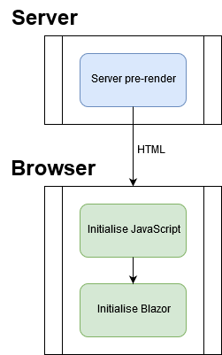

As well as invoking methods on .NET object instances, Blazor also enables us to invoke static methods.
The next example will show how to call into .NET from JavaScript and retrieve a specific setting it might need for an
API call - for example, for Google Analytics.

The benefit of reading JavaScript settings from the server's settings is that the values can be overridden depending on
the environment (Development/ QA / Production) as part of the deployment process without having to alter JavaScript files.

**Warning:** Do not be tempted to create a JavaScript invokable method that returns arbitrary values from configuration, as this could expose sensitive information such as API keys or connection strings. Always expose only the specific values the client needs, and consider whether those values should be visible to the browser at all.

[](https://github.com/mrpmorris/blazor-university/tree/master/src/JavaScriptInterop/CallingStaticDotNetMethods)

- Create a new Blazor server-side application
- Open the **/appsettings.json** file and add a section named "JavaScript"

```json
{
    "Logging": {
        "LogLevel": {
            "Default": "Information",
            "Microsoft": "Warning",
            "Microsoft.Hosting.Lifetime": "Information"
        }
    },
    "JavaScript": {
        "SomeApiKey":  "123456789"
    },
    "AllowedHosts": "*"
}
```

- Next we need a class to hold this setting, create a folder named **Configuration**
- Within that folder, create a file named **JavaScriptSettings.cs**

```cs
public class JavaScriptSettings
{
    public string SomeApiKey { get; set; }
}
```

- Edit the **Program.cs** file
- Before the `builder.Build()` call, read the "JavaScript" section from configuration and store it in a static reference.

```cs
var javaScriptSettings = builder.Configuration
    .GetSection("JavaScript")
    .Get<JavaScriptSettings>();
JavaScriptConfiguration.SetSettings(javaScriptSettings);
```

- The **JavaScriptConfiguration** class doesn't yet exist, so next we'll create that in the **Configuration** folder.

```cs
public static class JavaScriptConfiguration
{
    private static JavaScriptSettings Settings;

    internal static void SetSettings(JavaScriptSettings settings)
    {
        Settings = settings;
    }

    public static JavaScriptSettings GetSettings() => Settings;
}
```

We now have some new settings in our config file,
a class to represent those settings in .NET, and we are reading those values and storing them away in a static reference.
Next we need to access it from JavaScript.

- Add the following `<script>` tag to your host page. In modern Blazor, this is typically in **App.razor** or **Components/App.razor**, before the Blazor script tag (`_framework/blazor.web.js`).

```html
<script src="~/scripts/CallingStaticDotNetMethods.js"></script>
```

- Next, create a folder named **scripts** under the **/wwwroot** folder
- Within that folder, create a new file named **CallingStaticDotNetMethods.js** and add the following script

```js
setTimeout(async function () {
    const settings = await DotNet.invokeMethodAsync("CallingStaticDotNetMethods", "GetSettings");
    alert('API key: ' + settings.someApiKey);
}, 1000);
```

`DotNet.invokeMethodAsync` takes a minimum of two parameters.
It is possible to pass more than two,
and any parameters after the second are considered values to pass to the method as its parameters.

1. The full name (excluding file extension) of the binary in which the method exists
2. The identifier of the method to execute

The final piece of the puzzle is to decorate the method with the `[JSInvokable]` attribute,
passing in the identifier - in this case the identifier will be `GetSettings`.

Edit the **/Configuration/JavaScriptConfiguration** class, and change the GetSettings method:

```cs
[JSInvokable("GetSettings")]
public static JavaScriptSettings GetSettings() => Settings;
```

The identifier passed to `[JSInvokable]` does not have to be the same as the method name.

## Qualifying methods for JavaScript invocation

To qualify as a candidate .NET method to be invokable in this way, the method must meet the following criteria:

1. The class owning the method must be public
2. The method must be public
3. It must be a static method
4. The return type must be void, or serializable to JSON - or it must be `Task` or `Task<T>` where T is serializable to JSON
5. All parameters must be serializable to JSON
6. The method must be decorated with `[JSInvokable]`
7. The same `identifier` used in the `JSInvokable` attribute cannot be used within a single assembly more than once.

> **Note:** Do not immediately invoke .NET static methods from JavaScript

If you read back to the section on [The JavaScript boot process](/javascript-interop/javascript-boot-process/),
you'll remember that JavaScript is initialized in the browser before Blazor has been initialized.



It is for this reason we are only invoking the .NET static method after an initial timeout -
in this case I have chosen one second.

```js
setTimeout(async function () {
    const settings = await DotNet.invokeMethodAsync("CallingStaticDotNetMethods", "GetSettings");
    alert('API key: ' + settings.someApiKey);
}, 1000);
```

## Using JavaScript initializers

Modern Blazor provides proper hooks for running JavaScript after Blazor has initialized, eliminating the need for arbitrary timeouts.

The cleanest approach is to use the `afterWebStarted` callback. This is set on the `Blazor` object before the Blazor script is loaded, and runs once after Blazor has fully initialized its runtime.

```html
<script>
    window.Blazor = {
        afterWebStarted: async function () {
            const settings = await DotNet.invokeMethodAsync("CallingStaticDotNetMethods", "GetSettings");
            alert('API key: ' + settings.someApiKey);
        }
    };
</script>
<script src="_framework/blazor.web.js"></script>
```

Alternatively, you can disable autostart on the Blazor script tag and call `Blazor.start` yourself. This gives you full control over the initialization sequence.

```html
<script src="_framework/blazor.web.js" autostart="false"></script>
<script>
    Blazor.start({}).then(async function () {
        const settings = await DotNet.invokeMethodAsync("CallingStaticDotNetMethods", "GetSettings");
        alert('API key: ' + settings.someApiKey);
    });
</script>
```

Both approaches ensure that your `DotNet.invokeMethodAsync` calls are only made after Blazor is ready to receive them, without polling or arbitrary delays.
