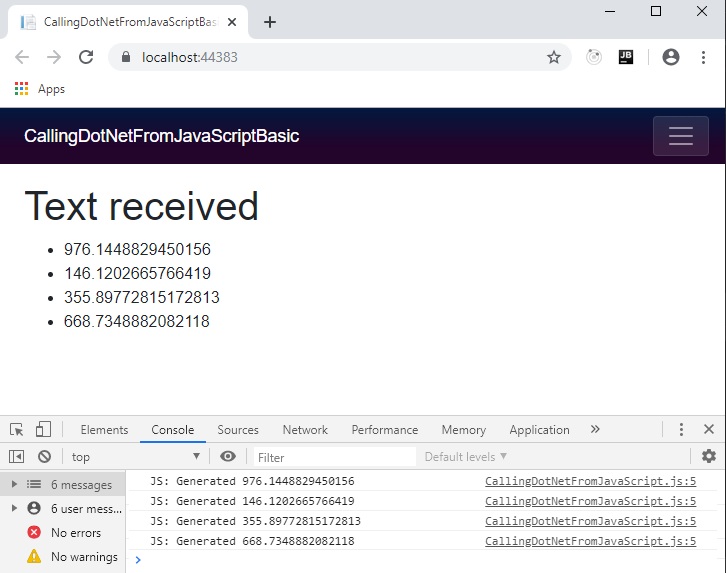
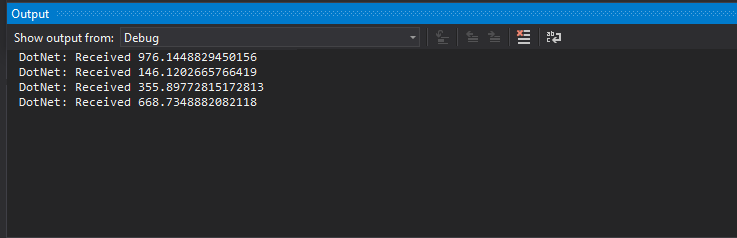

Sometimes our .NET application code needs to be executed from JavaScript.
Blazor enables us to asynchronously call methods on instances of objects, or static methods on classes.

## Identifying invokable .NET code

Blazor does not allow JavaScript to call just any static or instance method in our .NET code. There are conditions

1. The method must be decorated with the `JsInvokableAttribute`.
2. The method must be public.
3. The parameters of the method must be Json serializable.
4. The return type of the method must be Json serializable, `void`, a `Task`, or a `Task<T>` where `T` is Json serializable.
5. If specifying the `identifier` parameter on `JsInvokable` the value must be unique per class hierarchy
   (if an instance method) or unique per assembly (if a static method).

> **Security note:** Adding `[JSInvokable]` to a method widens the attack surface of your application. Any JavaScript running in the browser can invoke that method with any arguments. Avoid exposing methods that accept or return sensitive data without additional authorization checks, and never trust client-supplied values as authoritative.

## Making .NET code invokable

[](https://github.com/mrpmorris/blazor-university/tree/master/src/JavaScriptInterop/CallingDotNetFromJavaScriptBasic)

To call a method on a .NET object instance, we first need to pass a reference to the object over to JavaScript.
We cannot pass our object directly because we want to give JavaScript a reference to our object rather than a Json
serialized representation of its state.
We do this by creating an instance of the `DotNetObjectReference` class.
To demonstrate this, we'll create a simple Blazor app that receives random text from JavaScript every second.

First, create a new Blazor application and change Index.razor to the following mark-up.

> **Warning**: The following code has a memory leak and should not be used in production. This will be highlighted and 
> corrected in [Lifetimes and Memory Leaks](/javascript-interop/calling-dotnet-from-javascript/lifetimes-and-memory-leaks/).

```razor
@page "/"
@inject IJSRuntime JSRuntime

<h1>Text received</h1>
<ul>
    @foreach (string text in TextHistory)
    {
        <li>@text</li>
    }
</ul>

@code
{
    List<string> TextHistory = new List<string>();

    protected override void OnAfterRender(bool firstRender)
    {
        base.OnAfterRender(firstRender);
        if (firstRender)
        {
            // See warning about memory above in the article
            var dotNetReference = DotNetObjectReference.Create(this);
            JSRuntime.InvokeVoidAsync("BlazorUniversity.startRandomGenerator", dotNetReference);
        }
    }

    [JSInvokable("AddText")]
    public void AddTextToTextHistory(string text)
    {
        TextHistory.Add(text.ToString());
        while (TextHistory.Count > 10)
            TextHistory.RemoveAt(0);
        StateHasChanged();
        System.Diagnostics.Debug.WriteLine("DotNet: Received " + text);
    }
}
```

- **Line 2**  
    Injects the `IJSRuntime` service. We use this to initialise our JavaScript, passing in a reference to the component that will receive the notifications.
- **Line 6**  
    Iterates over a `List<string>` and renders them as HTML `<li>` elements.
- **Line 22**  
    When the component is first rendered, we invoke a JavaScript function named **BlazorUniversity.startRandomGenerator**,
    passing a reference to the current component by calling `DotNetObjectReference.Create(this)`.
- **Line 26**  
    We decorate our call-back method with `JSInvokable`. 
    A specific `identifier` is given; this is a recommended practice,
    otherwise Blazor will infer the name from the name of the method,
    and so refactoring the method to a new name could break any JavaScript that executes it.
- **Line 27**  
    Our method conforms to Blazor callback requirements. It is public, has a `void` return type,
    and its only parameter is serializable from Json.
- **Lines 29-32**  
    Adds the received text to our `List<string>`,
    ensures there are no more than 10 items, and then calls `StateHasChanged` so Blazor knows it needs to recreate its [RenderTree](/components/render-trees/).
- **Line 33**  
    Outputs the text received by .NET to the Visual Studio output window.

## Invoking .NET code from JavaScript

First, add a reference to the script we are about to create. In modern Blazor, add the `<script>` element in your host page before the Blazor script tag. For server-side Blazor with Interactive Server rendering, this is typically in **App.razor** or **Components/App.razor**. The Blazor script is now `_framework/blazor.web.js` for all hosting models.

```html
<script src="/scripts/CallingDotNetFromJavaScript.js"></script>
```

> **Prerequisite:** This example requires an interactive Blazor render mode (Interactive Server, Interactive WebAssembly, or Interactive Auto). JavaScript interop is only available during interactive sessions, not during static server-side rendering (SSR).

Next, we'll create the function **BlazorUniversity.startRandomGenerator** and have it call back our .NET object with a random
number every second.

```razor
var BlazorUniversity = BlazorUniversity || {};
BlazorUniversity.startRandomGenerator = function(dotNetObject) {
    setInterval(function () {
        let text = Math.random() * 1000;
        console.log("JS: Generated " + text);
        dotNetObject.invokeMethodAsync('AddText', text.toString());
    }, 1000);
};
```

Now run the application and press F12 to view the browser tools window.
Look in the console and we should see something like the following:



Browser view



Visual Studio output view

## Module isolation as a modern alternative

Instead of defining functions on the global `window` object (e.g., `BlazorUniversity.startRandomGenerator`), modern Blazor applications can use JavaScript modules. This avoids global namespace pollution and provides better encapsulation.

Create a small helper in your host page to enable module loading:

```html
<script>
    window.importModule = url => import(url);
</script>
```

Then define your JavaScript functions in a module file:

```js
// scripts/callingDotNetFromJavaScriptModule.js
export function startRandomGenerator(dotNetObject) {
    setInterval(function () {
        let text = Math.random() * 1000;
        console.log("JS: Generated " + text);
        dotNetObject.invokeMethodAsync('AddText', text.toString());
    }, 1000);
}

export function stopRandomGenerator(handle) {
    clearInterval(handle);
}
```

Load the module from your Blazor component and call its exported functions:

```razor
@code
{
    IJSObjectReference Module;

    protected override async Task OnAfterRenderAsync(bool firstRender)
    {
        if (firstRender)
        {
            Module = await JSRuntime.InvokeAsync<IJSObjectReference>("importModule", "./scripts/callingDotNetFromJavaScriptModule.js");
            var dotNetReference = DotNetObjectReference.Create(this);
            await Module.InvokeVoidAsync("startRandomGenerator", dotNetReference);
        }
    }
}
```

For Blazor WebAssembly targeting .NET 7 or later, the `[JSImport]` attribute provides strongly-typed module interop without runtime string identifiers.
