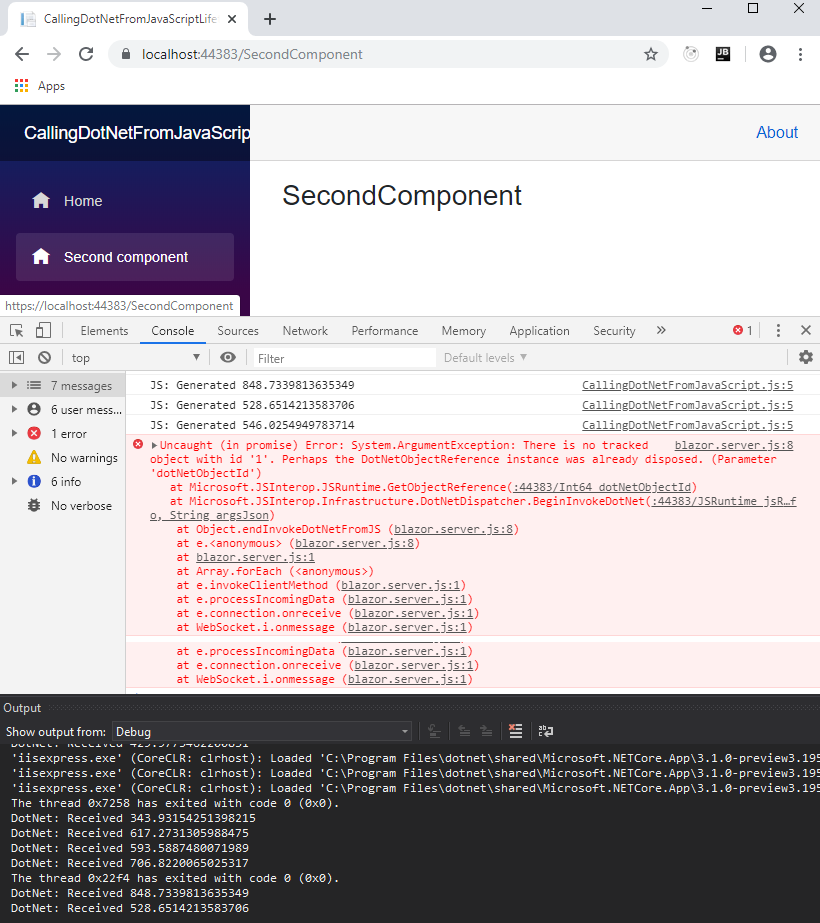

[](https://github.com/mrpmorris/blazor-university/tree/master/src/JavaScriptInterop/CallingDotNetFromJavaScriptLifetimes)

If we run the app we created in [Calling .NET from Javascript](/javascript-interop/calling-dotnet-from-javascript/) and
inspect browser console window, we'll see that when we navigate to another page JavaScript is still calling back our component.
What's worse, if we look in our Visual Studio output window we'll see that our component is still being invoked and outputting
the values passed from JavaScript, which means our component has not been garbage collected!

When we create a `DotNetObjectReference`, Blazor will generate a unique ID (integer for WASM, GUID for server side) and
store a lookup to our object in the current JSRuntime.
This means that unless we dispose of our references correctly, our app is going to leak memory.

The `DotNetObjectReference` class implements `IDisposable`. To solve our memory leak problem we need to do the following:

- Our component should keep a reference to the `DotNetObjectReference` we create.
- Our component should implement `IDisposable` and dispose our `DotNetObjectReference`.

```razor
@page "/"
@inject IJSRuntime JSRuntime
@implements IDisposable

<h1>Text received</h1>
<ul>
  @foreach (string text in TextHistory)
  {
    <li>@text</li>
  }
</ul>

@code
{
  List<string> TextHistory = new List<string>();
  DotNetObjectReference<Index> ObjectReference;

  protected override async Task OnAfterRenderAsync(bool firstRender)
  {
    await base.OnAfterRenderAsync(firstRender);
    if (firstRender)
    {
      ObjectReference = DotNetObjectReference.Create(this);
      await JSRuntime.InvokeVoidAsync("BlazorUniversity.startRandomGenerator", ObjectReference);
    }
  }

  [JSInvokable("AddText")]
  public void AddTextToTextHistory(string text)
  {
    TextHistory.Add(text.ToString());
    while (TextHistory.Count > 10)
      TextHistory.RemoveAt(0);
    StateHasChanged();
    System.Diagnostics.Debug.WriteLine("DotNet: Received " + text);
  }

  public void Dispose()
  {
    GC.SuppressFinalize(this);

    if (ObjectReference != null)
    {
      //Now dispose our object reference so our component can be garbage collected
      ObjectReference.Dispose();
    }
  }
}
```

- **Line 3**  
    Tells the compiler we want our component to implement `IDisposable`.
- **Line 16**  
    We now keep a reference to our `DotNetObjectReference`.
- **Line 21**  
    If this is our first render, we create a `DotNetObjectReference` and pass it to our JavaScript method so it can call
    us back whenever it generates a new random number.
- **Line 45**  
    When our component is disposed, we call `Dispose()` on our `DotNetObjectReference`.

If you remember our [JavaScript caveats](/javascript-interop/), we cannot invoke JavaScript too early,
so we only use `JSRuntime` in `OnAfterRender*` events and then only if **firstRender** is true.
If the component is never rendered (for example, if being pre-rendered in a server-side Blazor app)
then our `DotNetObjectReference` will never be created, so we should only dispose of it if it is not null.

## Warning: Avoid invoking methods on disposed .NET references

If we run our app now we will see our component no longer receives random numbers from JavaScript.
However, if we look in the browser's console window we'll see an error being raised every second.



Once our `DotNetObjectReference` has been disposed it is removed from the `JSRuntime`,
allowing our component to be garbage collected -
as a consequence the reference is no longer valid and should not be used by JavaScript.
Next we'll adapt our component so that it cancels the JavaScript `setInterval` so it is no longer executed once our component
has been destroyed.

First, we need to update our JavaScript so that it returns the handle that is created when we execute `setInterval`.
Then we need to add an additional function that will accept that handle as a parameter and cancel the interval.

```razor
var BlazorUniversity = BlazorUniversity || {};
BlazorUniversity.startRandomGenerator = function (dotNetObject) {
  return setInterval(function () {
    let text = Math.random() \* 1000;
    console.log("JS: Generated " + text);
    dotNetObject.invokeMethodAsync('AddText', text.toString());
  }, 1000);
};
BlazorUniversity.stopRandomGenerator = function (handle) {
  clearInterval(handle);
};
```

- **Line 3**  
    The handle created by `setInteval` is returned from the function that starts the random number generator.
- **Line 9**  
    A function that will accept the handle to the interval we created and pass it to the JavaScript `clearInterval` function.

Finally, we need our component to keep track of the handle of the JavaScript interval we created,
and call the new stopRandomGenerator function when our component is disposed.

```razor {: .line-numbers}
@page "/"
@inject IJSRuntime JSRuntime
@implements IDisposable

<h1>Text received</h1>
<ul>
  @foreach (string text in TextHistory)
  {
    <li>@text</li>
  }
</ul>

@code
{
  List<string> TextHistory = new List<string>();
  int GeneratorHandle = -1;
  DotNetObjectReference<Index> ObjectReference;

  protected override async Task OnAfterRenderAsync(bool firstRender)
  {
    await base.OnAfterRenderAsync(firstRender);
    if (firstRender)
    {
      ObjectReference = DotNetObjectReference.Create(this);
      GeneratorHandle = await JSRuntime.InvokeAsync<int>("BlazorUniversity.startRandomGenerator", ObjectReference);
    }
  }

  [JSInvokable("AddText")]
  public void AddTextToTextHistory(string text)
  {
    TextHistory.Add(text.ToString());
    while (TextHistory.Count > 10)
      TextHistory.RemoveAt(0);
    StateHasChanged();
    System.Diagnostics.Debug.WriteLine("DotNet: Received " + text);
  }

  public async void Dispose()
  {
    GC.SuppressFinalize(this);

    if (GeneratorHandle != -1)
    {
      //Cancel our callback before disposing our object reference
      await JSRuntime.InvokeVoidAsync("BlazorUniversity.stopRandomGenerator", GeneratorHandle);
    }
    if (ObjectReference != null)
    {
      //Now dispose our object reference so our component can be garbage collected
      ObjectReference.Dispose();
    }
  }
}
```

- **Line 16**  
    We create a member to hold a reference to the interval returned from our
    JavaScript **BlazorUniversity.startRandomGenerator** function.
- **Line 25**  
    We store the returned handle in our new member.
- **Line 46**  
    If the handle has been set, we invoke our new JavaScript **BlazoUniversity.stopRandomGenerator** function,
    passing our interval handle so it can be passed to clearInterval.

The interval is cancelled before our `DotNetObjectReference` is disposed so our JavaScript doesn't try to invoke a method
on a .NET object using an invalid object reference.
As per good practice, we check the **GeneratorHandle** member has been set before trying to clear it,
just in case the component is being disposed of before the `OnAfterRender*` methods have been executed.
