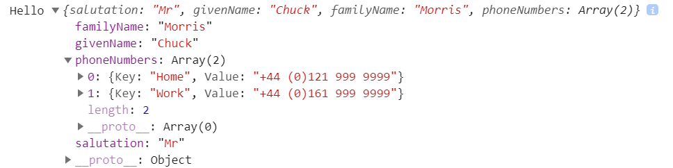

JavaScript should be added into either **/Pages/_Host.cshtml** in Server-side Blazor apps,
or in **wwwroot/index.html** for Web Assembly Blazor apps.

Our JavaScript can then be invoked from Blazor by injecting the `IJSRuntime` service into our component.

[](https://github.com/mrpmorris/blazor-university/tree/master/src/JavaScriptInterop/CallingJavaScriptFromDotNet)

```razor
public interface IJSRuntime
{
  ValueTask<TValue> InvokeAsync<TValue>(string identifier, object[] args);
  ValueTask<TValue> InvokeAsync<TValue>(string identifier, CancellationToken cancellationToken, object[] args);
  // Via an extension class
  void InvokeVoid(string identifier, params object[] args);
}
```

The `identifier` must be a JavaScript function scoped to the global `window` variable,
but it is not necessary to include `window` in the identifier.
So, to invoke `window.alert` we only need to specify `alert` as the identifier.

```razor
@page "/"
@inject IJSRuntime JSRuntime

<button @onclick=ButtonClicked>Perform interop</button>

@code
{
   private async Task ButtonClicked()
   {
     await JSRuntime.InvokeVoidAsync("alert", "Hello world");
   }
}
```


## Passing parameters

[](https://github.com/mrpmorris/blazor-university/tree/master/src/JavaScriptInterop/PassingComplexObjectsToJavaScript)

The previous example passed the string "Hello world" as a parameter to the JavaScript `alert` function.
It is also possible to pass complex objects to JavaScript.
Parameters are serialized to JSON and then deserialized in JavaScript before being passed by-value as an anonymous object
type to the function being invoked.

All parameter types passed to JavaScript must be basic types (string / int / etc) or be JSON serializable.

Create a new Blazor application, and add the following Person class.

```cs
using System.Collections.Generic;

namespace PassingComplexObjectsToJavaScript.Models
{
  public class Person
  {
    public string Salutation { get; set; }
    public string GivenName { get; set; }
    public string FamilyName { get; set; }
    public List<KeyValuePair<string, string>> PhoneNumbers { get; set; }

    public Person()
    {
      PhoneNumbers = new List<KeyValuePair<string, string>>();
    }
  }
}
```

Now in our Index.razor page create an instance of `Person` and pass it to `console.log`.

```razor
@page "/"
@inject IJSRuntime JSRuntime

<button @onclick=ButtonClicked>Perform interop</button>

@code
{
  private async Task ButtonClicked()
  {
    var person = new Models.Person
    {
      Salutation = "Mr",
      GivenName = "Chuck",
      FamilyName = "Morris"
    };
    person.PhoneNumbers.Add(new KeyValuePair<string, string>("Home", "+44 (0)121 999 9999"));
    person.PhoneNumbers.Add(new KeyValuePair<string, string>("Work", "+44 (0)161 999 9999"));

    await JSRuntime.InvokeVoidAsync("console.log", "Hello", person);
  }
}
```

If we view the browser's console output we should see the following when the button is clicked.



## Accessing JavaScript return values

[](https://github.com/mrpmorris/blazor-university/tree/master/src/JavaScriptInterop/AccessingJavaScriptReturnValues)

So far we've only used the `IJSRuntime` extension method `InvokeVoidAsync`.
If we want to receive the return value from a JavaScript function we need to use the `InvokeAsync<TValue>` method.
In the following example we'll invoke the standard JavaScript `confirm` function (which returns a Boolean) and the `prompt`
function (which returns a string).

```razor
@page "/"
@inject IJSRuntime JSRuntime

<p>
  Status: @Result
</p>
<p>
  <button @onclick=ShowConfirm>Confirm popup</button>
</p>
<p>
  <button @onclick=ShowPrompt>Prompt popup</button>
</p>

@code
{
  private string Result;

  private async Task ShowConfirm()
  {
    bool confirmed = await JSRuntime.InvokeAsync<bool>("confirm", "Are you sure?");
    Result = confirmed ? "You clicked OK" : "You clicked Cancel";
  }

  private async Task ShowPrompt()
  {
    string name = await JSRuntime.InvokeAsync<string>("prompt", "What is your name?");
    Result = "Your name is: " + name;
  }
}
```
