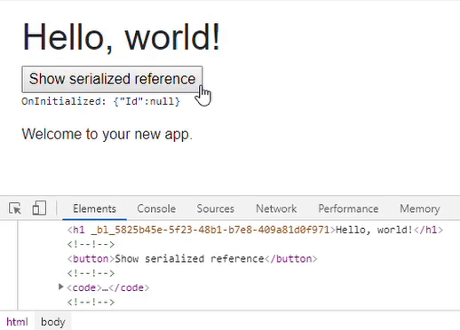

[](https://github.com/mrpmorris/blazor-university/tree/master/src/JavaScriptInterop/HtmlElementReferences)

When writing a Blazor application, manipulation of the Document Object Model (DOM) is discouraged as it may interfere with
its [incremental render tree](/components/render-trees/incremental-rendertree-proof/),
any changes to HTML should be managed in .NET code inside our components.

Sometimes we may wish to proceed anyway and let JavaScript interact with our generated HTML.
The standard JavaScript method for achieving this is to give our HTML element an `id` and have JavaScript locate it
using `document.getElementById('someId')`.
In statically generated HTML pages this is quite simple,
but when pages are dynamically created by composing the output of many components it is difficult to ensure IDs are
unique across all of the components.
Blazor solves this problem with the `@ref` element tag and the `ElementReference` struct.

## @ref and ElementReference

When we require a reference to an HTML element we should decorate that element (or Blazor component) with `@ref`.
We identify which member in our component will hold a reference to the HTML element by creating a member
with the type `ElementReference` and identify it on the element using the `@ref` attribute.

```razor {: .line-numbers}
@page "/"

<h1 @ref=MyElementReference>Hello, world!</h1>
Welcome to your new app.

@code {
  ElementReference MyElementReference;
}
```

- **Line 3**  
    Defines an HTML element and uses `@ref` to specify which member in our component we will use when referencing that element (MyElementReference).
- **Line 7**  
    The member that will be used when referencing the element decorated with `@ref`.

If we alter the **Index.razor** file of a new Blazor application to add an element reference to the `h1` element and
run the application, we'll see something like the following generated HTML.

```html
<h1 \_bl\_bc0f34fa-16bd-4687-a8eb-9e3838b5170d="">Hello, world!</h1>
```

The addition of this specially formatted attribute is how Blazor uniquely identifies an element
without having to hijack the element's `id` parameter.
We'll now use `@ref`,`ElementReference`, and JavaScript interop to solve a common problem.

## Case: Auto focusing elements

The HTML specification has an `autofocus` attribute that can be applied to any focusable element;
when a page is loaded the browser will find the first element decorated with `autofocus` and give it focus.
As [Blazor apps do not really navigate](http://blazor-university.com/routing/#simulated-navigation)
(the HTML is simply rewritten and the browser URL changed),
the browser will not scan for `autofocus` attributes when we navigate to a new URL and present the user with new content.
This means that putting `autofocus` attributes on inputs doesn't work.
This is the problem we will solve using JavaScript Interop, `@ref`, and `ElementReference`.

### Observing the autofocus problem

- First create a new Blazor application.
- In each of the pages replace the content with the same mark-up just below each `@page` directive.

```html
Enter your name: <input autofocus />
```

Run the application and observe how the `<input>` element does not automatically gain focus, not even on first page load.

### Solving the autofocus problem

- In the **wwwroot** folder create a **scripts** folder.
- Within that folder create a new file named **AutoFocus.js** and enter the following script.

```razor
var BlazorUniversity = BlazorUniversity || {};
BlazorUniversity.setFocus = function (element) {
    element.focus();
};
```

Make sure a reference is added to this script either in **/Pages/_Host.cshtml** (Server-side Blazor apps) or **/wwwroot/index.html** (WebAssembly Blazor apps).

In the **Index.razor** page change the mark-up as follows:

```razor {: .line-numbers}
@page "/"
@inject IJSRuntime JSRuntime
Enter your name
<input @ref=ReferenceToInputControl />

@code
{
    ElementReference ReferenceToInputControl;
    protected override async Task OnAfterRenderAsync(bool firstRender)
    {
        if (firstRender)
            await JSRuntime.InvokeVoidAsync("BlazorUniversity.setFocus", ReferenceToInputControl);
    }
}
```

- **Line 4**  
    The input is given an identification that is unique within the component using the `@ref` decorator.
- **Line 8**  
    This is the member that will hold the identity of the element, the member must be of type `ElementReference`.
- **Line 12**  
    If this is the first time this component has rendered,
    the element reference is passed to our JavaScript which gives focus to the element.

Switching between pages now should result in the input on the first page obtaining focus whenever that specific page is rendered.

### Componentizing our autofocus solution

Adding the JavaScript to set focus on every page isn't much work, but it is repetitive.
Also, setting auto-focus to the first control in a [tab control](/templating-components-with-renderfragements/creating-a-tabcontrol/)
based on which tab sheet is displayed would be a lot more work.
This is the sort of thing we should be writing in a reusable form.

First, alter the mark-up of one of our pages so it uses a new AutoFocus control.

```razor
@page "/"
Enter your name
<input @ref=ReferenceToInputControl />
<AutoFocus Control=ReferenceToInputControl/>

@code {
  ElementReference ReferenceToInputControl;
}
```

In the **/Shared** folder create a new component named **Autofocus.razor** and enter the following mark-up.

```razor
@inject IJSRuntime JSRuntime
@code {
    [Parameter]
    public ElementReference Control { get; set; }

    protected override async Task OnAfterRenderAsync(bool firstRender)
    {
        if (firstRender)
            await JSRuntime.InvokeVoidAsync("BlazorUniversity.setFocus", Control);
    }
}
```

- **Line 4**  
    Defines a parameter for the component named `Control` which accepts an `ElementReference` to identify which control should receive focus.
- **Line 9**  
    Executes our JavaScript in order to set focus to the specified control.

The problem with this solution as it stands is that component parameters' values are passed
during the render tree building process,
whereas Element References are not valid until after the render tree has been built and the
result has been rendered to HTML in the browser.
This solution results in an error `element.focus is not a function`,
because the `ElementReference` was invalid at the point its value was passed to our AutoFocus component.

> **_Note_**: Do not use element references too soon!

As we saw in the [Render Trees](/components/render-trees/) section,
during its rendering phase Blazor does not update the browser DOM at all.
Only after rendering of all components is complete will Blazor compare the new and previous render trees and then update
the DOM with as few changes as possible.

This means that at the point of building the render tree it is possible that the elements referenced using `@ref` don't yet
exist in the browser DOM - so any attempt to interact with them via JavaScript will fail.
Because of this, we should never try to use an instance of `ElementReference` in any component lifecycle
method other than `OnAfterRender` or `OnAfterRenderAsync`,
and because components' parameters are set during the building of the render tree we cannot pass an `ElementReference`
as a parameter because it is too soon in the component's lifecycle.
Of course, accessing references from user events such as button clicks is acceptable
because the page as already been generated into HTML.

In fact, instances of `ElementReference` aren't even set until just before the `OnAfterRender*` methods have been called.
The Blazor process is as follows:

1. Generate the virtual render tree for the page.
2. Apply changes to the browser's HTML DOM.
3. For each `@ref` decorated element, update the `ElementReference` member in the Blazor component.
4. Execute the `OnAfterRender*` lifecycle methods.

We can prove this process by altering the Index.razor component of a standard Blazor application to serialize an
`ElementReference` to a string at various points in our component's lifecycle and render the serialized text to the screen.
Change Index.razor in a new project to the following mark-up and run the application.

```razor
@page "/"

<h1 @ref=MyElementReference>Hello, world!</h1>
<button @onclick=ButtonClicked>Show serialized reference</button>

<code><pre>@Log</pre></code>

Welcome to your new app.

@code {
    string Log;

    ElementReference MyElementReference;

    protected override void OnInitialized()
    {
        Log += "OnInitialized: ";
        ShowSerializedReference();
    }

    protected override void OnAfterRender(bool firstRender)
    {
        Log += "OnAfterRender: ";
        ShowSerializedReference();
    }

    private void ButtonClicked()
    {
        Log += "Button clicked: ";
        ShowSerializedReference();
    }

    private void ShowSerializedReference()
    {
        Log += System.Text.Json.JsonSerializer.Serialize(MyElementReference) + "\\r\\n";
    }
}
```

1. Our component instance is created. `OnInitialized` (Line 15) is executed.
2. The value of `MyElementReference` is serialized to our `Log` string (Line 33).
3. The Render Tree is generated.
4. The browser's DOM is updated
5. Blazor checks for elements decorated with `@ref` and updates the `ElementReference` they identify.
6. `OnAfterRender` is executed on our component (Line 21).
7. The value of `MyElementReference` is serialized to our `Log` string, but is not displayed - we'd have to call `StateHasChanged` to see it, but the value of `Log` **has** been updated.
8. The user clicks the button.
9. The value of `MyElementReference` is serialized to our `Log` string.
10. Blazor executes `StateHasChanged` in response to the button click.
11. We see the `Log` updated on screen to show the values added from steps #7 and #9 - both of these show a non-null identifier.



### Completing the AutoFocus component

Instead of passing in the ElementReference itself we can pass in a `Func<ElementReference>`,
our AutoFocus component can then execute this `Func` in its `OnAfterRender*` lifecycle method -
at which point the returned value will be valid.

Change the AutoFocus control to accept a `Func` and, for good measure, ensure the value set isn't null.

```razor
@inject IJSRuntime JSRuntime
@code {
    [Parameter]
    public Func<ElementReference> GetControl { get; set; }

    protected override async Task OnAfterRenderAsync(bool firstRender)
    {
        if (GetControl is null)
            throw new ArgumentNullException(nameof(GetControl));

        if (firstRender)
            await JSRuntime.InvokeVoidAsync("BlazorUniversity.setFocus", GetControl());
    }
}
```

The component can now be used as follows:

```razor
@page "/"
Enter your name
<input @ref=ReferenceToInputControl />
<AutoFocus GetControl=@( () => ReferenceToInputControl)/>

@code {
  ElementReference ReferenceToInputControl;
}
```

> **_Note_:** There are plans for a future Blazor to automatically create the `ElementReference` member.
