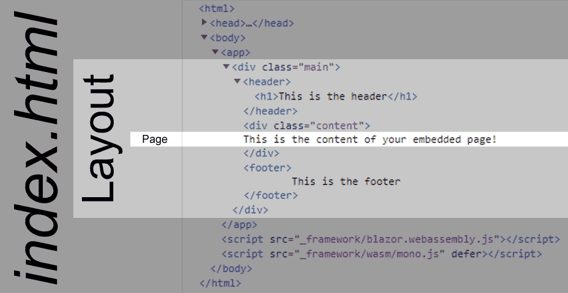

[](https://github.com/mrpmorris/blazor-university/tree/master/src/Layouts/CreatingALayout)

Any content you intend to act as a layout template for pages must descend from the `LayoutComponentBase` class.
To indicate where you want the content of your page to appear you simply output the contents of the `Body` property.

```razor
@inherits LayoutComponentBase

<div class="main">
  <header>
    <h1>This is the header</h1>
  </header>

  <div class="content">
    @Body
  </div>

  <footer>
    This is the footer
  </footer>
</div>
```

Note that this is not the entire HTML page.
Blazor layouts work only within the part of the HTML that Blazor is defined within the `wwwroot\index.html` page,
in a default Blazor application this is everything within the `<app>` element.
It isn't currently possible to alter attributes of HTML elements outside of this scope except by use of [JavaScript Interop](http://blazor-university.com/javascript-interop/).

[](http://blazor-university.com/wp-content/uploads/2019/06/image.png)
