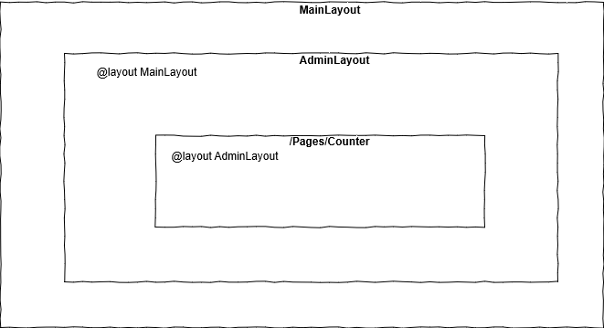

[](https://github.com/mrpmorris/blazor-university/tree/master/src/Layouts/NestedLayouts)

When specifying a `@layout` (either explicitly or through a **\_Imports.razor** file),
Blazor will decorate the generated target class with a `LayoutAttribute`.

```cs
[Microsoft.AspNetCore.Components.LayoutAttribute(typeof(MainLayout))]
public class AdminUsers : Microsoft.AspNetCore.Components.ComponentBase { }
```

**Note**: Generated `.cs` files can be found in the obj\Debug\netstandard2.0\Razor\ folder of your project.

Blazor will honor a `LayoutAttribute` on any `ComponentBase` descendant.
Not only do pages descend from this class,
but the `LayoutComponentBase` does too! This means that a custom layout can also have its own parent layout.

Next we'll create a custom layout for the

1. Edit the **/Shared/AdminLayout.razor** file.
2. Explicitly state it uses the **MainLayout** as its parent by adding `@layout MainLayout`.

```razor
@inherits LayoutComponentBase
@layout MainLayout

<h1>Admin</h1>
@Body
```

First we descend our view from `LayoutComponentBase`,
then we tell Blazor that we want this layout to be contained within the **MainLayout** Razor view,
and finally we render any content declared by a consuming view by outputting the contents of the `Body` property.

In order to ensure the **AdminUsers** page uses the **AdminLayout**,
ensure there is no explicit `@layout` at the top of the **AdminUsers.razor** file.
This will tell Blazor to use the layout specified in **Pages/Admin/_Imports.razor**.

```razor
@page "/admin/users"

<h2>Users</h2>
```


