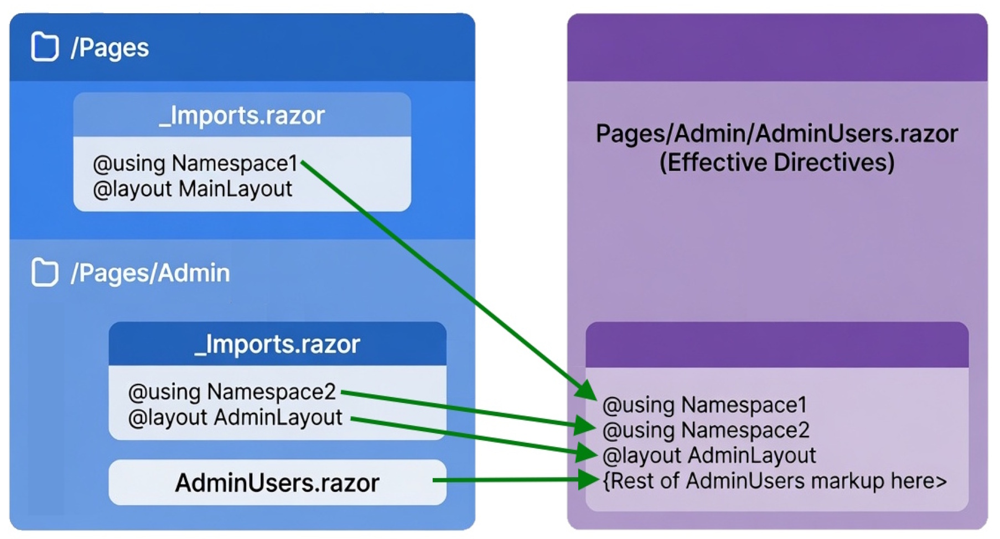

## Specifying a default layout for the app

The application's default layout for all pages is specified in `/Components/Routes.razor` in the following line of code.

```razor
<RouteView RouteData="routeData"
           DefaultLayout="typeof(Layout.MainLayout)" />
```

The name of the layout is strongly typed. Blazor will only syntax-highlight the code correctly
if there is a layout with the name specified. The compiler will also fail if the identifier is incorrect.

**Note**: If you just wish to alter the appearance of the existing layout you should alter the
`/Components/Layout/MainLayout.razor` file.

## Using _Imports.razor
`_Imports.razor` is a convention used by Blazor to specify defaults. These can be `@using` declarations for
specifying commonly imported namespaces or, in this case, a default `@layout` to use.

1. Edit `/Components/Routes.razor`.
1. Find the `<RouteView>` component.
1. Remove the attribute `DefaultLayout="typeof(Layout.MainLayout)"`.

If you now run the app it will look pretty awful, because there is no layout wrapping any of the pages. To
fix this, follow these steps:

1. Expend the `/Components/Pages` folder.
1. Create a new file `_Imports.razor`.
1. Add the following content
```razor
@layout MainLayout
```

Now run the app again and note the layout is back.

**WARNING**: Make sure you edit the file inside `/Components/Pages` and **not** the one directly inside
`/Components`. `MainLayout.razor` is within the `/Components` folder (`/Components/Layout`), so inherits
all code defined inside `/Components/_Imports.razor`, meaning it will have itself as a layout - which will
cause an infinite loop and your app will hang.

## Specifying a default template for a sub area of the app

[](https://github.com/mrpmorris/blazor-university/tree/master/src/Layouts/UsingALayout)

If your app has separate areas to it, for example an "Admin" area, it is possible to specify a
default layout to use for all pages within that area simply by grouping them within their own
child-folder that has its own `_Imports.razor` file.

We have seen this previously in `Using _Imports.razor`. When rendering a page, Blazor will look in the page's
folder for an `_Imports.razor` file. If found, it will merge its contents into the top of the page. But it
doesn't stop there. It will then inspect the parent folder, and the parent's parent folder, and so on.

All the contents are merged together before being added to the razor file. When a declaration can only have
a single value ('@layout', `@inherits`) then the value defined in the `_Imports.razor` closest to the razor
file being rendered is used.



### Example

Create a new Blazor Web App, and then update the navigation menu to contain a link to a new page we'll
create shortly.

1. Open the `/Components/Layout/NavMenu.razor` file.
1. Locate the last `<div>` element, it should contain a `<NavLink>` component.
1. Duplicate the `<div>` element.
1. Change the NavLink's `href` attribute to `"admin/users"`.
1. Change the text of the link to `Admin users`.

Next we'll create a very basic page

1. Expand the `/Components/Pages` node in the Solution Explorer.
2. Create a folder named `Admin`.
3. Create a new file within the folder named `AdminUsers.razor`.

```razor
@page "/admin/users"

<h2>Users</h2>
```

**Note**: The URL to the page does not have to reflect the folder structure.

Running the app now will present you with an app that has a new menu item named `Admin users`.
When you click on the item it will show a very basic page that simply says "Users".
Next we'll create a default layout for all Admin pages.

1. Create another new file in the `/Components/Pages/Admin` folder named `_Imports.razor`.
1. Enter the following code:

```razor
@layout AdminLayout
```

At this point there is no file within the app named `AdminLayout`, so you should see a red-line in
Visual Studio beneath the name indicating it cannot be found. You can fix this by creating an
`AdminLayout.razor` in the `/Components/Layout/` folder.

```razor
@inherits LayoutComponentBase

<h1>Admin</h1>
@Body
```

If you now run the app and click the Admin users link you will see an awful user experience consisting
merely of an `h1` and an `h2`. We will fix this in the section on [Nested layouts](/layouts/nested-layouts/),
but for now we'll use it as an exercise in how to explicitly specify a layout from the page itself.

## Specifying a layout explicitly for an individual page

[](https://github.com/mrpmorris/blazor-university/tree/master/src/Layouts/SpecifyingALayoutExplicitly)

So far we've seen that a default layout can be specified in the `/Components/Pages/_Imports.razor` file, and
we've also seen that this setting can be overridden by Blazor finding a more specific `_Imports.razor`
file in a folder closer to the page it is rendering (`/Components/Pages/Admin/_Imports.razor`).

The most explicit level of specifying a template to use is to literally specify it in the page
itself using the `@layout` directive.

```razor
@page "/admin/users"
@layout MainLayout

<h2>Users</h2>
```

Running the app again and clicking on the `Admin users` link will now show basic page
using the app's standard layout.
