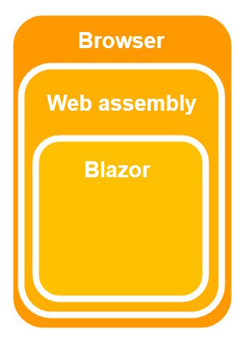
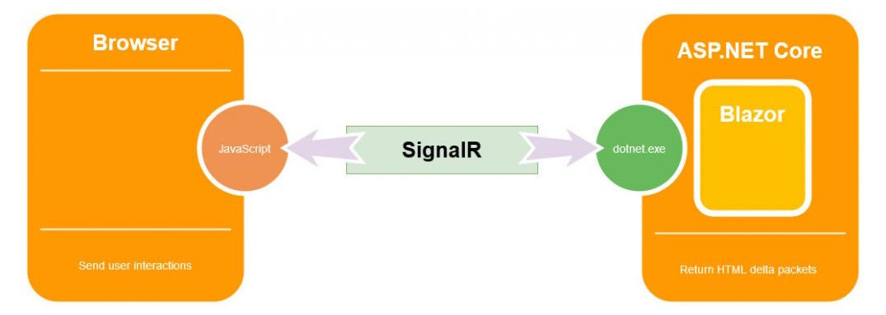
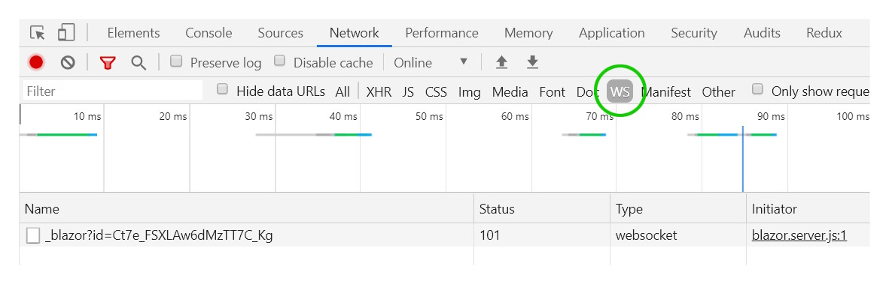
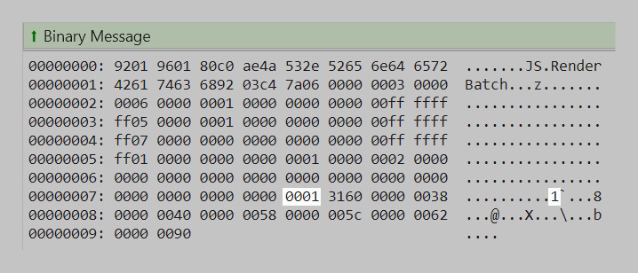

Blazor currently has five hosting options:

- **Static Server Rendering**<br/>
  Renders components to static HTML on the server with no SignalR circuit or client-side interactivity. Each navigation causes a full page load.
  ```
  dotnet new blazor --interactivity None -n MyApp
  ```

- **Interactive Server**<br/>
  Runs .NET code on the server and communicates with the browser via a persistent SignalR connection. Enables rich interactivity with low client-side requirements.
  ```
  dotnet new blazor --interactivity Server -n MyApp
  ```

- **Interactive WebAssembly**<br/>
  Downloads and runs .NET assemblies directly in the browser via WebAssembly. Can work offline and reduces server load, but has a slower initial load.
  ```
  dotnet new blazor --interactivity WebAssembly -n MyApp
  ```

- **Interactive Auto**<br/>
  Starts with Interactive Server rendering, then downloads the .NET assemblies in the background and switches to WebAssembly mode on future visits.
  ```
  dotnet new blazor --interactivity Auto -n MyApp
  ```

- **Blazor Hybrid**<br/>
  Hosts Blazor components inside a native .NET application (MAUI, WPF, WinForms) using the `BlazorWebView` control, with full access to native device APIs.
  ```
  dotnet new maui-blazor -n MyApp
  ```

Server-side hosting was released in September 2019, WebAssembly was officially released in May 2020, Blazor Hybrid was introduced with .NET 6 in 2021, and .NET 8 unified the Blazor Web App template with multiple render modes.

Since .NET 8, the recommended approach is the **Blazor Web App** template, which supports all hosting models through render mode selection. Previously, developers had to choose between the `blazorwasm` and `blazorserver` project templates at creation time. Now the same project can mix multiple render modes on a per-component or per-page basis.

### Visual Studio

Create a new project, search for **Blazor**, and select the **Blazor Web App** template. In the **Additional information** dialog, choose an **Interactive render mode** from the dropdown:

- **None** - Static SSR only (no interactivity)
- **Server** - Interactive Server as the default render mode
- **WebAssembly** - Interactive WebAssembly as the default render mode
- **Auto** - Interactive Auto (Server first, WebAssembly after download)

The **WebAssembly** and **Auto** options add a `.Client` project to the solution that compiles to WebAssembly.

### Render mode nesting rules

Interactive render modes can be combined within a single page. The following rules apply:

- Interactive Server and Interactive WebAssembly components can be embedded in a static page.
- Interactive WebAssembly components can be embedded inside an Interactive Server component.
- Interactive Server components cannot be embedded inside an Interactive WebAssembly component, because WebAssembly mode has no SignalR circuit to the server.


## Blazor WebAssembly



### Pros

Blazor WebAssembly runs on the client, inside the browser, so it can be deployed as static files. Despite this, Blazor WebAssembly apps will not run directly from the local file system due to browser security restrictions.

Blazor WebAssembly can work off-line. When the network connection to the server is lost, the client app can continue to function (obviously it won't be able to talk to the server to retrieve new data).

It can also quite easily run as a [Progressive Web App](https://web.dev/progressive-web-apps/), which means the client can choose to install our app onto their device and run it whenever they wish without any network access at all.

With code running on the client's machine it means the server load is significantly reduced.

### Cons

The `blazor.webassembly.js` file bootstraps the client application. It downloads all required .NET DLL assemblies, which makes the start-up time of the application slower than server-side the first time your app is run (DLLs are then cached by the browser, making subsequent start-up times much faster).

Since .NET 8, Blazor WebAssembly supports multi-threading (experimental in .NET 8, refined in .NET 9/10) on browsers with SharedArrayBuffer support.

Additionally, Blazor WebAssembly only works on newer browsers and is not search-engine friendly (unless we enable server-side pre-rendering).

## Static Server Rendering

Static Server Rendering (also called Static SSR) renders components to static HTML on the server. There is no SignalR circuit, no `blazor.*.js` file downloaded by the browser, and no client-side interactivity. Each navigation or form submission causes a full page load from the server.

Static SSR is the default when creating a Blazor Web App with `--interactivity None`, or when a component does not specify an interactive render mode.

### Pros

- Fastest initial page load - HTML is rendered on the server and sent directly to the browser.
- Best search engine optimisation - all content is present in the initial HTML.
- Lowest server resource usage per request - no persistent SignalR connections to maintain.
- Works on any browser.

### Cons

- No client-side interactivity or UI event handling.
- Full page reloads on navigation and form submissions (unless enhanced navigation is enabled).

## Interactive Server



### Pros

Interactive Server pre-renders HTML content before it is sent to the client's browser.
This makes it search-engine friendly, and there is no perceivable start-up time.

Interactive Server apps will work on older browsers (such as Internet Explorer 11) as there is no requirement for WebAssembly,
only HTML and JavaScript. As the code executes on the server, it is also possible to debug our .NET code in Visual Studio.

### Cons

Interactive Server sets up an in-memory session for the current client and
uses SignalR to communicate between the .NET running on the server and the client's browser.
All memory and CPU usage comes at a cost to the server, for all users.
It also means that the client is tied to the server that first served it, so doesn't work with load-balancing.

Once the initial page has been rendered and sent to the browser,
the `blazor.server.js` file hooks into any relevant user interaction events
in the browser so it can mediate between the user and the server.
For example, if a rendered element has an `@onclick` event registered,
`blazor.server.js` will hook into its JavaScript `onclick` event and then use its SignalR connection
to send that event to the server and execute the relevant .NET code.

```razor
<p>
  Current count = @CurrentCount
</p>
<button @onclick=IncrementCount>Click me</button>

@code
{
  private int CurrentCount;

  public void IncrementCount()
  {
    CurrentCount++;
  }
}
```

After the .NET code has finished, Blazor will re-render the components on the page and then send a delta package of HTML
back to the client's browser so it can update its display without having to reload the entire page.

**Note:** [Render trees](/components/render-trees/) are covered in depth later.

If we run a standard Blazor app, click the **Counter** link in the menu, and then click the **Click me**
button we can observe the SignalR data communication to and from the server.

1. Run the app in the Chrome browser.
2. Click the **Counter** link in the app's menu.
3. Press F12 to open the browser's Developer tools.
4. In the developer tools window, click the **Network** tab.
5. Reload the page.
6. Next, click the **WS** tab (short for WebSocket).  
    
7. Click on the **\_blazor** item to show socket data.
8. Clicking the **Click me** button will show network traffic something like the following (abridged and formatted for easy reading).

```json
DispatchBrowserEvent
  {
    "browserRendererId": 0,
    "eventHandlerId": 3,
    "eventArgsType": "mouse",
    "eventFieldInfo": null
  }
  {
    "type": "click",
    "detail": 1,
    "screenX": 338,
    "screenY": 211,
    "clientX": 338,
    "clientY": 109,
    "button": 0,
    "buttons": 0,
    "ctrlKey": false,
    "shiftKey": false,
    "altKey": false,
    "metaKey": false
  }
```

Which results in a response from the server that looks something like the following:



**Note:** The highlighted `1` indicates the delta HTML, and is the new value for the counter.

This round-trip can provide a sluggish experience if the client's browser and the server are not close or the network
connection between them is slow, especially when the events triggering state change are frequent.
For example, an event such as `onmousemove` will fire very often.

Additionally, changes that require large HTML delta updates can also be slow.
For example, if we were to have an HTML `<textarea>` component in our page that updated an area of the display to preview
the user's input as they type, the delta HTML from the server would increase with each character added to the `<textarea>`.
When the input content becomes large, it results in a large network transfer for every keypress.

Unlike Blazor WebAssembly, once the connection from the browser to the server is lost the app becomes unresponsive.
Blazor will try to re-establish a connection to the server but, until it succeeds,
the app shows the message "Attempting to reconnect to the server..." and prevents all mouse interaction with the user-interface.

## Blazor Hybrid

Blazor Hybrid lets you host Blazor components inside a native .NET application using the `BlazorWebView` control. The UI is rendered using the native platform's rendering engine, not a browser. This gives your Blazor components full access to native device APIs such as the camera, GPS, file system, and notifications.

Blazor Hybrid is supported on:
- **.NET MAUI** - cross-platform mobile and desktop (iOS, Android, Windows, macOS, iPadOS)
- **WPF** - Windows desktop applications
- **Windows Forms** - Windows desktop applications

For .NET MAUI, the project template is `dotnet new maui-blazor` or select **.NET MAUI Blazor App** in Visual Studio.

### Pros

- Native performance and full access to device APIs.
- Share the same Blazor components across web and native apps.
- Works offline - no server connection required.
- Can be published to app stores (Apple App Store, Google Play, Microsoft Store).

### Cons

- Larger application binary size compared to a web app.
- Platform-specific deployment - must build and distribute per-platform packages.
- Cannot run in a browser - it is a native application.

## Choosing a render mode

The `--interactivity` flag on `dotnet new blazor` sets the default render mode for the entire project, but render modes can be applied per-component or per-page using the `@rendermode` directive. This allows you to mix interactivity types within a single application.

For example, a public-facing marketing site can use Static Server Rendering for most pages while using Interactive Server or Interactive WebAssembly for an admin dashboard or a real-time data page.

For a detailed look at each render mode, see the [Render modes](/render-modes/) section.
