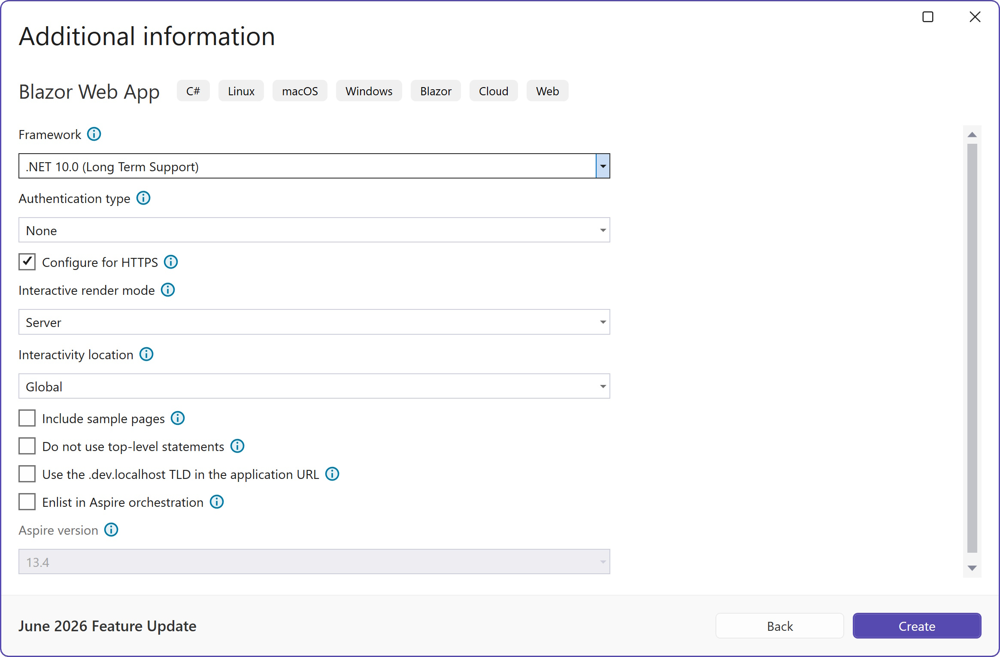

1. Open Visual Studio.
1. Click **Create a new project**.
1. In the search box type Blazor.
1. Select **Blazor Web App**.
1. Click **Next**.
1. Enter a project name, such as **MyFirstBlazorApp**.
1. Click **Next**.
1. Enter the following information
    - **Framework**: Highest version installed.
    - **Authentication type**: None
    - **Configure for HTTPS**: Checked
    - **Interactive render mode**: Server
    - **Interactivity location**: Global
    - **Include sample pages**: Checked
    - (Other options remain unchecked)
1. Click **Create**.



Or to create a Blazor Server app via the CLI:

```
dotnet new blazor --interactivity Server -n MyFirstBlazorApp
```
