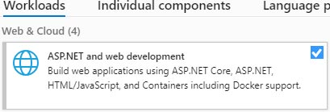

Blazor server-side and WebAssembly are both now shipping as part of .NET Core 3.2.0.
Installing Blazor is now as simple as installing version 16.6 or later of Visual Studio!
You can download the latest version of Visual Studio by following [this link](https://visualstudio.microsoft.com/vs/).

When installing, ensure you select the option **ASP.NET and web development** under the **Workloads** tab.

