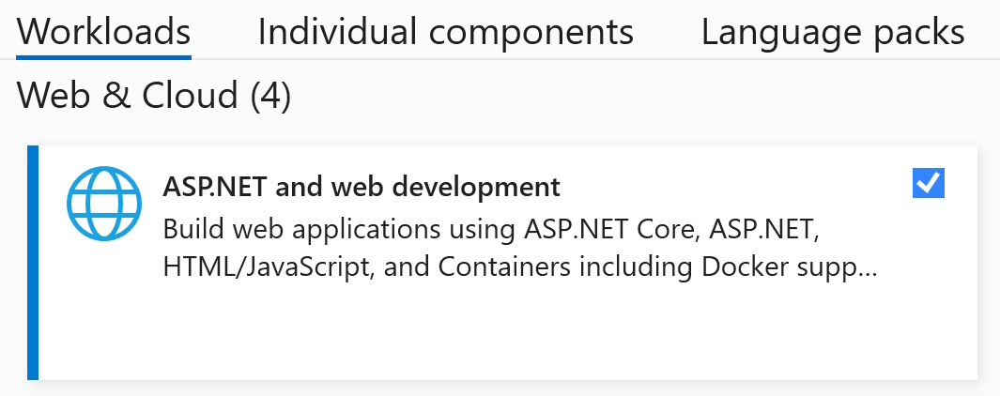

Blazor is now part of the .NET SDK, so we can get started by installing the latest version of Visual Studio from [this link](https://visualstudio.microsoft.com/vs/).

When installing, ensure you select the option **ASP.NET and web development** under the **Workloads** tab.



For Blazor Hybrid apps (hosted in .NET MAUI, WPF, or WinForms), also select **.NET Multi-platform App UI development**. Alternatively, install the MAUI workload via the CLI:

```
dotnet workload install maui
```
