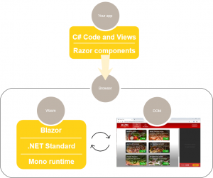
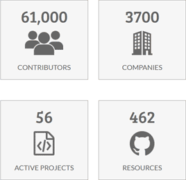

Blazor is a [Single Page Application](https://en.wikipedia.org/wiki/Single-page_application) development framework.
The name Blazor is a combination/mutation of the words Browser and Razor (the .NET HTML view generating engine).
The implication being that instead of having to execute Razor views on the server in order to present HTML to the browser,
Blazor is capable of executing these views on the client.

Blazor app with client-side execution

Blazor also supports executing [SPAs on the server](/overview/blazor-hosting-models/).

## What Blazor is not

Blazor is not like Silverlight, Microsoft's previous attempt at hosting in-browser applications.
Silverlight required a browser plugin in order to run on the client, which prevented it from running on iOS devices.

Blazor does not require any kind of plugin installed on the client in order to execute inside a browser.
Blazor either runs server-side, in which case it executes on a server and the browser acts like a dumb terminal,
or it runs in the browser itself by utilizing [WebAssembly](/overview/what-is-webassembly/).

Because WebAssembly is a web standard, it is supported on all major browsers, which means also client-side Blazor apps
will run inside a browser on Windows/Linux/Mac/Android and iOS.

## Blazor is open-source

Blazor source code is available [here](https://github.com/dotnet/aspnetcore/tree/master/src/Components).
The source code is owned by [The .NET Foundation](https://dotnetfoundation.org/), a non-profit organization created for
the purpose of supporting open-source projects based around the .NET framework.

According to the .NET foundation, at the time of writing it is supported by 3,700 companies and has 61,000 contributors.

