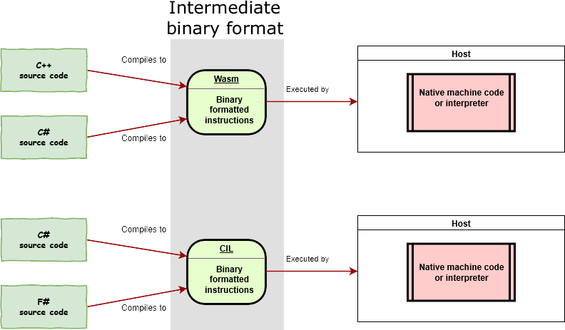

WebAssembly (abbreviated "Wasm") is an instruction set designed to run on any host capable of interpreting those instructions,
or compiling them to native machine code and executing them.

Wasm is an instruction set that is formatted in a specific binary format.
Any host (hardware or software) that adheres to this specification is therefore capable of reading binaries and executing
them - either interpreted, or by compiling directly to machine language specific to the device.

Wasm is akin to the common instruction set (Common Intermediate Language) that .NET source code compiles to.
Just like .NET, Wasm can be generated from higher languages such as C#.

Blazor does not require .NET to be installed on the client in order to run through WebAssembly.

Supported browsers

<table class="">
  <tbody>
    <tr>
      <td><strong>Browser</strong></td>
      <td><strong>From version</strong></td>
    </tr>
    <tr>
      <td>Android browser</td>
      <td>67</td>
    </tr>
    <tr>
      <td>Chrome</td>
      <td>57</td>
    </tr>
    <tr>
      <td>Chrome for Android</td>
      <td>74</td>
    </tr>
    <tr>
      <td>Edge</td>
      <td>16</td>
    </tr>
    <tr>
      <td>Firefox</td>
      <td>52</td>
    </tr>
    <tr>
      <td>Firefox for Android</td>
      <td>66</td>
    </tr>
    <tr>
      <td>iOS Safari</td>
      <td>11</td>
    </tr>
    <tr>
      <td>Opera</td>
      <td>44</td>
    </tr>
    <tr>
      <td>Opera mobile</td>
      <td>46</td>
    </tr>
    <tr>
      <td>Safari</td>
      <td>11</td>
    </tr>
    <tr>
      <td>Samsung Internet</td>
      <td>7.2</td>
    </tr>
  </tbody>
</table>

Data from CanIUse.com ([https://caniuse.com/#search=wasm](https://caniuse.com/#search=wasm))
