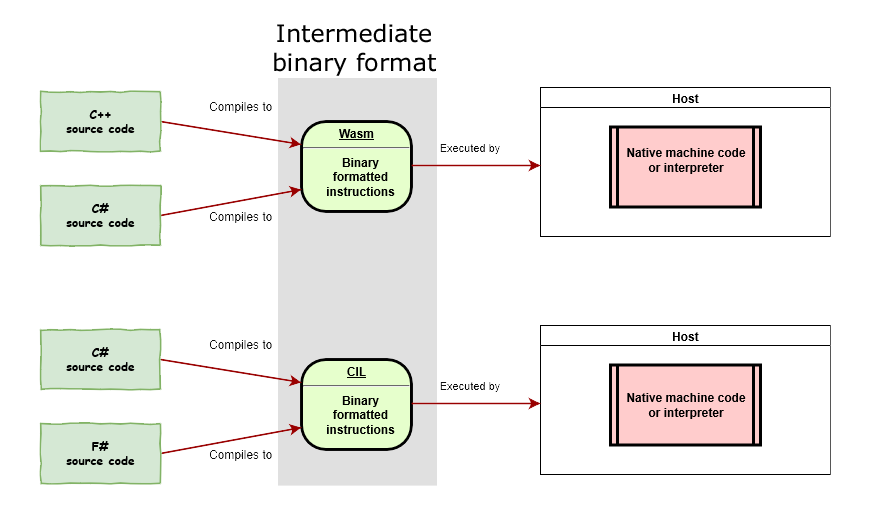

WebAssembly (abbreviated "Wasm") is an instruction set designed to run on any host capable of interpreting those instructions,
or compiling them to native machine code and executing them.

Wasm is an instruction set that is formatted in a specific binary format.
Any host (hardware or software) that adheres to this specification is therefore capable of reading binaries and executing
them - either interpreted, or by compiling directly to machine language specific to the device.

Wasm is akin to the common instruction set (Common Intermediate Language) that .NET source code compiles to.
Just like .NET, Wasm can be generated from higher languages such as C#.

Blazor does not require .NET to be installed on the client in order to run through WebAssembly.

WebAssembly is supported in all modern browsers. Legacy Internet Explorer (not the new Edge browser) and Opera Mini are the only browsers that do not support it. (Data from [CanIUse.com](https://caniuse.com/wasm).)

WebAssembly was announced in 2015 and reached version 1.0 in 2019, becoming a W3C recommendation in December of that year. It was created by engineers from Google, Mozilla, Microsoft, and Apple to provide a portable, secure, and fast compilation target for languages such as C, C++, Rust, and (through Blazor) C#. In 2024, Wasm 2.0 was ratified as a W3C recommendation. WebAssembly has since expanded beyond the browser into server-side runtimes (WASI) and edge computing platforms.
