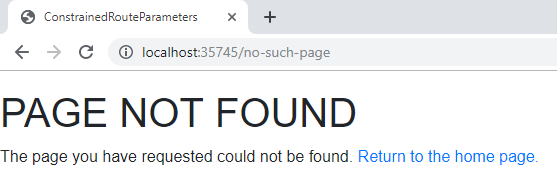

[](https://github.com/mrpmorris/blazor-university/tree/master/src/Routing/PageNotFound)

When Blazor fails to match a URL to a component we might want to tell it what content to display.

The `Router` component has a [RenderFragment parameter](/templating-components-with-renderfragements) named `NotFound`
which is a [RenderFragment](/templating-components-with-renderfragements/).
Any Razor mark-up defined within this parameter of the `Router` component will be
displayed when attempting to reach a URL the router cannot match to any component.

```razor
<Router AppAssembly="typeof(Program).Assembly">
	<Found Context="routeData">
		<RouteView RouteData="routeData" />
	</Found>
	<NotFound>
		<div class="content">
			<h1>PAGE NOT FOUND</h1>
			<p>
				The page you have requested could not be found. <a href="/">Return to the home page.</a>
			</p>
		</div>
	</NotFound>
</Router>
```


