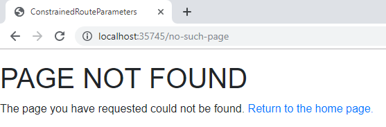

[](https://github.com/mrpmorris/blazor-university/tree/master/src/Routing/PageNotFound)

When Blazor fails to match a URL to a component we might want to tell it what content to display.

## The Router NotFound template

In interactive render modes (Interactive Server, Interactive WebAssembly, Interactive Auto), the `Router` component provides a way to render custom content when no route matches the current URL.

From .NET 10, the recommended approach is to set the `NotFoundPage` parameter to the type of a component that should be rendered when no route matches.

```razor
<Router AppAssembly="typeof(Program).Assembly"
        NotFoundPage="@typeof(NotFoundComponent)">
	<Found Context="routeData">
		<RouteView RouteData="routeData" />
	</Found>
</Router>
```

The `NotFoundComponent` is a regular Blazor component. It can be placed anywhere in the app, typically in the `Components/Pages` folder.

An alternative approach is to use the `NotFound` render fragment with inline markup:

```razor
<Router AppAssembly="typeof(Program).Assembly">
	<Found Context="routeData">
		<RouteView RouteData="routeData" />
	</Found>
	<NotFound>
		<div class="content">
			<h1>PAGE NOT FOUND</h1>
			<p>
				The page you have requested could not be found. <a href="/">Return to the home page.</a>
			</p>
		</div>
	</NotFound>
</Router>
```

Both forms of the `Router` component are placed in the `Routes.razor` file in modern Blazor templates.

## Static SSR and server-side status codes

The `Router`'s `NotFound` template only works within interactive render modes. When using Static Server-Side Rendering (Static SSR), the server renders pages without a persistent Blazor circuit. A request for an unmatched route will not trigger the interactive `Router` component, and the server will return a 200 status code with the default layout.

To serve a proper 404 status code under Static SSR, we must configure the ASP.NET Core middleware pipeline. The recommended approach is to call `UseStatusCodePagesWithReExecute` in `Program.cs`:

```cs
app.UseStatusCodePagesWithReExecute("/not-found");
```

This middleware intercepts 404 responses from the server and re-executes the pipeline with a new path. We can then create a page at that route that sets the status code:

```razor
@page "/not-found"
@layout MainLayout
@{
    Response.StatusCode = 404;
}

<h1>PAGE NOT FOUND</h1>
<p>The page you have requested could not be found. <a href="/">Return to the home page.</a></p>
```

## NavigationManager.NotFound

.NET 10 introduces the `NavigationManager.NotFound()` method, which signals that the current page should be treated as a 404. This is useful when a route matches syntactically but the resource identified by a route parameter does not exist. Calling `NavigationManager.NotFound()` lets the `Router` render the `NotFoundPage` component.

```cs
protected override void OnParametersSet()
{
    var product = ProductService.GetById(ProductId);
    if (product is null)
    {
        NavigationManager.NotFound();
    }
}
```

## Trigger conditions

The `Router` component considers a route unmatched only after it has enumerated all pages registered via the `@page` directive and found none whose template matches the current URL. This evaluation happens after the initial page load and does not affect the server-side HTTP status code in interactive modes.


