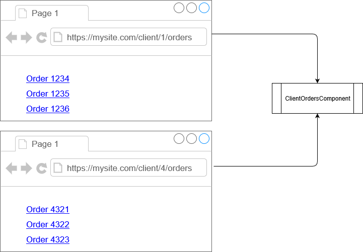

As with a standard ASP.NET MVC, Blazor routing is a technique for inspecting the browser's URL and matching it up to a page to render.

Routing is more flexible than simply matching a URL to a page. It allows us to match based on patterns of text so that, for example, both URLs in the preceding image will map to the same component and pass in an ID for context (either a 1 or a 4 in this example).

## Simulated navigation

When a Blazor app navigates to a new URL within the same app it doesn't actually navigate in the traditional WWW sense. No request is sent to the server requesting the content for the new page. Instead, Blazor rewrites the browser's URL and then renders the relevant content.

Note also that when a navigation is made to a new URL that resolves to the same type of component as the current page, the component will not be destroyed before navigation and the `OnInitialized*` lifecycle methods will not be executed. The navigation is simply seen as a change to the component's parameters.

