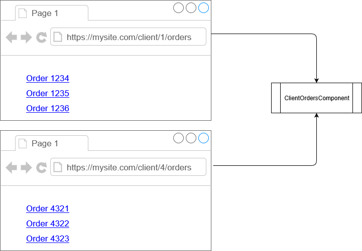

As with a standard ASP.NET MVC, Blazor routing is a technique for inspecting the browser's URL and matching it up to a page to render.

Routing is more flexible than simply matching a URL to a page. It allows us to match based on patterns of text so that, for example, both URLs in the preceding image will map to the same component and pass in an ID for context (either a 1 or a 4 in this example).

## Simulated navigation

How navigation behaves depends on the render mode. In interactive render modes (Interactive Server, Interactive WebAssembly, Interactive Auto) Blazor rewrites the browser's URL and renders the relevant content without a full HTTP request. In Static Server Rendering (Static SSR) mode, however, navigation sends a full HTTP request to the server, optionally enhanced with Blazor's progressive enhancement for form posts and anchor clicks.

Note also that when a navigation is made to a new URL that resolves to the same component type (the same .NET class decorated with `[RouteAttribute]`), the component will not be destroyed before navigation and the `OnInitialized*` lifecycle methods will not be executed. The navigation is simply seen as a change to the component's parameters.

## In this section

- [Defining routes](/routing/defining-routes/)
- [Route parameters](/routing/route-parameters/)
- [Constraining route parameters](/routing/constraining-route-parameters/)
- [Optional route parameters](/routing/optional-route-parameters/)

