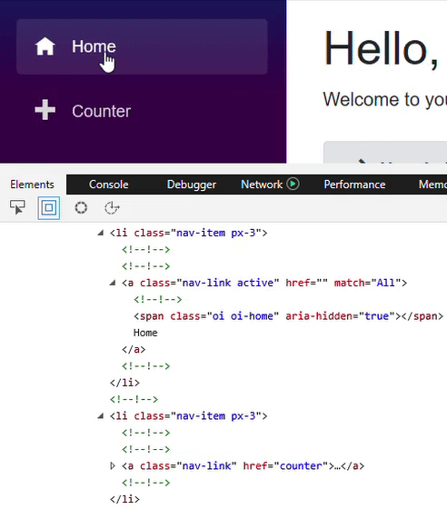
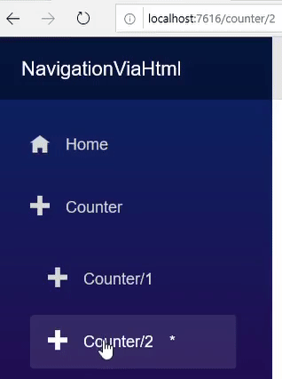
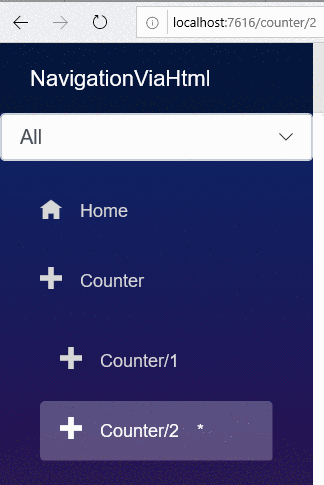

[](https://github.com/mrpmorris/blazor-university/tree/master/src/Routing/NavigatingViaHtml)

The simplest way to link to a route within a Blazor component is to use an HTML hyperlink.

```razor
<a href="/Counter">This works just fine</a>
```

Hyperlinks in a Blazor component are intercepted automatically.
When a user clicks a hyperlink the browser will not send a request to the server,
instead Blazor will update the URL in the browser and render whichever page is associated with the new address.

## Using the NavLink component

Blazor also includes a component for rendering hyperlinks with additional support for changing the HTML element's CSS
class when address matches the URL.

If we look inside the _/Shared/NavMenu.razor_ component in the default Blazor application we'll mark-up that looks
something like the following:

```razor
<NavLink class="nav-link" href="counter">
  <span class="oi oi-home" aria-hidden="true"></span> Counter
</NavLink>
```

The NavLink component decorates its child content with an HTML hyperlink.
All attributes such as `class`, `href`, etc. are rendered directly to the `<a>` element via [Attribute splatting](/components/code-generated-html-attributes/).
There are two parameters of the NavLink component that provide additional behavior.

The `ActiveClass` parameter specifies which CSS class to apply to the rendered `<a>` element when the URL of the browser
matches the URL of the `href` attribute.
If not specified, Blazor will apply a CSS class named "active".



## URL matching

The `Match` parameter identifies how the browser's URL should be compared to the `href` in order to decide whether or
not the `ActiveClass` should be added to the element's `class` attribute.

Edit the _/Pages/Counter.razor_ file in a new Blazor app so that it can be reached from three URLs.

```razor
@page "/counter"
@page "/counter/1"
@page "/counter/2"
```

Then edit the _/Shared/NavMenu.razor_ component so the Counter menu item has two sub-menu links.

```razor
<li class="px-3 nav-item">
  <NavLink class="nav-link" href="counter" Match=@NavLinkMatch.All>
    <span class="oi oi-plus" aria-hidden="true"></span>Counter
  </NavLink>
  <ul class="nav flex-column">
    <li class="px-3 nav-item">
      <NavLink class="nav-link" href="counter/1" Match=@NavLinkMatch.All>
        <span class="oi oi-plus" aria-hidden="true"></span>Counter/1
      </NavLink>
    </li>
    <li class="px-3 nav-item">
      <NavLink class="nav-link" href="counter/2" Match=@NavLinkMatch.All>
        <span class="oi oi-plus" aria-hidden="true"></span>Counter/2
      </NavLink>
    </li>
  </ul>
</li>
```

Also edit _/wwwroot/site.css_ and add the following so we easily see which NavLink elements are considered "active".

```css
.nav-item a.active::after
{
  content: " \*";
  margin-left: 1em;
}
```

The three NavLink components navigate to `/counter`, `/counter/1`, and `/counter/2`,
if we run the application and click the various links we'll see the following.



## NavLinkMatch

The `Match` parameter of the NavLink component accepts a value of the type `NavLinkMatch`.
This tells the NavLink component how you want the browser's URL compared with the `href` attribute of the `<a>` element
it renders to determine whether they are the same or not.

In the earlier example we specified `NavLinkMatch.All` for the `Match` parameter on every NavLink component.
This meant we wanted Blazor to only consider each NavLink to be active if its `href` matched the browser's URL completely.
If we now change the NavLink that links to /counter so its Match parameter is NavLinkMatch.Prefix we'll see it will be
considered a match whenever the URL starts with `/counter`, so it will also match `/counter/1` and `/counter/2`.

To illustrate the difference, declare a field within the code section of _/Shared/NavMenu.razor_

```razor
NavLinkMatch MatchMode = NavLinkMatch.All;
```

Find the `<div class="@NavMenuCssClass"...` element, and before the `<ul>` element add the following mark-up to bind a
`<select>` to the new field.

```razor
<select @bind=MatchMode class="form-control">
  <option value=@NavLinkMatch.All>All</option>
  <option value=@NavLinkMatch.Prefix>Prefix</option>
</select>
```

Finally, find the NavLink with its `href` linking to `/counter` and change its `Match` parameter to `"@MatchMode"`.
Your mark-up should now look something like this.

```razor
<div class="pl-4 top-row navbar navbar-dark">
  <a class="navbar-brand" href="">NavigationViaHtml</a>
  <button class="navbar-toggler" @onclick=ToggleNavMenu>
    <span class="navbar-toggler-icon"></span>
  </button>
</div>

<div class="@NavMenuCssClass" @onclick=ToggleNavMenu>
  <select @bind=MatchMode class="form-control">
    <option value=@NavLinkMatch.All>All</option>
    <option value=@NavLinkMatch.Prefix>Prefix</option>
  </select>
  <ul class="nav flex-column">
    <li class="px-3 nav-item">
      <NavLink class="nav-link" href="" Match=@NavLinkMatch.All>
        <span class="oi oi-home" aria-hidden="true"></span> Home
      </NavLink>
    </li>
    <li class="px-3 nav-item">
      <NavLink class="nav-link" href="counter" Match=@MatchMode>
        <span class="oi oi-plus" aria-hidden="true"></span>Counter
      </NavLink>
      <ul class="nav flex-column">
        <li class="px-3 nav-item">
          <NavLink class="nav-link" href="counter/1" Match=@NavLinkMatch.All>
            <span class="oi oi-plus" aria-hidden="true"></span>Counter/1
          </NavLink>
        </li>
        <li class="px-3 nav-item">
          <NavLink class="nav-link" href="counter/2" Match=@NavLinkMatch.All>
            <span class="oi oi-plus" aria-hidden="true"></span>Counter/2
          </NavLink>
        </li>
      </ul>
    </li>
  </ul>
</div>

@code {
  NavLinkMatch MatchMode = NavLinkMatch.All;

  bool collapseNavMenu = true;

  string NavMenuCssClass => collapseNavMenu ? "collapse" : null;

  void ToggleNavMenu()
  {
    collapseNavMenu = !collapseNavMenu;
  }
}
```

With either the Counter/1 or Counter/2 link selected, toggle the value of the `<select>`.



Despite the browser URL remaining unaltered, we can see the first Counter NavLink toggling between being
active/not-active based on the setting of its `Match` parameter.
