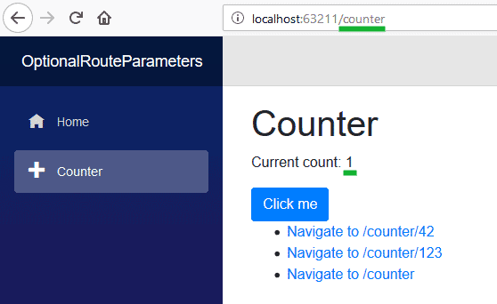
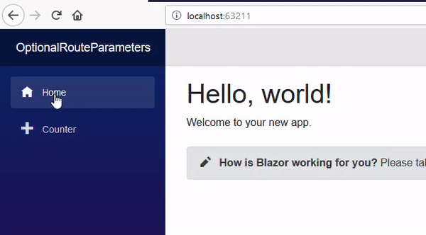
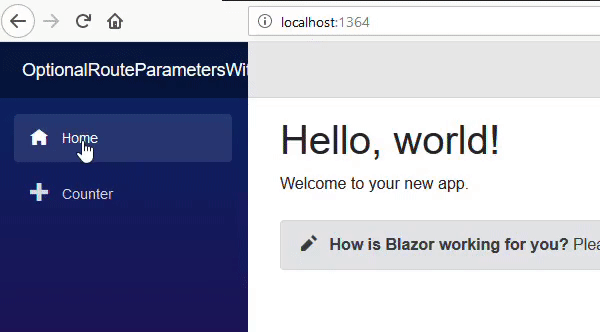

Optional route parameters aren't supported explicitly by Blazor, but the equivalent can be easily achieved by adding
more than one `@page` declaration on a component.
For example, alter the standard **Counter.razor** page to add an additional URL.

```razor
@page "/counter"
@page "/counter/{CurrentCount:int}"
```

Change the `int currentCount` field to a parameter, like so  
`[Parameter] public int CurrentCount { get; set; }`  
  
And then replace all references to `currentCount` with `CurrentCount`.
Also add a few navigations on the page so we can quickly test our routes

```razor
@page "/counter"
@page "/counter/{CurrentCount:int}"

<h1>Counter</h1>

<p>Current count: @CurrentCount</p>

<button class="btn btn-primary" @onclick=IncrementCount>Click me</button>

<ul>
  <li><a href="/counter/42">Navigate to /counter/42</a></li>
  <li><a href="/counter/123">Navigate to /counter/123</a></li>
  <li><a href="/counter/">Navigate to /counter</a></li>
</ul>

@code {
  [Parameter]
  public int CurrentCount { get; set; }

  void IncrementCount()
  {
    CurrentCount++;
  }
}
```

When we run this app we see we can navigate either to `/counter` (no parameter required) or `/counter/AnyNumber`
(parameter value specified).
When no value is specified in the URL the default value for the property type will be used.

## Specifying a default value for optional parameters

What if we want the default value of our parameter to be something other than the C# default?
For example, when no value for `CurrentCount` is specified, we might want it to default to `1` instead of `0`.

Firstly, we'll need to change the type of our parameter property to be nullable, so we can tell the difference between
`/counter/0` and just `/counter` - and then assign the default value to the property if it is `null`.

```razor
[Parameter]
public int? CurrentCount { get; set; }

protected override void OnInitialized()
{
  base.OnInitialized();
  CurrentCount = CurrentCount ?? 1;
}
```

At first this would seem to work, navigating to `/counter` will in fact default our `CurrentCount` value to `1`.



However, this only works the first time the page is displayed.
If we now navigate to `/counter` using one of the links without first navigating to another page (such as **Home**)
we'll see the `CurrentCount` defaults to null.



[](https://github.com/mrpmorris/blazor-university/tree/master/src/Routing/OptionalRouteParameters)

When the component is a `@page` and our Blazor app navigates to a new URL that renders the same page,
Blazor does not create a new instance of the component in order to render the page
but instead it treats it as the same page with changed parameters.
Because of this `OnInitialized` will be executed only when the page is first created.
See [Component lifecycles](http://blazor-university.com/components/component-lifecycles/) for details.

<table>
  <tbody>
    <tr>
      <td><strong>Previous URL</strong></td>
      <td><strong>Current URL</strong></td>
      <td><strong>Counter.OnInit executed</strong></td>
    </tr>
    <tr>
      <td>/</td>
      <td><strong>/counter</strong></td>
      <td>Yes - Different page</td>
    </tr>
    <tr>
      <td>/counter</td>
      <td><strong>/counter/42</strong></td>
      <td>No - Same page</td>
    </tr>
    <tr>
      <td>/counter/42</td>
      <td><strong>counter/123</strong></td>
      <td>No - Same page</td>
    </tr>
    <tr>
      <td>/counter/123</td>
      <td><strong>/counter</strong></td>
      <td>No - Same page</td>
    </tr>
    <tr>
      <td>/counter</td>
      <td><strong>/counter123</strong></td>
      <td>No - Same page</td>
    </tr>
    <tr>
      <td>/counter123</td>
      <td><strong>/counter</strong></td>
      <td>No - Same page</td>
    </tr>
    <tr>
      <td>/counter</td>
      <td><strong>/</strong></td>
      <td>Yes - Different page</td>
    </tr>
  </tbody>
</table>

The correct solution is to default the value in `SetParametersAsync` - which is called whenever the parameters change
and their values are pushed into the component's properties, such as during a navigation.

```razor
[Parameter]
public int? CurrentCount { get; set; }

public async override Task SetParametersAsync(ParameterView parameters)
{
  await base.SetParametersAsync(parameters);
  CurrentCount = CurrentCount ?? 1;
}
```


