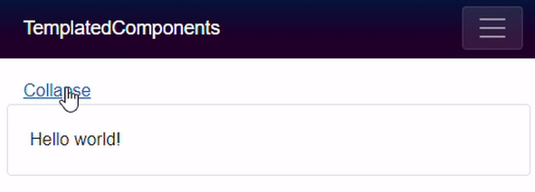

So far we've created components that generate 100% of their rendered output based on parameters, but components aren't always that simple. Sometimes we need to create components that mix consumer-supplied mark-up with their own rendered output.

It would be very messy (not to mention unmanageable) to pass content to a component as an HTML encoded string parameter:

<Collapsible content="Lots of encoded HTML for your entire view here"/>

And, in addition to the maintenance nightmare, the embedded HTML could only be basic HTML mark-up too, no Blazor components. Basically, it'd be useless, and obviously that's not how it should be done. The correct approach is to use a `RenderFragment`.

## Child content

If we create a new component named Collapsible (a completely empty .razor file) we can, as you have already seen, consume that in the `Index.razor` page, like so:

<Collapsible/>

But what if we want to embed some content? Give it a try and then look at the error in your browser's console output.

<Collapsible>Hello world!</Collapsible>

> WASM: System.InvalidOperationException: Object of type 'TemplatedComponents.Components.Collapsible' does not have a property matching the name 'ChildContent'.
> 
> Error output when trying to embed content in a component not designed to expect it

## The RenderFragment class

Now change the `Collapsible` component so that it has a property named `ChildContent`, a type of `RenderFragment`, and make sure it is decorated with a `[Parameter]` attribute.

@code {
	[Parameter]
	public RenderFragment ChildContent { get; set; }
}

These are the criteria Blazor uses to inject embedded content into a component. The embedded content may be anything you wish; plain text, HTML elements, more razor mark-up (including more components), and the content of that embedded content may be output anywhere in your component's mark-up simply by adding `@ChildContent`.

	<a href="#" @onclick=Toggle class="col-12">@ActionText</a>
	@if (!Collapsed)
	{
		

			@ChildContent
		

	}

@code
{
	[Parameter]
	public RenderFragment ChildContent { get; set; }

	[Parameter]
	public bool Collapsed { get; set; }

	string ActionText { get => Collapsed ? "Expand" : "Collapse"; }

	void Toggle()
	{
		Collapsed = !Collapsed;
	}
}

## Multiple render fragments

When we write mark-up inside a component, Blazor will assume it should be assigned to a Parameter on the component that is descended from the `RenderFragment` class and is named `ChildContent`. If we wish to use a different name, or multiple render fragments, then we must explicitly specify the parameter's name in our mark-up.

<MyComponent>
  <Header>
    <h1>The header</h1>
  </Header>
  <Footer>
    This is the footer
  </Footer>
  <ChildContent>
    The ChildContent render fragment must now be explicitly named because we have
    more than one render fragment parameter in MyComponent.

    It doesn't have to be named ChildContent.
  </ChildContent>
</MyComponent>

In the preceding example we only need to explicitly specify `<ChildContent>` because we have explicitly used one or more other render fragments (`Header` and `Footer`). If we don't want to specify a `<Header>` and a `<Footer>` then there would be no need to name `<ChildContent>` explicitly, Blazor will assume that all mark-up within between `<MyComponent>` and `</MyComponent>` is the render fragment for `ChildContent`.

See [Passing data to RenderFragments](/templating-components-with-renderfragements/passing-data-to-a-renderfragement/) for more information.

