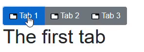

[](https://github.com/mrpmorris/blazor-university/tree/master/src/TemplatedComponents/PassingDataToARenderFragment)

So far we've used `RenderFragment`s that simply contains child mark-up, which is then included as-is when the component
is rendered.
As well as the standard `RenderFragment` class, there is also a generic `RenderFragment<T>` class that can be used to
pass data into the `RenderFragment`.

## Allowing the user to template tabs

Alter the `TabControl` component and add a new `TabTextTemplate` parameter property beneath the `ChildContent` parameter.

```razor
[Parameter]
public RenderFragment ChildContent { get; set; }

[Parameter]
public RenderFragment<TabPage> TabTextTemplate { get; set; }
```

Then change the mark-up in the `foreach` loop.
What we need to do is check if `TabTextTemplate` has been set or not;
if it hasn't then we render as usual, if it has been set then we execute the `TabTextTemplate` `RenderFragment`,
passing in the `TabPage` from the `foreach` loop.

```razor
<CascadingValue Value="this">
  <div class="btn-group" role="group">
  @foreach (TabPage tabPage in Pages)
  {
    <button type="button"
      class="btn @GetButtonClass(tabPage)"
      @onclick=@( () => ActivatePage(tabPage) )>

    @if (TabTextTemplate != null)
    {
      @TabTextTemplate(tabPage)
    }
    else
    {
      @tabPage.Text
    }
  </button>
    }
  </div>
  @ChildContent
</CascadingValue>
```

To set the `TabTextTemplate` we need to edit the mark-up in the page where we are using the `TabControl`.
This is done simply by adding a `<TabTextTemplate>` element inside the `<TabControl>` element,
and everything inside that template will be considered the `RenderFragment` to use whenever the mark-up for a `TabPage`
is rendered into a tab of the `TabControl`.

```razor
<TabControl>

  <TabTextTemplate>
    Hello
  </TabTextTemplate>

  <TabPage Text="Tab 1">
    <h1>The first tab</h1>
  </TabPage>
  <TabPage Text="Tab 2">
    <h1>The second tab</h1>
  </TabPage>
  <TabPage Text="Tab 3">
    <h1>The third tab</h1>
  </TabPage>
</TabControl>
```

But as soon as you do this, the compiler complains with the following error message.

> Unrecognized child content inside component 'TabControl'.
> The component 'TabControl' accepts child content through the following top-level items: 'ChildContent', 'TabTextTemplate'.

When there is only a single `RenderFragment` parameter in your component, and it is named `ChildContent`,
then Blazor will assume whenever we use the component and include content between the opening and closing tags we want
to assign it to `ChildContent`.
But once we have two `RenderFragment`s in the consumer's mark-up, Blazor cannot assume that all of the content should be
assigned to the `ChildContent` parameter.
At this point the user of your component must explicitly create a `<ChildContent>` element to hold the content.

To make the intention clear, let's rename the `ChildContent` property to `Tabs`.

```razor
<TabControl>

  <TabTextTemplate>
    Hello
  </TabTextTemplate>

  <ChildContent>
    <TabPage Text="Tab 1">
      <h1>The first tab</h1>
    </TabPage>
    <TabPage Text="Tab 2">
      <h1>The second tab</h1>
    </TabPage>
    <TabPage Text="Tab 3">
      <h1>The third tab</h1>
    </TabPage>
  </ChildContent>
</TabControl>
```

## Accessing context in the RenderFragment

So far the `TabControl` component will simply shows the text "Hello!" for the tab of each `TabPage`.
What we need is access to the `TabPage` being rendered so we can output the value of its `Text` property.
Note the use of `TabTextTemplate` in the `TabControl` component.

```razor
 @if (TabTextTemplate != null)
 {
  @TabTextTemplate(tabPage)
 }
 else
 {
   @tabPage.Text
 }
```

Within the `foreach` loop an HTML `<button>` is created, and within that button the preceding code is used to output the
content that should appear for the user to click on.
If `TabTextTemplate` is null then `@tabPage.Text` is rendered, but if `TabTextTemplate` is not null (the component user
has specified a template) then the template is rendered, passing in the current tabPage of the loop for context.

When a Generic version of the `RenderFragment<T>` class is used, we must pass a value of `<T>` when rendering that fragment.
The value passed to the fragment is available via a special variable named `context`.
This can then be used to determine exactly what to render. In our case, we want to render the `TabPage.Text` property
with some additional mark-up.

```razor
<TabTextTemplate>
   @context.Text
</TabTextTemplate>
```



Tabs templated by the component user

## Avoiding @context name conflicts

If the name `context` conflicts with another identifier in your component it is possible to instruct Blazor to use a
different name on a case-by-case basis by using the `Context` attribute on a `RenderFragment`.

For example, the `TabTextTemplate` mark-up demonstrated earlier could instead be written as follows.

```razor
<TabTextTemplate Context="TheTab">
   @TheTab.Text
</TabTextTemplate>
```
