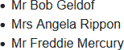
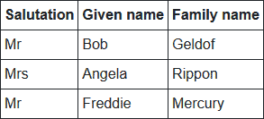

[](https://github.com/mrpmorris/blazor-university/tree/master/src/TemplatedComponents/PassingPlaceholdersToRenderFragments)

**Credit:** This page was inspired by a Twitter post by the user [ℳisterℳagoo](https://twitter.com/mistermag00).

At first, it might seem unintuitive, or perhaps a little odd, to think of declaring a `[Parameter]` property of type `RenderFragment<RenderFragment>`.

[Parameter]
public RenderFragment<RenderFragment> ChildContent { get; set; }

The fact is, if you have ever created a [Custom Blazor layout](/layouts/creating-a-blazor-layout/) then you are already
familiar with a similar concept.

The `<T>` in `RenderFragment<T>` is passed into the user-specified mark-up as the `@context` variable.
A layout uses the name `@Body` rather than `@context`, but `@Body` is actually a `RenderFragment`.
To prove this point, edit the **/Shared/MainLayout.razor** file and change `@Body` to the following.

```razor
@Body.GetType().Name
```

Now instead of displaying the content rendered by `@Body`, we will see the class name, which happens to be `RenderFragment`.

Although this is not exactly how a Blazor layout works, it is a useful comparison for helping to understand the principle
behind declaring a `[Parameter]` property of type `RenderFragment<RenderFragment>`.

```razor
<div class="our-main-layout">
  @Body
</div>
```

In the preceding fictitious layout, we can imagine the entire mark-up as being the **ChildContent** `RenderFragment` of some parent component,
and the `@Body` on line 3 as the equivalent of a `@context` (named **Body**)
that is a `RenderFragment` that we can choose to inject anywhere we wish.
In this case, we are choosing to inject the **Body** inside an HTML `<div>` element.

The equivalent of our own would be either

```razor
<OurComponent>
  <p>
    @context
  </p>
</OurComponent>
```

Or, if we want to use the name **Body** (or anything else) instead of **context**,
we can specify the name to use for the context.
See the **Avoiding @context name conflicts** section at the bottom of [Passing data to a RenderFragment](/templating-components-with-renderfragements/passing-data-to-a-renderfragement/).

```razor
<OurComponent Context="FragmentWeNeedToRender">
  <div class="our-wrapped-fragment">
    @FragmentWeNeedToRender
  </div>
</OurComponent>
```

## Creating a working example

First, create a class we can use to bind some data to.

```cs
public class Person
{
  public string Salutation { get; set; }
  public string GivenName { get; set; }
  public string FamilyName { get; set; }
}
```

### Creating a simple templated repeating component

This detail is similar to that covered in the section [Using @typeparam to create generic components](/templating-components-with-renderfragements/using-typeparam-to-create-generic-components/).
Here we'll quickly gloss over the shared content so, if you've not read that already, please read it first.

Next, we need to create a new component in **/Shared** named **DataList.razor**.
This component will be a generic component (using `@typeparam`) and will take an `IEnumerable<TItem>` and iterate over
the enumerable to render content per item using a template specified by its consumer.

```razor
@typeparam TItem
<ul>
  @foreach (TItem item in Data ?? Array.Empty<TItem>())
  {
    @ItemTemplate(item)
  }
</ul>
@code
{
  [Parameter]
  public IEnumerable<TItem> Data { get; set; }

  [Parameter]
  public RenderFragment<TItem> ItemTemplate { get; set; }
}
```

This component may be consumed by our Index page like so:

```razor
@page "/"

<DataList Data=@People>
  <ItemTemplate>
    <li @key=context>@context.Salutation @context.GivenName @context.FamilyName</li>
  </ItemTemplate>
</DataList>

@code
{
  private IEnumerable<Person> People;
  protected override void OnInitialized()
  {
    base.OnInitialized();
    People = new Person[]
    {
      new Person { Salutation = "Mr", GivenName = "Bob", FamilyName = "Geldof" },
      new Person { Salutation = "Mrs", GivenName = "Angela", FamilyName = "Rippon" },
      new Person { Salutation = "Mr", GivenName = "Freddie", FamilyName = "Mercury" }
    };
  }
}
``

**Note:** The `@key=context` in the `<li>` element is for performance purposes and should be used whenever rendering a list.
See [Optimising using @key](/components/render-trees/optimising-using-key/) for more information.

### The problem

What if our DataList component doesn't only output a list of items.
Perhaps it has a footer that allows the user to show a page of elements at a time with Previous / Next buttons,
and a footer showing how many items there are in total?

We can simply add this additional mark-up to our **DataList** component,
but what if the consumer of our component wants to also render the list differently?
Perhaps they need to display the paged list as an HTML `<table>` in once place, and an HTML `<ul>` somewhere else?

```razor
<div class="paged-data-list">
  <div class="paged-data-list_header">
    @Data.Count() item(s)
  </div>
  <div class="paged-data-list_body">
    <!-- Consumer wants either a <table> or a <ul> here -->
    @foreach(TItem item in CurrentPageOfData)
    {
      @ItemTemplate(item)
    }
    <!-- Consumer wants either a </table> or a </ul> here -->
  </div>
  <div class="paged-data-list_footer">
    <button type="button" etc>Prev</button>
    <button type="button" etc>Next</button> 
  </div>
</div>
```

This is exactly the kind of use-case that requires us to have the user pass in a `RenderFragment<RenderFragment>`.

### Rendering a RenderFragment within a RenderFragment

Now that we have our `ItemTemplate` that receives an `@context` of type `Person` in order to render each element,
we need to allow our component's consumer to specify what content to include
before the first element and after the last element -
as highlighted in the preceding code sample on lines 6 and 11.

The consuming component would look something like either of the two following examples

```razor {: .line-numbers }
<DataList Data=@People>
   <ItemTemplate Context="person">
    <li @key=person>
      @person.Salutation @person.FamilyName, @person.GivenName
    </li>
  </ItemTeplate>
</DataList>

<DataList Data=@People>
  <ListTemplate Context="allPeople">
    <ul Type="A">
      @allPeople
    </ul>
  </ListTemplate>
  <ItemTemplate Context="person">
    <li @key=person>
      @person.Salutation @person.FamilyName, @person.GivenName
    </li>
  </ItemTemplate>
</DataList>
```

- **Line 2**  
    Defines the template to use for the list.
    In this case, we wrap our inner content (our data items "allPeople") with `<ul>` and `</ul>`.
- **Line 4**  
    Indicates where to render the items mark-up by executing the `RenderFragment` passed via the context variable that
    we have chosen to refer to as "allPeople".
- **Line 7**  
    Specifies a template for each item. In this case, the context will be an instance of `Person` and so we've chosen to
    refer to the context by the name "person" by specifying `Context="person"`.

### Passing rendered content as a placeholder for the consumer to display

The DataList component needs to render each item in the `Data` property,
and then pass that to the consumer to decide where in its `ListTemplate` to render that output.
Or, more accurately, the DataList needs to pass a `RenderFragment` that will render the mark-up for the items when executed.

First, we'll add the `ListTemplate` property to our DataList component.

```razor
[Parameter]
public RenderFragment<RenderFragment> ListTemplate { get; set; }
```

Next we'll change our DataList so that it uses `<ul>` and `<li>` as a default when no `ListTemplate` has been specified
by the consumer, after that we'll deal with the scenario where the consumer does want to use a custom `ListTemplate`.

### Rendering using a default list template

This is the easy part. All we need to do is to write our mark-up as if there were no such thing as a `ListTemplate` on
the component, just as we normally would - but only if the `ListTemplate` property is null.

```razor {: .line-numbers}
@typeparam TItem
@if (ListTemplate == null)
{
  <ul>
    @foreach (TItem item in Data ?? Array.Empty<TItem>())
    {
      @ItemTemplate(item)
    }
  </ul>
}

@code
{
  [Parameter]
  public IEnumerable<TItem> Data { get; set; }

  [Parameter]
  public RenderFragment<TItem> ItemTemplate { get; set; }

  [Parameter]
  public RenderFragment<RenderFragment> ListTemplate { get; set; }
}
```

- **Lines 2**  
    Checks if ListTemplate is null
- **Lines 4-9**  
    If ListTemplate is null then we render a standard `<ul>` list, and then render element in Data using the ItemTemplate.

### Rendering with a custom ListTemplate

The `RenderFragment<TItem>` expects us to pass an instance of `TItem` each time we render it.
This is simple to do because we have an `IEnumerable<TItem>` from which we can pull values to be rendered,
but what do we do when we need to pass an instance of `RenderFragment` to our template?

To define a non-generic `RenderFragment` we can use the standard Razor escape sequence to denote HTML, which is `@:`

RenderFragment rf = @<h1>Hello</h1>;

To define a `RenderFragment<T>` we need to use a lambda that passes in an instance of `T`

```razor
RenderFragment<Person> rf = 
  person => @<h1>Hello @person.Name</h1>;
```

So how would we return a RenderFragment that will loop over the items in our `Data` property only when it is rendered?
For that, we need to use the wig-pig syntax.

#### The wig-pig


The wig-pig is a set of characters that the Razor rendering engine can use to denote a chunk of Razor mark-up within C# files.
For obvious reasons, this character sequence only works in `.razor` files.
Any visual likeness to any person, either living or dead, is purely coincidental.

**Note:** `@:@{` is in fact two character sequences.
First `@:` tells the Razor parser to treat the following text as Razor mark-up,
and then `@{` is the start of a C# code block - which will obviously end somewhere with a complementary `}`.
Ultimately this gives us a chunk of Razor mark-up,
which is equivalent to a `RenderFragment` with C# code inside it that can perform operations such as loops.

When calling `@ListItem(...)` in our Razor file we can pass an in-place `RenderFragment`
as the parameter using the wig-pig syntax.

```razor
@ListTemplate(
  @:@{
    foreach (TItem item in Data ?? Array.Empty<TItem>())
    {
      @item.ToString()
    }
  }
)
```

Using this syntax, we render the mark-up specified by the consumer in `<ListTemplate>` passing in a `RenderFragment` that
will render all of the elements in `Data`.
In the preceding code it simply calls `ToString()` on each item in `Data`.
However, ideally we would like to use the `ItemTemplate` the consumer has provided for us.

```razor
@ListTemplate(
  @:@{
    foreach (TItem item in Data ?? Array.Empty<TItem>())
    {
      @ItemTemplate(item)
    }
  }
)
```

### DataList.razor

```razor
@typeparam TItem
@if (ListTemplate == null)
{
  <ul>
    @foreach (TItem item in Data ?? Array.Empty<TItem>())
    {
      @ItemTemplate(item)
    }
  </ul>
}
else
{
  @ListTemplate(
    @:@{
      foreach (TItem item in Data ?? Array.Empty<TItem>())
      {
        @ItemTemplate(item)
      }
    }
  )
}

@code
{
  [Parameter]
  public IEnumerable<TItem> Data { get; set; }

  [Parameter]
  public RenderFragment<TItem> ItemTemplate { get; set; }

  [Parameter]
  public RenderFragment<RenderFragment> ListTemplate { get; set; }
}
```

## Consuming our DataList

### Sample 1: A simple list

```razor
<DataList Data=@People>
  <ItemTemplate>
    <li @key=context>@context.Salutation @context.GivenName @context.FamilyName</li>
  </ItemTemplate>
</DataList>
```

Generates the following

```html
<ul>
    <li>Mr Bob Geldof</li>
    <li>Mrs Angela Rippon</li>
    <li>Mr Freddie Mercury</li>
</ul>
```



Rendered HTML

### Sample 2: An HTML table

```razor
<DataList Data=@People>
  <ListTemplate Context="listOfPeople">
    <table border=1 cellpadding=4>
      <thead>
        <tr>
          <th>Salutation</th>
          <th>Given name</th>
          <th>Family name</th>
        </tr>
      </thead>
      <tbody>
        @listOfPeople
      </tbody>
    </table>
  </ListTemplate>
  <ItemTemplate Context="person">
    <tr @key=@person>
      <td>@person.Salutation</td>
      <td>@person.GivenName</td>
      <td>@person.FamilyName</td>
    </tr>
  </ItemTemplate>
</DataList>
```

Generates the following

```html
<table cellpadding="4" border="1">
  <thead>
    <tr>
      <th>Salutation</th>
      <th>Given name</th>
      <th>Family name</th>
    </tr>
  </thead>
  <tbody>
    <tr>
      <td>Mr</td>
      <td>Bob</td>
      <td>Geldof</td>
    </tr>
    <tr>
      <td>Mrs</td>
      <td>Angela</td>
      <td>Rippon</td>
    </tr>
    <tr>
      <td>Mr</td>
      <td>Freddie</td>
      <td>Mercury</td>
    </tr>
  </tbody>
</table>
```



Rendered HTML

### Assigning defaults when RenderFragments are not specified

At the moment we are having to check if `ListTemplate` is null using an `@if` statement in our view,
and we aren't even checking if `ItemTemplate` is set or not. Neither of these approaches are ideal.

Instead, we should set our `RenderFragment` properties to a desired default if they have not been set by the consumer.
This way our component's render logic can be kept much simpler.

```razor
@ListTemplate(
  @:@{
    foreach(TItem item in CurrentPage)
    {
      @ItemTemplate(item)
    }
  }
)
```

Override `OnParametersSet()` in our component and ensure the `ItemTemplate` property is not null.
To do this, we create a lambda that receives a `TItem` and returns a `RenderFragment` (using the wig-pig syntax).

```razor
  protected override void OnParametersSet()
  {
    if (ItemTemplate == null)
    {
      ItemTemplate = (item) => @:@{ 
      <li @key=item>@item.ToString()</li>}
      ;
    }
}
```

To ensure the `ListTemplate` is not null we create a lambda that receives a `RenderFragment` and then ignores it and returns
our custom wig-pig `RenderFragment` instead.

```razor
    if (ListTemplate == null)
    {
      ListTemplate = \_ => @:@{ 
      <ul>
        @foreach(TItem item in CurrentPage)
        {
          @ItemTemplate(item)
        }
      </ul>
      }
    ;
    }
```

**Note**: The `;` cannot be on the same line as the preceding `}`, otherwise the Razor parser does not parse the source correctly.
This has been [reported as a bug](https://github.com/dotnet/aspnetcore/issues/20971)
and will hopefully be fixed in the near future.

## Summary

The `RenderFragment<RenderFragment>` technique should be used when the consumer wishes to identify a place-holder in their
mark-up for content that will be passed to them during render - such as the `Body` placeholder in a Blazor Layout.

Hopefully, this section has helped you to understand when to use this technique, and how to use the wig-pig `@:@{`
syntax to generate in-place `RenderFragments`.

## Additional reading

The source code for this section includes an additional [sample page](https://github.com/mrpmorris/blazor-university/blob/master/src/TemplatedComponents/PassingPlaceholdersToRenderFragments/Pages/Paged.razor)
that consumes a [PagedDataList](https://github.com/mrpmorris/blazor-university/blob/master/src/TemplatedComponents/PassingPlaceholdersToRenderFragments/Shared/PagedDataList.razor)
component.
